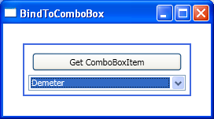

# How to bind the items of a ComboBox (and get its ComboBoxItems)

Binding the items of a ComboBox is pretty much the same as binding the items of a ListBox:

	<Window.Resources>
		<local:GreekGods x:Key="greekGods"/>
	
		<DataTemplate x:Key="itemTemplate">
			<TextBlock Text="{Binding Path=Name}" />
		</DataTemplate>
	</Window.Resources>

	<ComboBox ItemsSource="{StaticResource greekGods}" ItemTemplate="{StaticResource itemTemplate}" Width="200" Name="comboBox"/>

The reason for this similarity is that both ComboBox and ListBox derive from ItemsControl, and ItemsSource and ItemTemplate are properties on ItemsControl. 

If you read my previous post about how to get a ListBoxItem from a data bound ListBox, you're probably thinking that you don't need to keep reading to know how to do the same thing for a ComboBox. There is a little trick that you should be aware of, though. 

If you use similar code to the solution of my previous post, you will notice that the ComboBoxItems are null:

	GreekGod greekGod = (GreekGod)(comboBox.Items[0]);
	ComboBoxItem cbi1 = (ComboBoxItem)(comboBox.ItemContainerGenerator.ContainerFromIndex(0));
	ComboBoxItem cbi2 = (ComboBoxItem)(comboBox.ItemContainerGenerator.ContainerFromItem(comboBox.Items.CurrentItem));

This is because the generation of items for the ComboBox only happens when you open it. So the trick is to open the ComboBox before calling ContainerFromIndex/ContainerFromItem:

	GreekGod greekGod = (GreekGod)(comboBox.Items[0]);
	comboBox.IsDropDownOpen = true;
	ComboBoxItem cbi1 = (ComboBoxItem)(comboBox.ItemContainerGenerator.ContainerFromIndex(0));
	ComboBoxItem cbi2 = (ComboBoxItem)(comboBox.ItemContainerGenerator.ContainerFromItem(comboBox.Items.CurrentItem));
	comboBox.IsDropDownOpen = false;

