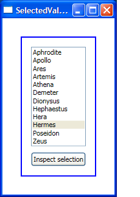

# What is the difference between SelectedValue and SelectedItem?

When they are used by themselves, these two properties are very similar. The need for both and the difference between the two becomes apparent when SelectedValuePath is also set.

For example, consider our well-known GreekGods data source. I set the DataContext of the StackPanel to be that collection through code:

	GreekGods items;
	items = new GreekGods();
	mainStackPanel.DataContext = items;

And used an empty Binding to bind that collection to the ListBox. I know that I want to select the GreekGod with description "Messenger of the Gods" (even though I am only displaying the Name of each God). This is when SelectedValuePath becomes useful. Each item in the ListBox is a GreekGod object, so by setting SelectedValuePath to "Description" I am able to drill down into the Description property of each GreekGod. Then I just have to set SelectedValue to the description I am looking for and the item becomes selected.

	<StackPanel Name="mainStackPanel">
		<ListBox ItemsSource="{Binding}" DisplayMemberPath="Name" SelectedValue="Messenger of the Gods" SelectedValuePath="Description" Name="listBox1" (...) />
	</StackPanel>

The difference between SelectedValue and SelectedItem should be obvious now. SelectedValue returns the string it was set to ("Messenger of the Gods"), while SelectedItem returns the actual GreekGod object with that description.

	string messengerOfGods = (string)(listBox1.SelectedValue);
	GreekGod hermes = (GreekGod)(listBox1.SelectedItem);

SelectedValue is particularly useful when only part of your item is stored in the model you are data binding to. In this scenario, you would data bind the SelectedValue property to the partial information in your model but the ListBox can show a lot more information about that item.

If you have ideas of how to combine these two properties in one, we would love to hear it.

