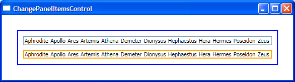

# How to change the layout of an ItemsControl

I will show in this sample two ways to change the layout of an ItemsControl. In response to a comment on my previous post, this sample uses XmlDataProvider, which allows binding to XML data. 

The easiest way to change the layout of an ItemsControl is simply by setting the ItemsPanel property to the Panel that will contain the items:

	<ListBox ItemsSource="{Binding Source={StaticResource xmlData}}" (...) >
		<ListBox.ItemsPanel>
			<StackPanel Orientation="Horizontal" />
		</ListBox.ItemsPanel>
	</ListBox>

Alternatively, for more extensive customizations, you can create a ControlTemplate. This ControlTemplate allows you to replace the whole VisualTree, including picking a new Panel to hold the items. For example, the following markup shows a ControlTemplate that adds a Border and changes the Panel on the ItemsControl:

	<ControlTemplate x:Key="listBoxTemplate">
		<Border BorderBrush="Orange" BorderThickness="2" Margin="10,0,10,10">
			<StackPanel Orientation="Horizontal" IsItemsHost="True" />
		</Border>
	</ControlTemplate>
	    
	<ListBox ItemsSource="{Binding Source={StaticResource xmlData}}" Template="{StaticResource listBoxTemplate}" (...) />

Most people get this far in this scenario, but often forget to set the IsItemsHost property in the Panel. IsItemsHost is a property that says "Use this Panel to lay out the items in the ItemsControl." Notice that selection still works as usual.

If you want your items to wrap onto multiples lines, you can use a WrapPanel in place of the StackPanel. In this scenario, bear in mind that the default template for ListBox contains a ScrollViewer, so your items won't wrap. To make them wrap, you can either provide your own ControlTemplate or, if you don't need selection to work, use an ItemsControl instead of a ListBox.

As I mentioned before, I am using XmlDataProvider to bind to XML data. This is how I converted the GreekGods CLR data source I've used in previous samples:

	<Window.Resources>
		<XmlDataProvider XPath="/GreekGods/GreekGod" x:Key="xmlData">
			<GreekGods xmlns="">
				<GreekGod>
					<Name>Aphrodite</Name>
					<Description>Goddess of love, beauty and fertility</Description>
					<RomanName>Venus</RomanName>
				</GreekGod>
				(...)
			</GreekGods>
		</XmlDataProvider>
	</Window.Resources>

The only thing to keep in mind when binding to XML is that instead of using the Path property in the Binding object, you should use the XPath property. You can use either Path or XPath syntax for DisplayMemberPath.

