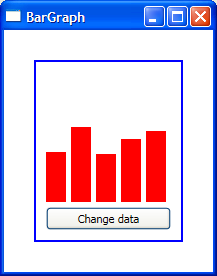

# How to make a data bound bar graph

A very simple bar graph can be created by combining Avalon's styling and templating features with a data bound ItemsControl. An ItemsControl is simply a control that displays a list of items. Those items can be anything you want: people, numbers, controls, and so on. If you template each item of an ItemsControl to be a rectangle whose height is bound to numerical data, you have a data bound bar graph.

The data source for this sample is a class with a property called ValueCollection of type ObservableCollection<int>. ObservableCollection<T> implements INotifyCollectionChanged, which means that if items are added/removed/replaced from that collection, the binding engine will be notified of that and the UI will be updated.

This is the markup for the ItemsControl:

	<ItemsControl ItemsSource="{Binding Source={StaticResource source}, Path=ValueCollection}" ItemTemplate="{StaticResource template}" Height="130">
		<ItemsControl.ItemsPanel>
			<StackPanel Orientation="Horizontal" />
		</ItemsControl.ItemsPanel>
	</ItemsControl>

The default Panel for ItemsControl has vertical orientation, but we want the items to be displayed horizontally - each bar should be to the right of the previous one. To change the panel, we set the ItemsControl's ItemsPanel property (see my previous blog post for more details on changing the Panel of an ItemsControl).

The template for each item has a rectangle with height bound to the corresponding integer in the data source and a second rectangle with no fill to add some blank space between the bars:

	<DataTemplate x:Key="template">
		<StackPanel Orientation="Horizontal" VerticalAlignment="Bottom">
			<Rectangle Height="{Binding}" Width="20" Fill="Red" />
			<Rectangle Width="5" />
		</StackPanel>
	</DataTemplate>

This is a very simple bar graph but it will hopefully give you ideas and serve as the base for more elaborate representations of data. This is the result:

