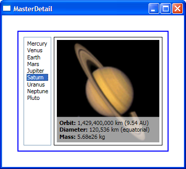

# Master-detail scenario

In the simplest master-detail scenario, clicking a particular item of an ItemsControl causes the details about that item to be displayed in another control. For example, an application may display a list of customer names in a ListBox, and clicking a particular customer causes TextBlocks to be updated with the address, phone number and date of birth of that customer. 

In this post I will use a data source with the planets of the solar system: clicking on the name of a planet in the ListBox causes its picture and information to be displayed in a templated ContentControl. The ListBox plays the role of the master and the ContentControl presents the detail.

In the resources section of the Window, I have an XmlDataProvider with the planet data and a CollectionViewSource with the Source property bound to the provider (for more information about CollectionViewSource see my previous post). Here is the markup for the ListBox bound to the CollectionViewSource:

	<!-- master -->
	<ListBox ItemsSource="{Binding Source={StaticResource cvs}}" DisplayMemberPath="@Name" Padding="5" Margin="0,0,5,0"/>

I also need a ContentControl, which is used to display the details of the selected item. The markup below may seem a little strange at first: we are binding a ContentControl (which displays a single item) to a collection of items? (Notice that its Content's Binding is the same as the Binding in the ListBox's ItemsSource.) This markup works fine because the data binding engine is smart enough to distinguish between the two targets. When binding an ItemsControl to a collection we get the collection; when binding a ContentControl to a collection we get the current item of that collection. This is what makes the master-detail scenario so simple in WPF.

	<!-- detail -->
	<ContentControl ContentTemplate="{StaticResource detailTemplate}" Content="{Binding Source={StaticResource cvs}}"/>

To specify how the details of the planet data should be displayed in the ContentControl, we use a DataTemplate. The following markup shows the data-binding specific parts of the DataTemplate. Notice that because I am binding to XML, the Binding is using XPath instead of Path.

	<DataTemplate x:Key="detailTemplate">
		(...)
		<Image Source="{Binding XPath=Image, Converter={StaticResource stringToImageSource}}" />
		(...)
		<StackPanel Orientation="Horizontal" Margin="5,5,5,0">
			<TextBlock Text="Orbit: " FontWeight="Bold" />
			<TextBlock Text="{Binding XPath=Orbit}" />
		</StackPanel>
		<StackPanel Orientation="Horizontal" Margin="5,0,5,0">
			<TextBlock Text="Diameter: " FontWeight="Bold"/>
			<TextBlock Text="{Binding XPath=Diameter}" />
		</StackPanel>
		<StackPanel Orientation="Horizontal" Margin="5,0,5,5">
			<TextBlock Text="Mass: " FontWeight="Bold"/>
			<TextBlock Text="{Binding XPath=Mass}" />
		</StackPanel>
		(...)
	</DataTemplate>

Here is a screen shot of the completed sample:

