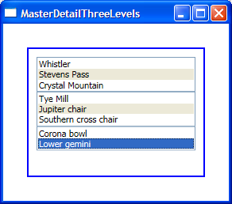

# How to synchronize ListBoxes displaying three levels of hierarchical data

The master-detail scenario with more than 2 levels is very common, and we made sure we have good support for it in WPF. I will show in this post three ways to sync selection of three ListBoxes, each displaying a different level of a hierarchy of data. In this sample, the first ListBox displays a list of mountain ski resorts. When the user selects a ski resort, the second ListBox gets updated with several lifts from that mountain. By selecting a particular lift, the third ListBox gets updated with ski runs that can be taken down from the top of that lift.

Here is the approach most people take when trying to get this scenario to work:

	<Window.Resources>
		<local:Mountains x:Key="mountains" />
		<CollectionViewSource Source="{StaticResource mountains}" x:Key="cvs" />
	</Window.Resources>
	<ListBox ItemsSource="{Binding Source={StaticResource cvs}}" DisplayMemberPath="Name" Name="lb1" />
	<ListBox ItemsSource="{Binding Source={StaticResource cvs}, Path=Lifts}" DisplayMemberPath="Name" Name="lb2" />
	<ListBox ItemsSource="{Binding Source={StaticResource cvs}, Path=Lifts/Runs}" Name="lb3" />

Unfortunately this does not work as expected: lb1 and lb2 are in sync but lb3 is not. When creating a custom view on top of a collection by using CollectionViewSource, selection and currency are in sync by default (more details can be found in my November 10 post). This is why lb1 and lb2 are in sync in this scenario. This markup does not use a custom view for the Lifts collection though - a default view is created internally instead. Default views do not have currency and selection in sync by default, which is the reason why lb2 and lb3 don't sync.

There are at least three ways to have the three ListBoxes in sync.

The most obvious solution is to create a second CollectionViewSource for the Lifts collection and bind lb2 and lb3 to it:

	<Window.Resources>
		(...)
		<CollectionViewSource Source="{Binding Source={StaticResource cvs}, Path=Lifts}" x:Key="cvs2"/>
	</Window.Resources>
	<ListBox ItemsSource="{Binding Source={StaticResource cvs}}" DisplayMemberPath="Name" Name="lb1" />
	<ListBox ItemsSource="{Binding Source={StaticResource cvs2}}" DisplayMemberPath="Name" Name="lb2" />
	<ListBox ItemsSource="{Binding Source={StaticResource cvs2}, Path=Runs}" Name="lb3" />

The second solution is to ignore CollectionViewSource, and let WPF create default views internally for us. Because default views don't sync selection and currency by default, we have to override the default behavior by setting IsSynchronizedWithCurrentItem to true:

	<ListBox ItemsSource="{Binding Source={StaticResource mountains}}" DisplayMemberPath="Name" IsSynchronizedWithCurrentItem="True" Name="lb1" />
	<ListBox ItemsSource="{Binding Source={StaticResource mountains}, Path=Lifts}" DisplayMemberPath="Name" IsSynchronizedWithCurrentItem="True" Name="lb2" />
	<ListBox ItemsSource="{Binding Source={StaticResource mountains}, Path=Lifts/Runs}" IsSynchronizedWithCurrentItem="True" Name="lb3" />

The third solution is to rely simply on the items displayed in the previous ListBox. Binding allows us to link not only to XML and objects, but also to other elements in the logical tree. To accomplish this scenario, we set the ElementName property of Binding to the Name of the source element (instead of setting Binding's Source property), and the Path to the property of the element we're interested in.

	<ListBox ItemsSource="{Binding Source={StaticResource mountains}}" DisplayMemberPath="Name" Name="lb1" IsSynchronizedWithCurrentItem="True"/>
	<ListBox DataContext="{Binding ElementName=lb1, Path=Items}" ItemsSource="{Binding Path=Lifts}" DisplayMemberPath="Name" Name="lb2" IsSynchronizedWithCurrentItem="True"/>
	<ListBox DataContext="{Binding ElementName=lb2, Path=Items}" ItemsSource="{Binding Path=Runs}" Name="lb3" IsSynchronizedWithCurrentItem="True"/>

In the markup above, we set the DataContext of the second ListBox to the first ListBox's Items property. Because DataContext is not expecting a collection, internally the binding engine returns the current item of that collection (more details in my previous post). We can then bind the ItemsSource to the Lifts property of the current Mountain, which returns the list we want.

This sample uses CLR objects as the data source. When using an XML data source, note that only the third solution above will work (for reasons I won't go into here).

Here is a screen shot of the completed sample:

