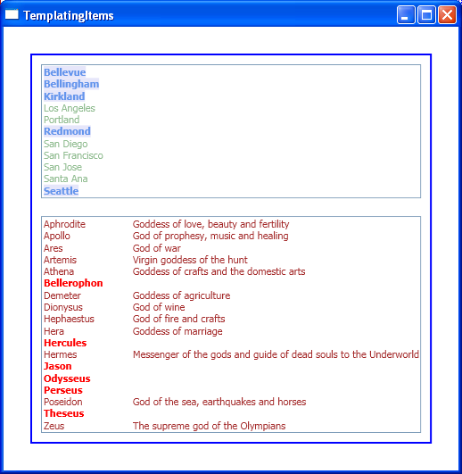

# How to display items in an ItemsControl using different templates

I will show you two ways to display some items of a data bound collection differently from others. The rule of thumb is straightforward: if you want to differentiate items that are of the same type based on one of their properties, you should use DataTemplateSelector; if your data items are of different types and you want to use the types to differentiate them, then using implicit data templating is a simpler way to do this. 

Let us consider the scenario where the source collection has elements that are all of the same type. In this case, the goal is to change the way they are displayed based on some property in the data element, and using a DataTemplateSelector is the way to go. In the sample code below, the ListBox is bound to a collection of Places, where Place is an object with properties Name and State. I want places in Washington state to be displayed differently from other places, so I defined two DataTemplates in the resources. Then I wrote a PlaceTemplateSelector that picks the correct DataTemplate based on the State property of a Place. Finally, I instantiated a ListBox whose ItemTemplateSelector DependencyProperty is set to the selector I defined.

	<Window.Resources>    
		<local:Places x:Key="places" />
	
		<DataTemplate x:Key="washingtonTemplate">
			<Border Background="Lavender">
				<TextBlock Text="{Binding Path=Name}" Foreground="CornFlowerBlue" FontWeight="Bold"/>
			</Border>
		</DataTemplate>
	
		<DataTemplate x:Key="notWashingtonTemplate">
			<TextBlock Text="{Binding Path=Name}" Foreground="DarkSeaGreen" />
		</DataTemplate>
	
		<local:PlaceTemplateSelector WashingtonTemplate="{StaticResource washingtonTemplate}" NotWashingtonTemplate="{StaticResource notWashingtonTemplate}" x:Key="placeTemplateSelector" />
	</Window.Resources>
	
	<ListBox ItemsSource="{Binding Source={StaticResource places}}" ItemTemplateSelector="{StaticResource placeTemplateSelector}" Margin="10"/>

Here is the code for the PlaceTemplateSelector:

	public class PlaceTemplateSelector : DataTemplateSelector
	{
		private DataTemplate washingtonTemplate;
	
		public DataTemplate WashingtonTemplate
		{
			get { return washingtonTemplate; }
			set { washingtonTemplate = value; }
		}
	
		private DataTemplate notWashingtonTemplate;
		
		public DataTemplate NotWashingtonTemplate
		{
			get { return notWashingtonTemplate; }
			set { notWashingtonTemplate = value; }
		}
		
		public override DataTemplate SelectTemplate(object item, DependencyObject container)
		{
			Place place = (Place)item;
		
			if (place.State == "WA")
			{
				return washingtonTemplate;
			}
			else
			{
				return notWashingtonTemplate;
			}
		}
	}

Consider now the scenario where the collection has objects with different types added to it. In this case, the goal is to template items differently depending on their type. In the sample code below, the ListBox is bound to a heterogeneous collection that contains both GreekGod and GreekHero objects.

	<Window.Resources>
		<local:GreekGodsAndHeros x:Key="godsAndHeros" />
	</Window.Resources>
	
	<ListBox ItemsSource="{Binding Source={StaticResource godsAndHeros}}" Margin="10"/>

Sure, a DataTemplateSelector could be used to template the items by picking the correct DataTemplate depending on the type of the item passed to the SelectTemplate method, as I have seen a few people do. However, implicit data templating is a better way to do this because it accomplishes the same thing all in xaml (no need for code behind). To use a DataTemplate implicitly, instead of setting its key (with x:Key), I set the DataType property to the type I want it to be applied to.

	<DataTemplate DataType="{x:Type local:GreekGod}">
		<Grid>
			<ColumnDefinition Width="100"/>
			<ColumnDefinition Width="*"/>
			<RowDefinition Height="Auto"/>
			<TextBlock Text="{Binding Path=GodName}" Grid.Column="0" Grid.Row="0" Foreground="Brown"/>
			<TextBlock Text="{Binding Path=GodDescription}" Grid.Column="1" Grid.Row="0" Foreground="Brown"/>
		</Grid>
	</DataTemplate>
	
	<DataTemplate DataType="{x:Type local:GreekHero}">
		<TextBlock Text="{Binding Path=HeroName}" FontWeight="Bold" Foreground="Red"/>
	</DataTemplate>

Here is a screen shot of the completed sample:

