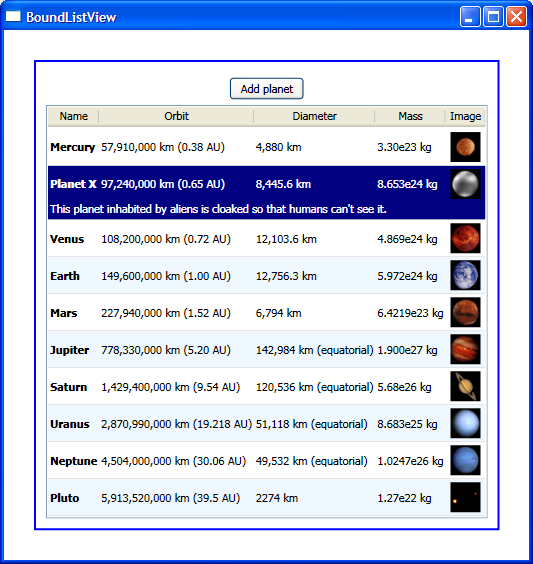

# How to implement a data bound ListView

*Update: In WPF 3.5 SP1, WPF introduced built-in support for alternating rows, so my alternating row solution below is no longer necessary. See <a href="http://blogs.msdn.com/vinsibal/archive/2008/05/28/wpf-3-5-sp1-feature-alternating-rows.aspx">Vincent's blog post</a> for more information.

The ListView control allows us to display data in a tabular form. In this post, I will show you how easy it is to data bind a ListView to XML data. I will also show you how to style the ListViewItems such that they alternate background colors, even when data items are added and removed. Someone left a comment in one of my previous posts asking for a sample with GridView and GridViewRowPresenter. I will include those in this sample and explain their behavior.

I used an XML data source of the solar system planets in this sample. This data is added to the Window's Resources in the following form:

	<Window.Resources>    
		<XmlDataProvider XPath="/SolarSystemPlanets/Planet" x:Key="planets">
			<x:XData>
			<SolarSystemPlanets xmlns="">
				<Planet Name="Mercury">
					<Orbit>57,910,000 km (0.38 AU)</Orbit>
					<Diameter>4,880 km</Diameter>
					<Mass>3.30e23 kg</Mass>
					<Image>merglobe.gif</Image>
					
The small and rocky planet Mercury is the closest planet to the Sun.

				</Planet>
				(...)
			</SolarSystemPlanets>
			</x:XData>
		</XmlDataProvider>
		(...)
	</Window.Resources>

In particular, notice the addition of the x:XData element, new in Feb CTP, and the empty XML namespace (xmlns="") on the SolarSystemPlanets element.

ListView has a View property of type ViewBase. Currently, the only class that derives from ViewBase is GridView, which can be used as in the following markup to display each of the data fields:

	<Window.Resources>
		(...)
		<DataTemplate x:Key="ImageTemplate">
			<Image Source="{Binding XPath=Image, Converter={StaticResource stringToImageSource}}" (...) />
		</DataTemplate>
	        
		<DataTemplate x:Key="NameTemplate">
			<TextBlock Text="{Binding XPath=@Name}" FontWeight="Bold" (...) />
		</DataTemplate>
		(...)
	</Window.Resources>
	    
	<ListView ItemsSource="{Binding Source={StaticResource planets}}" (...)>
		<ListView.View>
			<GridView>
				<GridView.Columns>
					<GridViewColumn Header="Name" CellTemplate="{StaticResource NameTemplate}" />
					<GridViewColumn Header="Orbit" DisplayMemberBinding="{Binding XPath=Orbit}" />
					<GridViewColumn Header="Diameter" DisplayMemberBinding="{Binding XPath=Diameter}" />
					<GridViewColumn Header="Mass" DisplayMemberBinding="{Binding XPath=Mass}" />
					<GridViewColumn Header="Image" CellTemplate="{StaticResource ImageTemplate}" />
				</GridView.Columns>
			</GridView>
		</ListView.View>
	</ListView>

You can use one of two GridViewColumn properties to control the way each planet data item is displayed: CellTemplate or DisplayMemberBinding. CellTemplate takes a DataTemplate, allowing maximum flexibility in how we visualize the data. In this particular sample, I used it for the "Name" column because I wanted it to be bold and for the "Image" column because I wanted to display the actual image (and not the name of the image, which is what is stored in the data source). DisplayMemberBinding (notice this was renamed from DisplayMemberPath in Jan CTP) should be used when we want to display the data we are binding to directly in a TextBlock.

This is all it takes to display data in a ListView - it's really simple. This is great, but we want to make the data more readable by alternating the background color from one row to the next. We need the help of a StyleSelector to accomplish this. I talked in my <a href="http://www.zagstudio.com/blog/361">Jan 14</a> post about using a DataTemplateSelector to display some data items differently from others, based on custom logic. A StyleSelector does the same thing, but instead allows us to pick a different Style for each ListViewItem, which is what we want in this scenario. In case you are not familiar with the very important difference between styles and templates: styles allow you to set properties on any FrameworkElement; templates completely override the look of a particular Control (ControlTemplate) or its data portion (DataTemplate).

	<Window.Resources>
		(...)
	        
		
        
		
	        
		<local:ListViewItemStyleSelector x:Key="ListViewItemStyleSelector" />
	</Window.Resources>
	    
	<ListView ItemContainerStyleSelector="{StaticResource ListViewItemStyleSelector}" (...)>
	
	public class ListViewItemStyleSelector : StyleSelector
	{
		private int i = 0;
		public override Style SelectStyle(object item, DependencyObject container)
		{
			// makes sure the first item always gets the first style, even when restyling
			ItemsControl ic = ItemsControl.ItemsControlFromItemContainer(container);
			if (item == ic.Items[0])
			{
				i = 0;
			}
			string styleKey;
			if (i % 2 == 0)
			{
				styleKey = "ListViewItemStyle1";
			}
			else
			{
				styleKey = "ListViewItemStyle2";
			}
			i++;
			return (Style)(ic.FindResource(styleKey));
		}
	}

I added to the Window's Resources the two Styles I want to alternate. I want ListViewItems with an even index to be white, and the odd ones to be AliceBlue. As you can see above, the StyleSelector contains simple logic to return the correct Style for each item.

Notice that these Styles have a BasedOn property set to some other Style. The BasedOn property behaves similarly to object inheritance. I will show you the base Style shortly.

This works great as long as you never add a new item to the source. If a new item is added, this code will calculate the Style for the newly added item but it will not redo the work for the other items. You will end up with two consecutive items of the same color, which is not what you want.

There are probably many ways to cause the StyleSelector to reassign the Styles for all items. In this sample, I attached a handler to the CollectionChanged event of the data source, and there I set the ListView's ItemContainerStyleSelector property to null and back to the same StyleSelector. If I don't set it to null first, Avalon is smart enough to not redo the Style assignment.

	protected override void OnInitialized(EventArgs e)
	{
		base.OnInitialized(e);
		((INotifyCollectionChanged)lv.Items).CollectionChanged += new NotifyCollectionChangedEventHandler(Restyle);
	}
	    
	private void Restyle(object sender, NotifyCollectionChangedEventArgs args)
	{
		StyleSelector selector = lv.ItemContainerStyleSelector;
		lv.ItemContainerStyleSelector = null;
		lv.ItemContainerStyleSelector = selector;
	}

Finally, I want the selected items to behave similarly to the ones in Add/Remove Programs. When I click on a planet, I want its details to appear in a single line, below the rest of the data, and spanning across all columns. 

The default template for ListViewItem contains a Border wrapping a GridViewRowPresenter. The GridViewRowPresenter is the one that does all the actual work of displaying each individual data item in tabular form. You can think of the GridView simply as a common container for the GridViewColumns, styles and templates and a few other things. 

When GridViewRowPresenter is used in the template for a ListViewItem and its Columns property is not set, it uses the collection of GridViewColumns set in the GridView automatically. All the information it needs to display the data is in the collection of GridViewColumns. The use of GridViewRowPresenter is not exclusive to ListView/GridView, though. If you set its Columns property directly, you can use it to template anything you can think of. I could go into more detail on this, but instead I will highly recommend you keep an eye on our <a href="http://blogs.msdn.com/atc_avalon_team/default.aspx">ATC's team blog</a>; they have some really cool stuff coming up.

(By the way, you can find the default templates for all our controls by using Sparkle — I mean, <a href="http://blogs.msdn.com/expression/archive/category/11753.aspx">Expression Interactive Designer</a>.)

Once you see the default template for ListViewItem and understand the role of GridViewRowPresenter, it is easy to get the details line to span across the columns: you simply need to add a TextBlock below the GridViewRowPresenter, as you can see in the markup below. (This is the base Style for the alternating Styles I mentioned before.)

	

I don't want the details to be visible all the time, though. I only want them to show for the selected item. To accomplish this, I first set the visibility of the TextBlock to collapsed (meaning that it takes no space in the layout, in addition to being invisible). I then added a Trigger that changes the TextBlock to be visible only when the ListViewItem is selected.

Here is a screenshot of the completed sample:

