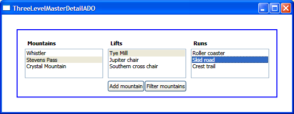

# How to bind to ADO.NET

Binding to ADO.NET data is for the most part similar to binding to objects or XML, but there are enough small differences to fill up a blog post. Designing Avalon support for ADO.NET was a little bit of a challenge: on one hand, it was important for us to maintain consistency across the different data sources; on the other, we felt it made sense to delegate as much work as we could to the ADO.NET classes (which at times broke that consistency). 

In this post I will:
- Show how to make a 3 level master-detail scenario with ADO.NET.
- Explain how (and why) change notifications work.
- Explain how to filter ADO.NET data.
- How to make a 3 level master-detail scenario with ADO.NET

In the VS project linked below, you'll find a very simple Access "mdb" database file with a hierarchical data source I used in previous posts. There are three tables in this database: Mountains, Lifts, and Runs. There is a one-to-many relationship between Mountains and Lifts and another one-to-many relationship between Lifts and Runs. In the GetData() method in the Window code behind you can find the ADO.NET code I use to read the Access data into a DataSet. I won't go into much detail about that, since there are plenty of resources out there to learn ADO.NET. The only part worth showing here is the creation of the relations between the tables because we will need their names later. The MountainsLifts relation links the Moutains and Lifts tables through the Mountain_ID column. Similarly, the LiftsRuns relation links the Lifts and Runs tables through the Lift_ID column.

	dataSet.Relations.Add("MountainsLifts",
		tables["Mountains"].Columns["Mountain_ID"],
		tables["Lifts"].Columns["Mountain_ID"]);
	    
	dataSet.Relations.Add("LiftsRuns",
		tables["Lifts"].Columns["Lift_ID"],
		tables["Runs"].Columns["Lift_ID"]);

Once you have your data in place, making a three-level master-detail application is very simple, as shown in the following markup. Notice that the DataContext is set somewhere up in the tree to the "Mountains" DataTable.

	<ListBox ItemsSource="{Binding}" DisplayMemberPath="Mountain_Name" IsSynchronizedWithCurrentItem="true" Name="lbMountains"/>
	<ListBox ItemsSource="{Binding Path=MountainsLifts}" DisplayMemberPath="Lift_Name" IsSynchronizedWithCurrentItem="true" />
	<ListBox ItemsSource="{Binding Path=MountainsLifts/LiftsRuns}" DisplayMemberPath="Run_Name" IsSynchronizedWithCurrentItem="true" />

You might be wondering how the second binding could possibly work, when there is no property MountainsLifts in DataTable.

When the data binding engine sees that the source of a binding implements IListSource (as DataTable does), it automatically calls the GetList() method, which in this case gives us the DataView. Rows in a DataView are of type DataRowView, which implements ICustomTypeDescriptor. Data binding honors this interface and will call the GetProperties() method on DataView, which will give us a few more properties. If you are curious about what those properties are, you can insert the following code somewhere in your code behind and add a breakpoint to inspect the collection:

	IList dataView = ((IListSource)ds.Tables["Mountains"]).GetList();
	PropertyDescriptorCollection coll = ((ICustomTypeDescriptor)dataView[0]).GetProperties();

You will see that coll provides three new properties to the DataRowView: the data value for each column (named Mountain_ID and Mountain_Name) and the relation we added earlier (named MountainsLifts). In the markup above, we are binding to the property MountainsLifts of the first table, which returns a DataView containing just those data items in the second table that are related to the currently selected row.

## How (and why) change notifications work

If you are using an object data source and you want the UI to be notified of changes in the source, your source object should implement INotifyCollectionChanged and/or INotifyPropertyChanged. INotifyCollectionChanged is used to tell the data binding engine that items have been added, removed, or moved within a collection. INotifyPropertyChanged is used to indicate that a property value has changed. Note that INotifyCollectionChanged does not cover changes to properties of items within a collection — the items should implement INotifyPropertyChanged themselves. I won't show an example of this here, since we have samples in the Avalon SDK for this. ADO.NET works differently.

The sample application includes a Button that adds a new Mountain to the Mountains table:

	private void AddItem(object sender, RoutedEventArgs args)
	{
		DataRow row = ds.Tables["Mountains"].NewRow();
		row["Mountain_ID"] = 4;
		row["Mountain_Name"] = "Big White";
		ds.Tables["Mountains"].Rows.Add(row);
	}

It comes as a surprise to some people that with this code, the item is also added to the UI, even though none of the ADO.NET objects implement our INotifyCollectionChanged interface. It turns out that ADO.NET's DataView already implements its own form of notification using the IBindingList interface, and Avalon's data binding engine understands that interface in addition to the usual ones. In particular, Avalon listens for the ListChanged event, whose ListChangedEventArgs contain a ListChangedType enum with values such as "ItemAdded", "ItemDeleted", and "ItemChanged".

## How to filter ADO.NET data

You can filter the items in XML and CLR collections by writing some custom code in the form of a delegate that gets called for each item. This delegate returns true or false depending on whether we want that particular item to be filtered out. You apply the filter by getting the CollectionView associated with your collection, and setting its Filter property to your delegate.

Filtering in ADO.NET is a little different, though. It is done by assigning an expression (written as a string) to the DataView's Filter property. When using a DataView as your source, Avalon allows you to use ADO.NET filtering directly (which is very efficient):

	private void FilterItems(object sender, RoutedEventArgs args)
	{
		BindingListCollectionView view = (BindingListCollectionView)CollectionViewSource.GetDefaultView(ds.Tables["Mountains"]);
		//bool canFilter = view.CanFilter; // false
		//bool canCustomFilter = view.CanCustomFilter; // true
	
		view.CustomFilter = "Mountain_Name <> 'Crystal Mountain'";
	}

In this sample, I am binding directly to the DataTable, and not to a CollectionViewSource that wraps the DataTable (as I did in a few previous blog posts). In this case, the data binding engine generates a default view of type BindingListCollectionView and binds to it. The static GetDefaultView method on CollectionViewSource returns a handle to the default view we generated internally. Notice that in this case the view type is BindingListCollectionView (and not ListCollectionView as in my previous posts with other data types) because DataView implements IBindingList. BindingListCollectionView has a new property CustomFilter of type string that allows us to set the filter expression to be passed to the DataView's Filter property. Its CanFilter property will return false because you can't filter it with the delegate you would use for other source types, but its CanCustomFilter property will return true.

Delegating all our filtering (and sorting) to the underlying DataView has one consequence that you should be aware of. If you have two different CollectionViewSources that refer to the same object or XML collection, and you filter one of them, the other one remains unfiltered. However, if the source is a DataTable or DataView, filtering the first CollectionViewSource causes the second one to be filtered as well. Because filtering is done at the source level and not at the view level, it affects both views.

The data binding team has been discussing whether or not we should change this behavior for ADO.NET. Maintaining consistency is very important for us because it helps people use their intuition to learn our features. Some of us claim that the platform would be more consistent if filtering affected ADO.NET sources in the same way as other sources, meaning that a filter applied to one CollectionViewSource should have no effect on another. Others argue that our implementation is consistent in the sense that we delegate all operations to the DataView.

If you want an opportunity to help shape Avalon, I would love to hear your opinions on this issue (note that if the current behavior changes, it will be in the Avalon V2 timeframe only).

