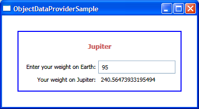

# When to use ObjectDataProvider

There are many ways to instantiate an object that will be used as the data source for bindings. I have seen many people create the object in code and set the DataContext of the Window to that instance, which is a good way to do this. You may have noticed that I have been adding the source object to the Window's Resource Dictionary in most of my previous posts, which works well too. We have an ObjectDataProvider class in data binding that can also be used to instantiate your source object in XAML. I will explain in this post the differences between adding the source object directly to the resources and using ObjectDataProvider. This will hopefully give you guidance on how to evaluate your scenario and decide on the best solution.

As I describe these features, I will walk you through building a little application that allows people to type their weight on Earth and calculates their weight on Jupiter.

When adding the source object directly to the resources, the Avalon data binding engine calls the default constructor for that type. The instance is then added to a dictionary of resources, using the key specified by x:Key. Here is an example of the markup for this solution:

	<Window.Resources>
		<local:MySource x:Key="source" />
		(...)
	</Window.Resources>

As an alternative, you can add an ObjectDataProvider to the resources and use that as the source of your bindings. ObjectDataProvider is a class that wraps your source object to provide some extra functionality. I will discuss here the following distinguishing capabilities of ObjectDataProvider:

- Passing parameters to the constructor
- Binding to a method (which may take parameters)
- Replacing the source object
- Creating the source object asynchronously

## Passing parameters to the constructor

When adding the source object to the resources directly, Avalon always calls the default constructor for that type. It may happen that you have no control over the source data, and the class you're given has no default constructor. In that case, you can still create an instance in XAML by using ObjectDataProvider in the following way:

	<ObjectDataProvider ObjectType="{x:Type local:MySource}" x:Key="odp1">
		<ObjectDataProvider.ConstructorParameters>
			<system:String>Jupiter</system:String>
		</ObjectDataProvider.ConstructorParameters>
	</ObjectDataProvider>

This markup creates a new instance of MySource by calling its constructor and passing the string "Jupiter". It also creates an instance of ObjectDataProvider, which will wrap the MySource object.

MySource has a public property called "Planet" that exposes an actual Planet object - the one whose name matches the string passed in the constructor parameter (in this case, "Jupiter"). I want to have a title Label in my application that binds to the Planet's Name property. Binding to subproperties can be done in Avalon by using "dot notation". The syntax for this is Path=Property.SubProperty, as you can see in the following markup:

	<Label Content="{Binding Source={StaticResource odp1}, Path=Planet.Name}" Grid.ColumnSpan="2" HorizontalAlignment="Center" FontWeight="Bold" Foreground="IndianRed" FontSize="13" Margin="5,5,5,15"/>

You may be looking at this binding statement and thinking that it makes no sense. It seems like we are binding to the Name subproperty of the Planet property of ObjectDataProvider. But I just mentioned that MySource is the one that has a Planet property, not ObjectDataProvider. The reason this markup works is that the binding engine treats ObjectDataProvider specially, by applying the Path to the source object that is being wrapped. Note that this special treatment is also used when binding to XmlDataProvider and CollectionViewSource.

## Binding to a method

There is a method in MySource that takes as a parameter a person's weight on Earth and calculates that person's weight on the planet passed to the constructor. I want to pass some weight to this method in XAML and bind to its result. This can also be done with ObjectDataProvider:

	<ObjectDataProvider ObjectInstance="{StaticResource odp1}" MethodName="WeightOnPlanet" x:Key="odp2">
		<ObjectDataProvider.MethodParameters>
			<system:Double>95</system:Double>
		</ObjectDataProvider.MethodParameters>
	</ObjectDataProvider>

Notice that instead of setting the ObjectType property, I set the ObjectInstance property this time. This allows us to reuse the instance of MySource that we created in the earlier ObjectDataProvider. I also set the MethodName property and pass a parameter to this method with the help of the MethodParameters property. Displaying the result returned from this method is as simple as binding to this second ObjectDataProvider:

	<Label Content="{Binding Source={StaticResource odp2}}" Grid.Row="2" Grid.Column="1" Grid.ColumnSpan="2"/>

This is a good start, but I would like to allow users to enter their own weight in a TextBox, and have the Label update to show the new result. The problem here is that I can't place a Binding statement in the MethodParameters because this property is not a DependencyProperty; in fact, ObjectDataProvider is not even a DependencyObject. Remember that the target of a Binding has to be a DependencyProperty, although the source can be anything. Luckily, there is a way out when you want to bind a CLR property to a DP: you can switch the source with the target, placing your binding in the DP and setting the binding Mode to TwoWay (or OneWayToSource). Here is how to make a TextBox that modifies the parameter being passed to the WeightOnPlanet method:

	<Window.Resources>
		(...)
		<local:DoubleToString x:Key="doubleToString" />
		(...)
	</Window.Resources>
	    
	(...)
	
	<TextBox Grid.Row="1" Grid.Column="1" Name="tb" Style="{StaticResource tbStyle}">
		<TextBox.Text>
			<Binding Source="{StaticResource odp2}" Path="MethodParameters[0]" BindsDirectlyToSource="true" UpdateSourceTrigger="PropertyChanged" Converter="{StaticResource doubleToString}">
			(...)
			</Binding>
		</TextBox.Text>
	</TextBox>

In this particular situation, because I am binding a TextBox's Text, I don't have to do anything for it to be Two-Way; it is already Two-Way by default. Bindings are One-Way by default for most DPs, and Two-Way in DPs that we expect will be changed by the user. This default behavior can be overriden by setting the Mode property of Binding.

I explained earlier that when binding to an ObjectDataProvider, the binding engine automatically looks at the source object being wrapped instead of the data provider. That is a problem for us in this situation, because we want to bind to the MethodParameters property of ObjectDataProvider. To get around the default behavior, we have to set the BindsDirectlyToSource property to true.

MethodParameters is an IList, and in this particular scenario we want to bind to the first element of the list, since the WeightOnPlanet method only takes one parameter. We can do this by using an indexer in the Path, just like we would in C# code. 

I set the UpdateSourceTrigger to PropertyChanged so that the method is called and we get a new result every time the user types something in the TextBox. Other values for UpdateSourceTrigger are "Explicit" (which I used in my December 11 post) and "LostFocus" (the source gets updated when focus moves to another element), which is the default behavior.

If we were binding to a property of type double, the binding engine would automatically convert between the TextBox's Text string and the double property. Because we are binding to a method, however, we need to write a converter ourselves. Without a converter, the binding would look for a method called WeightOnPlanet that takes a string as a parameter, and fail because no such method exists. If you looked at VS's Output window, you would see a debug message saying that we were not able to find a method that takes the parameters we are passing. This is the code for the converter:

	public class DoubleToString : IValueConverter
	{
		public object Convert(object value, Type targetType, object parameter, System.Globalization.CultureInfo culture)
		{
			if (value != null)
			{
				return value.ToString();
			}
			return null;
		}
	    
		public object ConvertBack(object value, Type targetType, object parameter, System.Globalization.CultureInfo culture)
		{
			string strValue = value as string;
			if (strValue != null)
			{
				double result;
				bool converted = Double.TryParse(strValue, out result);
				if (converted)
				{
					return result;
				}
			}
			return null;
		}
	}

Some of you may be a little confused about this converter: should it be StringToDouble or DoubleToString? The Convert method is called when transfering the data from the source (double) to the target (string), and the ConvertBack method is called in the opposite direction. So we need a DoubleToString converter, and not the other way around.

What if the user types an invalid weight? They could type a negative number, or a non-numeric string, or they could even type nothing at all. If that is the case, I don't even want to allow the binding to initiate the transfer of the value to the source. I want to build my own custom logic that will not only prevent data binding from transfering the value, but also alert the user the value is bad. This can be done with the Validation feature of data binding. I wrote a ValidationRule that checks for bad values and added it to the ValidationRules property in the following way:

	<Binding Source="{StaticResource odp2}" Path="MethodParameters[0]" BindsDirectlyToSource="true" UpdateSourceTrigger="PropertyChanged" Converter="{StaticResource doubleToString}">
		<Binding.ValidationRules>
			<local:WeightValidationRule />
		</Binding.ValidationRules>
	</Binding>

WeightValidationRule derives from ValidationRule and overrides the Validate method, where I added my custom logic:

	public class WeightValidationRule : ValidationRule
	{
		public override ValidationResult Validate(object value, System.Globalization.CultureInfo cultureInfo)
		{
			// Value is not a string
			string strValue = value as string;
			if (strValue == null)
			{
				// not going to happen
				return new ValidationResult(false, "Invalid Weight - Value is not a string");
			}
			// Value can not be converted to double
			double result;
			bool converted = Double.TryParse(strValue, out result);
			if (!converted)
			{
				return new ValidationResult(false, "Invalid Weight - Please type a valid number");
			}
			// Value is not between 0 and 1000
			if ((result < 0) || (result > 1000))
			{
				return new ValidationResult(false, "Invalid Weight - You're either too light or too heavy");
			}
				return ValidationResult.ValidResult;
		}
	}
    
Typing an invalid value will now cause a red outline to appear around the TextBox. I would like the user to be notified of the error message I returned in the ValidationResult, though. More specifically, I would like a ToolTip to come up with the error message when the user types something wrong. This can be done all in XAML, with the help of a Style and a Trigger:

	

Validation.HasError is an attached DependencyProperty that is true whenever at least one ValidationRule is in error. Validation.Errors is also an attached DependencyProperty that contains a list of all errors for a particular element. In this particular scenario we know that the TextBox can only have one error (since it only has one rule), so it's OK to bind the ToolTip to the first error in this collection. "{RelativeSource Self}" simply means the source of the binding is the TextBox element itself. Notice the parenthesis notation in the Path - parenthesis should be used every time we are binding to an attached DependencyProperty. In English, "Path=(Validation.Errors)[0].ErrorContent" means we find the attached property Validation.Errors on the source element (TextBox), get the first error object (of type ValidationError) in this list and drill into the ErrorContent subproperty of that ValidationError.

You should see a ToolTip come up with an error message when you type anything other than a number between 0 and 1000 into the TextBox.

I wrote a sample (which is in the Avalon SDK), that shows a few other aspects of Validation. There is a lot more to this feature, but a more detailed explanation will have to wait until a future post. 

## Replacing the source object

You may have a scenario where you want to swap the current source of all your bindings with another object. If you have an object in the resource dictionary that all your bindings use as source, there is no way to swap that object with something else and have all binding update. Removing that object from the resource dictionary and adding a new one with the same x:Key will not cause your bindings to be notified.

If this is your scenario, you may consider using an ObjectDataProvider. If you swap the ObjectType, all bindings to that ObjectDataProvider will be notified that the source object changed and will be updated.

Note that if you are setting the DataContext of an element up in the tree to your source data programatically, setting it to a different object will cause all bindings to update, too.

## Creating the source object asynchronously

In a nutshell, ObjectDataProvider has a property called IsAsynchronous that allows you to control whether the loading of the data happens in the same thread as your application or in a different thread. By default, ObjectDataProvider is synchronous and XmlDataProvider is asynchronous.

I am planning to talk about this in detail in one of my future posts, so stay tuned.

You could use the data source in this sample to write an Avalon application that allows the user to pick a planet and enter his or her weight, and shows the weight on that planet. It is actually very simple. I started out by writing that application, but I realized I wouldn't get to show some of the concepts I wanted to talk about, so I tweaked it until I had all the features I wanted.

