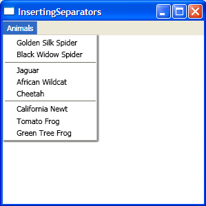

# How to insert Separator objects in a data bound MenuItem

<a href="http://www.interact-sw.co.uk/iangblog/2006/03/31/groupedwpfmenus">Ian Griffiths</a> wrote a great post about how to make Office 12 style menus in Avalon, by using the Grouping feature of data binding. Really slick looking. But what if you want the more traditional looking menus, with a simple line separating the items? Avalon has a Separator element that you can use to add a dividing line to your menus. This is really easy to accomplish when your Menu is not data bound: you simply add a Separator item together with all your other items, in the desired position. If your Menu is data bound, however, it becomes a little trickier to do this. One thing to keep in mind is that the information about where the Separator should be included has to come from your data source, too. This opens up many possibilities for how to store it and how to template it.

This first solution that comes to mind is to store Separator elements directly in a flat source collection. This is a bad solution for at least two reasons. First of all, when doing this, we are polluting the source with Avalon concepts - this data source would be useless when used with any other technology. We should strive for complete separation between UI and data. Second, this will not work when binding two ItemsControls to that same source collection. The issue is that a particular instance of a UIElement can only exist in one place in the tree.

To achieve a better separation between data and UI, I decided to create a special empty class called SeparatorData. When creating the source collection, I added a new instance of SeparatorData to the locations where I want a dividing line to appear in the UI:

	public class SeparatorData
	{
	}
	
	public class Source
	{
		private ObservableCollection<object> animalCollection;
	        
		public ObservableCollection<object> AnimalCollection
		{
			get { return animalCollection; }
		}

		public Source()
		{
			animalCollection = new ObservableCollection<object>();
			animalCollection.Add(new Animal("Golden Silk Spider", Category.Spiders));
			animalCollection.Add(new Animal("Black Widow Spider", Category.Spiders));
			animalCollection.Add(new SeparatorData());
			animalCollection.Add(new Animal("Jaguar", Category.BigCats));
			animalCollection.Add(new Animal("African Wildcat", Category.BigCats));
			animalCollection.Add(new Animal("Cheetah", Category.BigCats));
			animalCollection.Add(new SeparatorData());
			animalCollection.Add(new Animal("California Newt", Category.Amphibians));
			animalCollection.Add(new Animal("Tomato Frog", Category.Amphibians));
			animalCollection.Add(new Animal("Green Tree Frog", Category.Amphibians));
		}
	}

Now that I created my data source, I can add it to the Window's resources section and bind the MenuItem's ItemsSource to it. The next step is to template the Animal objects so that each Animal's Name property is displayed. I am using implicit data templating to control how to display each Animal instance, as you can see in the following markup:

	<Window.Resources>
		<local:Source x:Key="src"/>
	
		<DataTemplate DataType="{x:Type local:Animal}">
			<TextBlock Text="{Binding Path=Name}" />
		</DataTemplate>
	
		(...)
	</Window.Resources>
	
	<Menu>
		<MenuItem Header="Animals" ItemsSource="{Binding Source={StaticResource src}, Path=AnimalCollection}" (...) />
	</Menu>

We now want to create a Separator element for each SeparatorData object. This is a little trickier to do than you may imagine. 

By default, the SeparatorData objects are wrapped by an implicitly generated ListBoxItem. We can't use implicit data templating like we did for Animal because we want the whole item to look like a Separator; we don't want an ordinary-looking ListBoxItem that contains a Separator. 

We need a ControlTemplate with a Separator that will be applied to each ListBoxItem that contains a SeparatorData instance as its content. The problem is that ControlTemplate is applied to Controls, not to data items, so there is no DataType property we can set on ControlTemplate to make this happen implicitly.

The solution is to set the MenuItem's ItemContainerStyleSelector property to a StyleSelector that checks for the data item. If that item is of type SeparatorData, we return a Style that sets the ListBoxItem's Template property to the correct ControlTemplate.

	<Window.Resources>
		(...)
	
		
	
		<local:SeparatorStyleSelector x:Key="separatorStyleSelector"/>
	</Window.Resources>
	
	<Menu>
		<MenuItem (...) ItemContainerStyleSelector="{StaticResource separatorStyleSelector}" />
	</Menu>
	    
	public class SeparatorStyleSelector : StyleSelector
	{
		public override Style SelectStyle(object item, DependencyObject container)
		{
			if (item is SeparatorData)
			{
				return (Style)((FrameworkElement)container).FindResource("separatorStyle");
			}
			return null;
		}
	}

Ideally, we would have a selector type that would return the ControlTemplate directly, and not the Style. ItemsControl has an ItemTemplateSelector property that allows us to select a DataTemplate and an ItemContainerStyleSelector property to select a Style. When designing Avalon, we did not include an ItemControlTemplateSelector property on ItemsControl for several reasons: we suspected it would not be used often; everything you could do with it can be done with a StyleSelector as I show here; and we would have one more property complicating the API.

Here is a screenshot of the completed sample:

