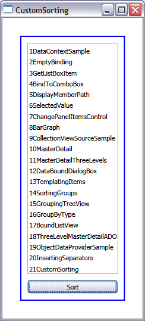

# How to add custom sorting logic

I showed in an <a href="..\14-SortingGroups">earlier post</a> how we can use CollectionViewSource to sort items in markup. This way of sorting allows us to pick Ascending or Descending sorting, but it doesn't provide any flexibility beyond that. Today I will show you how you can write your own sorting logic that enables full control over the order of items in a view.

When I write a new blog sample, I create a directory named with a number followed by a short description of the scenario. For example, for today's post, the name of the directory is 21CustomSorting. Windows Explorer knows how to do the right thing to order all those directories: the first one is 1DataContext, and all the others are displayed in increasing numeric order until 21CustomSorting. This is not a simple ascending string sort, though. A traditional string sort would display 10MasterDetail - 19ObjectDataProviderSample, 1DataContext, 20InsertingSeparators, 21CustomSorting, 2EmptyBinding - 9CollectionViewSourceSample, which is obviously not what I want. I will show you today how you can order strings that start with numbers the same way as Explorer. I will also give you a quick overview of Avalon's view classes.

A view is a layer on top of a collection that allows us to sort, filter and group the collection. Views also remember the current item of a collection, which is useful for the master-detail scenario. The base class for all views is CollectionView, which is where we keep the API for sorting, filtering, grouping and current item. There are currently two classes that derive from CollectionView: BindingListCollectionView and ListCollectionView. The view type we create internally depends on the type of your source collection:

- A CollectionView is created if your source implements IEnumerable. If the source implements IEnumerable *only*, you will not be able to sort or group the collection (you can only filter it). Also, perf will not be the best if the source has a large number of items or if you perform dynamic operations such as insertions and deletions. If this is your scenario, you should consider having your source implement a stronger interface. ICollection is slightly better because it provides a Count property. 

- ListCollectionView is the view type created when the source implements IList. Compared to IEnumerable and ICollection, IList performs much better for large or dynamic lists because it provides an indexer, allowing us quick random access. In addition, IList allows sorting, grouping and filtering. But ideally your source collection derives from ObservableCollection&lt;T&gt;, the mother of all collections in the eyes of data binding, since it provides several extra goodies such as property and collection change notifications.

- BindingListCollectionView is the type of view created by Avalon when the source collection implements IBindingList. This is the view we deal with in the ADO.NET scenario. It supports sorting and grouping, but not traditional filtering. Instead, it has an additional CustomFilter property that delegates filtering to the DataView (see <a href="..\18-ThreeLevelMasterDetailADO">my post on ADO.NET</a> for more details).

Note that if your source collection implements both IBindingList and IList, IBindingList has priority, and a BindingListCollectionView is created.

ListCollectionView has an extra CustomSort property that allows us to provide our own sorting logic, which is what I will show you next. The source collection for this sample is an  ObservableCollection&lt;string&gt; of the directory names that I use for my blog posts. The UI of this sample contains a ListBox of blog post directory names, initially in random order, and a "Sort" Button:

	<Window.Resources>
		<local:BlogPosts x:Key="posts"/>
		(...)
	</Window.Resources>

	<ListBox ItemsSource="{StaticResource posts}" (...) Name="lb"/>
	<Button Click="Sort" Content="Sort" Margin="0,10,0,0"/>

When the user clicks the "Sort" button, we get the default view for the source collection, cast it to ListCollectionView, and give it some custom sort logic. The GetDefaultView method returns a CollectionView, but we can cast it to ListCollectionView because we know that the BlogPosts source collection implements IList.

	private void Sort(object sender, RoutedEventArgs args)
	{
		BlogPosts posts = (BlogPosts)(this.Resources["posts"]);
		ListCollectionView lcv = (ListCollectionView)(CollectionViewSource.GetDefaultView(posts));
		lcv.CustomSort = new SortPosts();
	}

The CustomSort property is of type IComparer. We need to create a new class that implements IComparer, and add our sorting logic to its Compare method. This method should return a negative number if x comes before y, a positive number if x comes after y, and zero if they are equivalent.

	public class SortPosts : IComparer
	{
		public int Compare(object x, object y)
		{
			(...)
		}
	}

Here is a screenshot of the completed sample:

