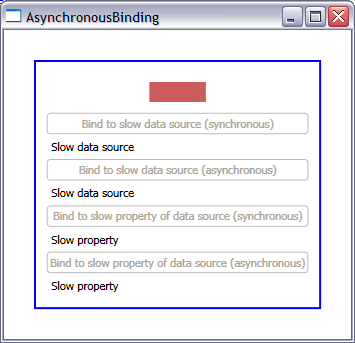

# How to control whether my Binding is synchronous or asynchronous

I will explain in this post how you can control whether your binding is synchronous or asynchronous. As you know, a synchronous binding will freeze the UI while it's fetching the data, while an asynchronous binding will start a second thread and keep the UI responsive. Understanding the default behavior will allow you to make the best decision for your particular scenario, whether that is keeping or changing it.

I will distinguish two very different scenarios in this sample: 

- The whole data source takes a while to be available. For example, you are binding to a web service, an RSS feed, or an external XML file. In this case, the actual creation of the data object is not immediate.

- A property in your data source is slow. In this scenario, the data source is created very quickly, but one of its properties takes a while to return from the getter (for example, the property uses an HttpWebRequest). Note that the .NET guidelines recommend against having slow code in a property getter, and so we actually went back and forth about whether we should support this scenario.

## Slow data source

I talked in an <a href="..\19-ObjectDataProviderSample">earlier post</a> about ObjectDataPovider, and mentioned that you will need it if you want to retrieve your data asynchronously. Well, here is the scenario where you would want to use it: when your whole data source is slow. I simulated a slow data source with the following code:

	public class SlowDataSource
	{
		private string property;
	
		public string Property
		{
			get { return property; }
			set { property = value; }
		}
	
		public SlowDataSource()
		{
			Thread.Sleep(3000);
			this.property = "Slow data source";
		}
	}

ObjectDataProvider has an IsAsynchronous property, which when set to true, tells Avalon to create the data source object in a worker thread. Keep in mind that by default the IsAsynchronous property is false, so you have to remember to set it to true. The following code shows how to create the ObjectDataProvider and Binding such that binding to the SlowDataSource object will not block the UI thread:

	ObjectDataProvider odp = new ObjectDataProvider();
	odp.IsAsynchronous = true;
	odp.ObjectType = typeof(SlowDataSource);
	Binding b = new Binding();
	b.Source = odp;
	b.Path = new PropertyPath("Property");
	tbSlowDSSync.SetBinding(TextBlock.TextProperty, b);

We made ObjectDataProvider synchronous by default because we typically expect object sources to be quick to retrieve. XmlDataProvider works similarly, except the IsAsynchronous property is set to true by default. We made it asynchronous by default because we expect it to be used mostly when binding to external XML files and RSS feeds, which can take a while to get to. If you only have 5 lines of XML embedded in your XAML page, however, you may want to set the IsAsynchronous property to false. 

!!Slow property in fast data source

In this second scenario, we get a handle to the data source pretty quickly, but one of its properties can be quite slow to retrieve. Here is a simulated sample of such a data source:

	public class DataSource
	{
		private string slowProperty;
		
		public string SlowProperty
		{
			get
			{
				Thread.Sleep(3000);
				return slowProperty;
			}
			set { slowProperty = value; }
		}
	
		public DataSource()
		{
			this.slowProperty = "Slow property";
		}
	}

In this scenario, we don't have to use ObjectDataProvider anymore. We can create the object in the same thread as the application, and we may want to bind to other fast properties in this same data source synchronously. We want to bind to just that one slow property asynchronously, so we don't block the UI. To achieve this, we can use the IsAsync property of Binding, as you can see in the following code snippet:

	DataSource source = new DataSource();
	Binding b = new Binding();
	b.Source = source;
	b.IsAsync = true;
	b.Path = new PropertyPath("SlowProperty");
	tbSlowPropAsync.SetBinding(TextBlock.TextProperty, b);

The IsAsync property is false by default, so you have to remember to set it to true in this scenario. We decided to make it false by default because slow setters are bad practice, so we don't expect this to be a common scenario.

Note that you could just as easily create asynchronous data providers or bindings from within XAML; I made them in code because a few people have asked for examples.

Below is a screenshot of the application. The rectangle on top is animating so you can clearly see the UI freeze when doing the synchronous bindings.

