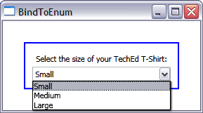

# How to bind an ItemsControl to the values of an enumeration

Today I will show how you can bind a ComboBox to all the possible values of an enumeration, using only XAML. This scenario was blocked by a bug in Feb CTP bits, so you will need Beta 2 bits to run this sample.

I have the following enumeration in the code behind of this sample:

	public enum TShirtSizes
	{
		Small,
		Medium,
		Large
	}

In the UI of my application, I have a ComboBox for TechEd staff to pick their T-Shirt size (you guys are all going to TechEd in Boston next week, right?). I want the entries in that ComboBox to display the values in the enum. 

This is really easy to do. It turns out that there is a static method on Enum that returns an Array of all the values of a particular enumeration. This is how we could get the array of values through code:

	Enum.GetValues(typeof(TShirtSizes));

Binding to this method can easily be done in XAML by using ObjectDataProvider:

	<ObjectDataProvider MethodName="GetValues" ObjectType="{x:Type sys:Enum}" x:Key="odp">
		<ObjectDataProvider.MethodParameters>
			<x:Type TypeName="local:TShirtSizes"/>
		</ObjectDataProvider.MethodParameters>
	</ObjectDataProvider>
	
	<StackPanel>
		<Label>Select the size of your TechEd T-Shirt:</Label>
		<ComboBox ItemsSource="{Binding Source={StaticResource odp}}" IsSynchronizedWithCurrentItem="true"/>
	</StackPanel>

I explained binding to a method using ObjectDataProvider in an <a href="http://www.zagstudio.com/blog/438">earlier post</a>. As you can see, there is nothing special about using ObjectDataProvider to bind to a *static* method (with the exception of the bug in Feb CTP).

Keep in mind that the values of the enumeration will be displayed in the ComboBox in the order they are defined (though you can control their order by sorting them with the help of a CollectionViewSource).

Below is a screenshot of the application:

