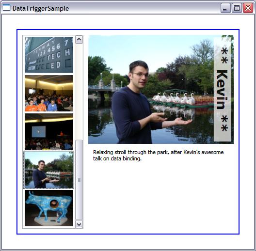

# How to display items differently based on their properties

I had a blast at TechEd. It was great to connect with our customers face to face, hear what everyone had to say about Avalon, and bring the praise and feedback to the team. I am very proud of the technology we are building and I get really thrilled when I hear success stories from our customers. 

Our PMs are all amazing speakers and their talks were very well received by the audience. <a href="http://work.j832.com/">Kevin</a> in particular did a great job at explaining the ins and outs of data binding, with a little humor between the lines (soooo like Kevin...). I was really pleased to see the audience clapping after he showed off certain features, such as binding to sub-properties and indexers.

The sample for this post displays a few pictures from TechEd with the help of the master-detail data binding feature, which I already talked about in a <a href="http://www.zagstudio.com/blog/355">previous post</a>. I will explain in this post how you can use a DataTrigger to change the way data items are displayed based on their properties. In particular, I am going to display a special visual tag with Kevin's name for all pictures of him, as you can see in the screenshot at the end of this post. 

My first step was to tag all the pictures I wanted to display. In order to do this, I right clicked on each of them, went to Properties - Summary and filled out the Title and Keywords fields. I added different keywords to the pictures, but the one I care about for this sample is "Kevin", which I added to all pictures of Kevin. 

Since I added all the information to the picture's metadata, my data source is really simple:

	public class TechEdPictures : ObservableCollection<Uri>
	{
		public TechEdPictures()
		{
			this.Add(new Uri(@"Pictures\TechEd 004.jpg", UriKind.Relative));
			this.Add(new Uri(@"Pictures\TechEd 022.jpg", UriKind.Relative));
			(...)
		}
	}

I'm not going to explain master-detail again, but here is the markup I used to get the ContentControl's Content to change when the ListBox's selection (and current item) changes:

	<StackPanel Orientation="Horizontal" DataContext="{StaticResource source}">
		<ListBox ItemsSource="{Binding}" ItemTemplate="{StaticResource picSmall}" Height="400" IsSynchronizedWithCurrentItem="True" />
		<ContentControl Content="{Binding Path=/}" ContentTemplate="{StaticResource picBig}"/>
	</StackPanel>

The template for the small images in the ListBox is also pretty simple:

	<DataTemplate x:Key="picSmall">
		<Image Source="{Binding}" Width="100" Margin="2"/>
	</DataTemplate>

Next I want to display Kevin's name everytime I bind to an image that contains "Kevin" in the keywords. I started by creating a TextBlock with the text "Kevin", added a white background with an opacity, rotated it and aligned it to the right of the image. Notice that both elements are inside a Grid. Because I didn't specify a row and column for the Image and the TextBlock, they will by default appear in the first row and column, and overlap.

	<DataTemplate x:Key="picBig">
		<StackPanel Margin="10, 0, 0, 0" Width="300" >
			<Grid>
				<Image Source="{Binding}" x:Name="img"/>
				<TextBlock Background="White" Opacity="0.7" Text="** Kevin **" Margin="5" FontWeight="Bold" FontSize="30" TextAlignment="Center" HorizontalAlignment="Right" Visibility="Hidden" x:Name="tb">
					<TextBlock.LayoutTransform>
						<RotateTransform Angle="90" />
					</TextBlock.LayoutTransform>
				</TextBlock>
			</Grid>
			<TextBlock Text="{Binding ElementName=img, Path=Source.Metadata.Title}" TextWrapping="Wrap" Margin="10" Height="100"/>
		</StackPanel>
		(...)
	</DataTemplate>

And now comes the interesting part. Notice that I set the Visibility of the TextBlock to Hidden. I need some logic that will set it to Visible when the image contains "Kevin" in the keywords - some sort of trigger. Avalon contains three types of triggers:

- EventTriggers - Used to control animations when a certain event occurs.
- Triggers - Used to set properties when a property of a UI element has a certain value.
- DataTriggers - Used to set properties when the result of a binding has a particular value.

In this case, we want to trigger based on the Metadata of the Image's Source, which can be easily expressed with an ElementName binding, so we should use a DataTrigger.

	<DataTemplate x:Key="picBig">
		<StackPanel Margin="10, 0, 0, 0" Width="300" >
			(...)
		</StackPanel>
		<DataTemplate.Triggers>
			<DataTrigger Binding="{Binding ElementName=img, Path=Source.Metadata.Keywords, Converter={StaticResource isInKeywords}, ConverterParameter=Kevin}" Value="True">
				<Setter Property="Visibility" Value="Visible" TargetName="tb" />
			</DataTrigger>
		</DataTemplate.Triggers>
	</DataTemplate>

Keep in mind that Metadata.Keywords returns a ReadOnlyCollection&lt;string&gt; and the keyword could be in any position in the collection. This makes things a little more complicated, because DataTriggers can only trigger when the result of the binding is exactly equal to the value you specify. The trick to make DataTriggers support any logic you want is to add a Converter containing that logic. In this case, my Converter returns True if the string "Kevin" is part of the metadata keywords, and False otherwise. When the result of this conversion equals the trigger's Value (True), the trigger will set the Visibility property of the TextBlock - which has the name "tb" - to Visible.

I did not want to hardcode the string "Kevin" in the Converter though; I wanted it to be generic enough to handle any string. I accomplished this by setting the ConverterParameter property in the binding to "Kevin", as you can see in the markup above.

Here is the code for the Converter:

	public class IsInKeywords : IValueConverter
	{
		public object Convert(object value, Type targetType, object parameter, CultureInfo culture)
		{
			ReadOnlyCollection<string> keywords = value as ReadOnlyCollection<string>;
			return keywords.Contains(parameter.ToString());
		}
	
		(...)
	}

Customers frequently ask, "How can I trigger when the Binding and Value are *not* equal?" Or, in case the binding is an integer, "How can I trigger when the result of the binding is bigger than 10?" The trick I show here with the Converter can be used for any of these scenarios.

Here is a screenshot of the complete application. And if you don't care about the technology, you should still download it to look at the pictures.  

