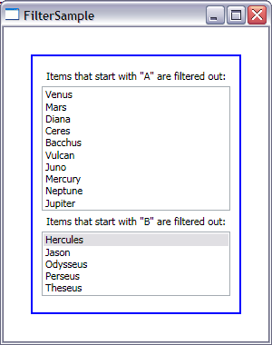

# How to filter items from a collection

Today I will show you two ways of using the filter feature of data binding.

There are two ObservableCollections of items in this sample. The first one contains a list of GreekGods, and the ListBox that displays it shows their Roman names. The second one contains a list of GreekHeroes. I will use these two collections to show two different ways of filtering items. 

I decided to filter out all items that start with "A" from the first collection. I started out by adding a new instance of the GreekGods collection to the resources and bound a ListBox's ItemsSource to that collection:

	<Window.Resources>
		<local:GreekGods x:Key="src1"/>
		(...)
	</Window.Resources>
	
	<Label>Items that start with "A" are filtered out:</Label>
	<ListBox ItemsSource="{Binding Source={StaticResource src1}}" DisplayMemberPath="RomanName"/>

In the constructor for the Window, I added code after initialization to get the default view for this collection. Remember that we never bind directly to the collection; there is always a view on top of that collection that we bind to. In this case I am not creating that view explicitly with the help of a CollectionViewSource, so a default view is created behind the scenes. I can get to that default view by using the GetDefaultView static method of CollectionViewSource:

	public Window1()
	{
		InitializeComponent();
	    
		object src1 = this.Resources["src1"];
		ICollectionView collectionView = CollectionViewSource.GetDefaultView(src1);
		collectionView.Filter = new Predicate<object>(FilterOutA);
	}

Once I have a handle to the view, I am able to set its Filter property to the Predicate&lt;object&gt; callback function below:

	public bool FilterOutA(object item)
	{
		GreekGod gg = item as GreekGod;
		if ((gg == null) || gg.RomanName.StartsWith("A"))
		{
			return false;
		}
		else
		{
			return true;
		}
	}

This method is called once for each item. If the item is a GreekGod whose Roman name begins with "A", it will return false, and that item will be filtered out. Otherwise, it will return true and the item will be displayed.

Similarly, I decided to filter out all items that start with B from the second collection. However, this time I am using CollectionViewSource explicitly. I set the Source property of the CollectionViewSource to the collection and bind the ListBox's ItemsSource to the CollectionViewSource:

	<Window.Resources>
		(...)
		<local:GreekHeroes x:Key="src2"/>
	
		<CollectionViewSource Source="{StaticResource src2}" x:Key="cvs" Filter="FilterOutB"/>
	</Window.Resources>
	
	<Label>Items that start with "B" are filtered out:</Label>
	<ListBox ItemsSource="{Binding Source={StaticResource cvs}}" DisplayMemberPath="HeroName"/>

We came up with the CollectionViewSource class to serve two purposes: 1) To allow us to do view related operations in XAML, such as grouping, sorting, filtering or creating a custom view of a certain type and 2) To serve as a container for all the view methods, such as GetDefaultView or IsDefaultView. Before we came up with this class these methods were in the Binding class, which cluttered it with unrelated methods and made it hard for users to find them.

I've been asked several times about the difference between CollectionView and CollectionViewSource. The difference is simple: CollectionViewSource is not a view, but a class that contains handles to the source and the corresponding view and is used for the purposes I described above. CollectionView is an actual view on top of a collection, which contains information about the current item, filtering, sorting and grouping.

Unfortunately you still need code to specify which items are filtered in or out:

	private void FilterOutB(object sender, FilterEventArgs e)
	{
		GreekHero gh = e.Item as GreekHero;
		if ((gh == null) || gh.HeroName.StartsWith("B"))
		{
			e.Accepted = false;
		}
		else
		{
			e.Accepted = true;
		}
	}

Note that the Filter property in CollectionViewSource is not a delegate like the one in CollectionView, but an event handler. We made this decision so that you could specify the name of the filter method in XAML. At this point, there is no support to add the name of the callback method of a delegate in XAML, but this support exists for events. We realize that the two ways of filtering are a little inconsistent, but this design brings us closer to our goal of allowing the user to do as much as possible in XAML with CollectionViewSource.

The filter event handler has a FilterEventArgs argument, which has two interesting properties: the Item property that provides the item on which we need to make the filter decision, and the Accepted property where we set the result of that decision. If we set Accepted to false, the item will be filtered out, and if we set it to true, the item will be displayed.

Here is a screenshot of the completed sample:

