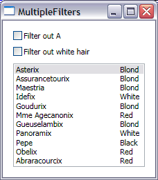

# How to apply more than one filter

Today I will explain how you can apply more than one filter to a data bound view of a collection.

I showed in my last post the two ways of filtering. CollectionViewSource allows us to filter by attaching an event handler to the Filter event (of type FilterEventHandler). You may be wondering what happens if we attach more than one filter event handler to the same CollectionViewSource's Filter event. It turns out that each of the event handlers is called in the sequence they were attached, once for each item. This allows each handler to override whatever filtering decision was made in the previous ones.

The good news is that within any event handler, you have access to the filtering decision made by the previous handlers. You can use this information to decide whether to filter the current item. I will show you how to do this next.

In my XAML file, I created an instance of an ObservableCollection with items of type AsterixCharacter, which contains two properties: one with the name of the character, and another one with its hair color. I then created a CollectionViewSource whose Source property points to this collection and bound the ListBox to it.

	<Window.Resources>
		<local:AsterixCharacters x:Key="asterix"/>
	
		<CollectionViewSource Source="{StaticResource asterix}" x:Key="cvs"/>
	
		<DataTemplate x:Key="characterTemplate">
			<StackPanel Orientation="Horizontal">
				<TextBlock Width="150" Text="{Binding Path=Name}" />
				<TextBlock Text="{Binding Path=Hair}" />
			</StackPanel>
		</DataTemplate>
	</Window.Resources>
	
	<StackPanel Margin="10" Width="200" >
		<CheckBox Content="Filter out A" Checked="AddAFilter" Unchecked="RemoveAFilter" Margin="5"/>
		<CheckBox Content="Filter out white hair" Checked="AddWhiteHairFilter" Unchecked="RemoveWhiteHairFilter" Margin="5"/>
		<ListBox ItemsSource="{Binding Source={StaticResource cvs}}" ItemTemplate="{StaticResource characterTemplate}" Margin="5"/>
	</StackPanel>

When the first check box is checked, I want to filter out all Asterix characters whose names start with A. Likewise, when the second check box is checked, I want to filter out all characters with white hair. It is important to me that these two filter conditions are in different handlers (I could be reusing one of the handlers in another scenario, for example). Here is the code where I add and remove the filter event handler associated with the first check box:

	CollectionViewSource cvs;
	public Window1()
	{
		InitializeComponent();
		cvs = (CollectionViewSource)(this.Resources["cvs"]);
	}
	 
	private void AddAFilter(object sender, RoutedEventArgs e)
	{
		cvs.Filter += new FilterEventHandler(FilterOutA);
	}
	
	private void RemoveAFilter(object sender, RoutedEventArgs e)
	{
		cvs.Filter -= new FilterEventHandler(FilterOutA);
	}

In order for the filter event handlers to work properly without interfering with each other, I made sure they only set the Accepted property of the FilterEventArgs to false when necessary to filter an item out. I never set the Accepted property to true, since that might override another filter's decision to keep an item out of the view. Here is my implementation:

	private void FilterOutA(object sender, FilterEventArgs e)
	{
		AsterixCharacter character = e.Item as AsterixCharacter;
		if ((character == null) || character.Name.StartsWith("A"))
		{
			e.Accepted = false;
		}
	}
	
	private void FilterOutWhiteHair(object sender, FilterEventArgs e)
	{
		AsterixCharacter character = e.Item as AsterixCharacter;
		if ((character == null) || (character.Hair == HairColor.White))
		{
			e.Accepted = false;
		}
	}

Here is a screenshot of the completed sample:

