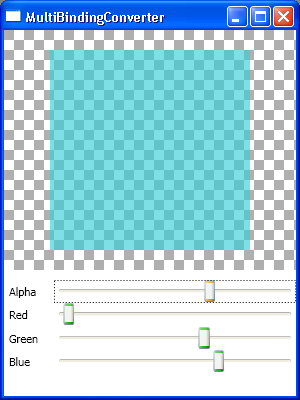

# How to control a color using Sliders

I will show you today how you can use four sliders (alpha, red, green, blue) to control the background color of a rectangle. This simple app allows the user to change the opacity and color of the rectangle by sliding each of the sliders. 

I started by defining a Rectangle with its Background set to a SolidColorBrush. The target of the Binding will be the Color property of this brush. The source is a little more complicated, since we have four sources for the same Binding. The Binding needs to know the value from each of the four sliders in order to produce an output value (the color) with that information. Anytime you need to combine several sources and bind them to a single target, you need a MultiBinding. You can think of a MultiBinding as a black box that accepts several Bindings as input, combines all those inputs with the help of a Converter and produces one single value which will be set to the target property.

You need two pieces of important information when you define a MultiBinding: you need to know all the individual bindings and you need to know the logic that combines them. In this sample, the individual bindings use ElementName to target each of the Sliders and bind to their Value property:

	<Window.Resources>
		<local:Conv x:Key="conv" />
		(...)
	</Window.Resources>
	
	<Rectangle Width="200" Height="200" Margin="20">
		<Rectangle.Fill>
			<SolidColorBrush>
				<SolidColorBrush.Color>
					<MultiBinding Converter="{StaticResource conv}">
						<MultiBinding.Bindings>
							<Binding ElementName="alpha" Path="Value" />
							<Binding ElementName="red" Path="Value" />
							<Binding ElementName="green" Path="Value" />
							<Binding ElementName="blue" Path="Value" />
						</MultiBinding.Bindings>
					</MultiBinding>
				</SolidColorBrush.Color>
			</SolidColorBrush>
		</Rectangle.Fill>
	</Rectangle>
	
	<Slider Minimum="0" Maximum="1" Value="0.75" Name="alpha" />
	<Slider Minimum="0" Maximum="1" Value="0.3" Name="red" />
	<Slider Minimum="0" Maximum="1" Value="0.7" Name="green" />
	<Slider Minimum="0" Maximum="1" Value="0.1" Name="blue" />

A MultiBinding's Converter is very similar to a Binding's Converter. The main difference here is that instead of receiving one single object value as the first parameter of the Convert method, it receives an array of objects. Those items contain the result produced by each of the Bindings that are part of the MultiBinding, in the order they are defined. In this particular app, I am getting the alpha, red, green and blue values that I need to create a Color. Here is my implementation of this Converter:

	public class Conv : IMultiValueConverter
	{
		public object Convert(object[] values, Type targetType, object parameter, System.Globalization.CultureInfo culture)
		{
			// Note that we have to downcast each of the values (an object) to its actual
			// type (double) before converting it to a float.
			float alpha = (float)(double)(values[0]);
			float red = (float)(double)(values[1]);
			float green = (float)(double)(values[2]);
			float blue = (float)(double)(values[3]);
	
			return Color.FromScRgb(alpha, red, green, blue);
		}
	
		public object[] ConvertBack(object value, Type[] targetTypes, object parameter, System.Globalization.CultureInfo culture)
		{
			throw new NotSupportedException("ConvertBack should never be called");
		}
	}

Many thanks to Adam Smith (dev lead for the 2D and 3D teams) for giving me the idea for this sample, for coding it with me, and for always being fun to chat with.

Here is a screenshot of the completed project:

