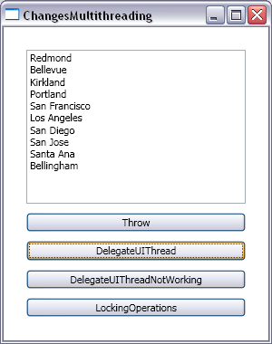

# How to propagate changes across threads

I hope you didn't get your hopes up too much when you read the title for this post. This time, instead of showing off what we support in our platform, I will explain to you what we don't.  The scenario I have in mind is when you want to bind a control in the UI thread to a collection or property that is modified in a different worker thread. My goal for this post is to tell you what works today and what doesn't, and although no good workaround exists, I will discuss some ideas around this topic. 

Here is the quick version of this post:
- We do not support collection change notifications across threads.
- We support property change notifications across threads.

Now the long version:

(Disclaimer: I will try to make the content as easy to read as possible, but you will only take full advantage of this post if you're comfortable with multithreading, the Avalon Dispatcher and some basic data binding.)

## Collection change notifications

In this scenario, I have a ListBox that is data bound to a collection of Place objects:

	<ListBox Name="lb"/>
	<Button Click="Throw_Click">Throw</Button>
	
	ObservableCollection<Place> throwPlaces;
	
	private void Throw_Click(object sender, RoutedEventArgs e)
	{
		throwPlaces = new ObservableCollection<Place>();
		AddPlaces(throwPlaces);
		lb.ItemsSource = throwPlaces;
		lb.DisplayMemberPath = "Name";
		(...)
	}
	
	private void AddPlaces(ObservableCollection<Place> places)
	{
		places.Add(new Place("Seattle", "WA"));
		places.Add(new Place("Redmond", "WA"));
		places.Add(new Place("Bellevue", "WA"));
		(...)
	}

Pretty simple. Next, I want to make sure that any changes to my collection are propagated to the UI. Typically, if you are using ObservableCollection&lt;T&gt;, this comes for free because it already implements INotifyCollectionChanged. However, this time I want to change the collection from a different thread:

	Thread workerThread1;
	
	private void Throw_Click(object sender, RoutedEventArgs e)
	{
		(...)
		workerThread1 = new Thread(new ThreadStart(CrashMe));
		workerThread1.Start();
	}
	
	void CrashMe()
	{
		throwPlaces.RemoveAt(0);
	}

Unfortunately, this code results in an exception: "NotSupportedException - This type of CollectionView does not support changes to its SourceCollection from a thread different from the Dispatcher thread." I understand this error message leads people to think that, if the CollectionView they're using doesn't support cross-thread changes, then they have to find the one that does. Well, this error message is a little misleading: none of the CollectionViews we provide out of the box supports cross-thread collection changes. And no, unfortunately we can not fix the error message at this point, we are very much locked down. 

If you understand the Avalon Dispatcher, you're probably already working on a master plan to delegate all collection change operations to the UI thread. You can do this by deriving from ObservableCollection, making sure your constructor takes a dispatcher as a parameter, and overriding all collection change operations. Here is my implementation of this collection:

	public class BeginInvokeOC<T> : ObservableCollection<T>
	{
		private Dispatcher dispatcherUIThread;
		
		private delegate void SetItemCallback(int index, T item);
		private delegate void RemoveItemCallback(int index);
		private delegate void ClearItemsCallback();
		private delegate void InsertItemCallback(int index, T item);
		private delegate void MoveItemCallback(int oldIndex, int newIndex);
		
		public BeginInvokeOC(Dispatcher dispatcher)
		{
			this.dispatcherUIThread = dispatcher;
		}
		
		protected override void SetItem(int index, T item)
		{
			if (dispatcherUIThread.CheckAccess())
			{
				base.SetItem(index, item);
			}
			else
			{
				dispatcherUIThread.BeginInvoke(DispatcherPriority.Send, new SetItemCallback(SetItem), index, new object[] { item });
			}
		}
		
		// Similar code for RemoveItem, ClearItems, InsertItem and MoveItem
		(...)
	}

When you create this collection, make sure you pass the dispatcher from the UI thread as a parameter to the constructor. Now imagine you change this collection from a worker thread. The first time SetItem is called, CheckAccess will return false because we are not in the UI thread. We will then add a call to this same method to the UI thread's dispatcher queue, at priority Send. Once the dispatcher finishes processing the current job (and any other higher priority jobs), it picks up the one we added and SetItem is called again, this time on the UI thread. CheckAccess is called again, but this time it returns true, and we call SetItem on the collection. In plain english, this code means "Use the UI thread to set an item in the collection."

Here is the code that uses this collection:

	<ListBox Name="lb"/>
	<Button Click="DelegateUIThread_Click">DelegateUIThread</Button>
	
	BeginInvokeOC<Place> beginInvokePlaces;
	
	private void DelegateUIThread_Click(object sender, RoutedEventArgs e)
	{
		beginInvokePlaces = new BeginInvokeOC<Place>(lb.Dispatcher);
		AddPlaces(beginInvokePlaces);
		lb.ItemsSource = beginInvokePlaces;
		lb.DisplayMemberPath = "Name";
		workerThread1 = new Thread(new ThreadStart(DontCrashMe));
		workerThread1.Start();
	}
	
	void DontCrashMe()
	{
		beginInvokePlaces.RemoveAt(0);
	}

If you click this button, you will see that the data will actually be changed (the item at index 0 will be removed) without any crashes. This will probably work OK if you only have the UI thread and a worker thread, but it may get you into trouble if you have two or more worker threads. This has nothing to do with Avalon, it's just a plain multithreading problem. Let's take a look at this same solution, but with two worker threads this time:

	private void DelegateUIThreadNotWorking_Click(object sender, RoutedEventArgs e)
	{
		beginInvokePlaces = new BeginInvokeOC<Place>(lb.Dispatcher);
		AddPlaces(beginInvokePlaces);
		lb.ItemsSource = beginInvokePlaces;
		lb.DisplayMemberPath = "Name";
		workerThread1 = new Thread(new ThreadStart(DelegateUIThreadNotWorking_Thread1));
		workerThread1.Start();
		workerThread2 = new Thread(new ThreadStart(DelegateUIThreadNotWorking_Thread2));
		workerThread2.Start();
	}
	
	void DelegateUIThreadNotWorking_Thread1()
	{
		int count = beginInvokePlaces.Count;
		Thread.Sleep(500); // do a bunch of work (or be really unlucky to be interrupted by another thread here)
		Place newPlace = beginInvokePlaces[count - 1];
	}
	
	void DelegateUIThreadNotWorking_Thread2()
	{
		Thread.Sleep(100); // do a little work
		beginInvokePlaces.RemoveAt(0);
	}

Look at the DelegateUIThreadNotWorking_Thread1() method. If you are unlucky enough to have execution switch from thread 1 to thread 2 between the calculation of the count and the use of indexer, and if you're even more unlucky to have thread 2 change your collection, you're in trouble. In this particular scenario, count is initially 11 in thread 1, then thread 2 removes an item and it becomes 10. However, when execution goes back to thread 1, the indexer still thinks count is 11, and will look for the item in index 11 - 1, which will throw an ArgumentOutOfRangeException. In a real world scenario, the probability of this happening would increase with the amount of work you would do in place of the Thread.Sleep(500) call.

If we're getting synchronization problems, the next logical step is to lock any atomic operations on these threads. Here is how I did that:

	<ListBox Name="lb"/>
	<Button Click="LockingOperations_Click">LockingOperations</Button>
	
	InvokeOC<Place> invokePlaces;
	object lockObject;
	
	public Window1()
	{
		InitializeComponent();
		lockObject = new object();
	}
	
	private void LockingOperations_Click(object sender, RoutedEventArgs e)
	{
		invokePlaces = new InvokeOC<Place>(lb.Dispatcher);
		AddPlaces(invokePlaces);
		lb.ItemsSource = invokePlaces;
		lb.DisplayMemberPath = "Name";
		workerThread1 = new Thread(new ThreadStart(LockingOperations_Thread1));
		workerThread1.Start();
		workerThread2 = new Thread(new ThreadStart(LockingOperations_Thread2));
		workerThread2.Start();
	}
	
	void LockingOperations_Thread1()
	{
		lock (lockObject)
		{
			int count = invokePlaces.Count;
			Thread.Sleep(500); // do a bunch of work
			Place newPlace = invokePlaces[count - 1];
		}
	}
	
	void LockingOperations_Thread2()
	{
		lock (lockObject)
		{
			Thread.Sleep(100); // do a little work
			invokePlaces.RemoveAt(0);
		}
	}

Because I am locking all atomic sequences of operations and all changes to the collection, I know that the logic in the worker threads will never lead to the synchronization problem in the previous example. The code that does the item generation in ItemsControl has a handle to the collection, but I can tell you for sure that it never modifies the collection (it only reads it), so there should be no conflicts with the UI thread either. I also couldn't think of a scenario where this code would lead to a deadlock (although it's easier to prove the existence of a deadlock than the lack of one...) There was one possible problem I was able to identify: if the last operation of a locked block does a BeginInvoke to the UI thread, but the execution is transfered to the other worker thread before that operation is able to execute, we could get in a bad state. I solved this by replacing all BeginInvoke calls (asynchronous) with Invoke calls (synchronous). This way, we guarantee that, by the time we exit the lock on one thread, all operations inside that lock have finished executing in the UI thread. 

This solution sounds pretty good, but I can think of a couple of reasons why you should NOT change your million dollar application to use it:

- Imagine the current job in the dispatcher is a lengthy layout pass, followed by several input operations (which have high priority). The dispatcher will not interrupt the current job, not even for a higher priority job, so we will have to let the layout pass finish. Also, since the worker threads are delegating to the dispatcher with priority Send, we will have to wait for all higher priority dispatcher items before the change operations are allowed to run. Delegating the worker thread operations at a priority higher than Send is not a good idea because your UI may become unresponsive. Basically, the worker thread needs to wait for the UI to catch up, and this is not efficient.

- It hasn't been tested. I make absolutely no guarantees about a solution that I have only seen running on my machine.

If you do decide to go ahead and use this solution (at your own risk), there are a few things for you to keep in mind:

- You should never add thread-bound objects to the ObservableCollection (such as UIElements). This solution can only be used with your usual data items (and frozen Freezables) because they are not thread-bound.

- The one advantage this solution provides is parallelism between the UI thread and one of the worker threads. Because the UI thread doesn't take any locks, it can be running at the same time as one other thread that takes locks. This is a big advantage if you have lengthy computations in the place of the Sleep calls that don't require delegating to the UI thread. However, if most of the work you do in the worker threads is collection change operations (which delegate to the UI thread), then this solution will not provide any advantage to you. If this is your scenario, you should start by asking yourself whether you really need a multithreaded solution. If you realize you do need it, then you should consider delegating the sequence of change operations as a whole, instead of delegating one by one like in my solution. 

- With great power comes great responsibility. Feel free to use the ObservableCollection that delegates all operations to the UI thread, but you are still responsible for locking all critical operations.

We really wanted to make it easier to develop multithreaded applications that use data binding, but unfortunately we ran out of time in V1. We do realize that it shouldn't be so complex. Hopefully we will be able to revisit this topic in V2.

## Property change notifications

Property change notifications across multiple threads work pretty well. When a UI element is data bound to a property that gets changed by a worker thread, Avalon will receive notification of the property change on the UI thread. One thing that may surprise you is that if there are many property changes happening very quickly in your data source, Avalon won't update your target dependency property at the same rate. This was a conscious decision. Although this behavior may prevent you from creating an accurate graph of all data changes over time, it has the advantage of keeping the UI responsive. The UI will always get updated when the data has changed, just not for every single change.

This is common sense, but I'll mention it anyway: if your setter is not atomic, don't forget to use a lock around your operations. Typically this is not a problem because most setters are atomic.

Talking about the one work item I so wished we had finished for V1 is tough. Thanks to all the customers who have asked me this question in the past. Thanks to <a href="http://www.interact-sw.co.uk/iangblog/">Ian Griffiths</a> for getting me to stop procrastinating and write this blog post about it. Thanks to David Jenni and Dwayne Need for listening to me ramble about multithreading when they had better things to do. Thanks to Sam Bent and Eric Stollnitz for going the extra mile of reviewing my sample code. 

The screenshot for today's post isn't all that interesting, but here it is anyway:

