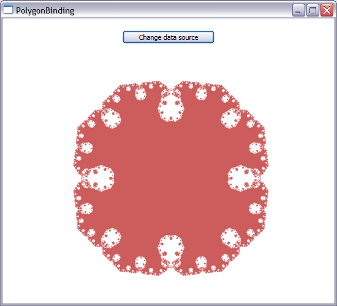

# How to data bind a Polygon’s Points to a data source – Part I

Today I will talk about one solution for data binding the Points property of a Polygon to a source collection. 

The Polygon's Points property is of type System.Windows.Media.PointCollection, which can be found in Avalon's PresentationCore.dll. The first approach I've seen most people take when they want to bind the Points property to some data is to add a property of type PointCollection to their source, and bind to it. This works in the sense that the Polygon will display the Points it is binding to, but there are a couple of problems with this approach:

- If we change the collection of points in the data source, the change will not be reflected in the UI. This can be fixed by making the collection of points in the source a DependencyProperty.

- Adding a PointCollection to the data source introduces a dependence on an Avalon type that brings in several UI concepts (dependency properties and freezable objects). Ideally, we should strive for no coupling between the presentation technology and the data source. I'm sure those of you who are porting applications from WinForms to Avalon understand the reasons why this is good practice: If your data layer is independent from the presentation layer, it will be easier to migrate to the next UI technology, or, more commonly, to present the same data in multiple ways within the same application.

With these issues in mind, the first step is to figure out how to store the collection of points in a way that is independent of presentation-related Avalon code. Every time I need to data bind to a collection, I think of ObservableCollection&lt;T&gt; because it provides collection change notifications. This would be my collection of choice if I were binding an ItemsControl to the points, but this scenario is a little different. 

Before I go any further, let me explain the two types of change notifications we support in data binding:

## Property change notifications 

- Your data source needs to implement INotifyPropertyChanged and raise the PropertyChanged event, passing the appropriate property name in the event arguments, whenever a property changes. If you pass null or the empty string as the property name, the binding engine assumes that all properties of the source have changed. If you have a property in your source that is a collection, you can still benefit from property change notifications: you may need to notify the binding engine when the whole collection is being replaced by a different one. In other words, you may need to notify that the property that holds the collection has changed. 

## Collection change notifications 

- Your data source needs to implement INotifyCollectionChanged. Typically, when you need collection change notifications, you can simply use an ObservableCollection&lt;T&gt; which does all the hard work of implementing this interface for you. I haven't encountered a scenario where a customer needed collection change notifications but couldn't use ObservableCollection&lt;T&gt; for some reason.This interface notifies the UI when there is some change in the collection, such as when an item is added or removed. If your data source is a business object, the binding engine is smart enough to add or remove only the UI items that are needed, rather than regenerating the entire collection of UI items. If your source is XML or an IBindingList, we are as clever as we can be with the information that we are given by those APIs.The item generator associated with an ItemsControl listens to these collection change notifications and is responsible for determining the corresponding changes that will be done to elements in the UI.In this scenario, I am binding a single DP (Polygon's Points) to a collection. Since there is no ItemsControl involved, even if I provide collection change notifications in the data source, there is no item generator listening to those notifications. Now that I've determined that I don't need all the complexity of ObservableCollection&lt;T&gt;, I can go ahead and pick a simpler collection. I decided to pick List&lt;T&gt;. 

But now I have a problem: if there is no one listening to collection changes in the UI, how can I automatically update my UI when I make a change to the source collection? The solution to this problem is to raise a property change notification when the collection changes. This may seem a little strange at first: there is a collection in the scenario, but there is no item generation in the UI, which makes this scenario somewhat unusual. But if you think about it, raising a property changed notification invalidates the Points property and causes the Polygon to re-render, which is what we want. This is how I implemented my data source:

	public class PolygonItem : INotifyPropertyChanged
	{
		public event PropertyChangedEventHandler PropertyChanged;
	
		private void OnPropertyChanged(string propertyName)
		{
			if (this.PropertyChanged != null)
			{
				this.PropertyChanged(this, new PropertyChangedEventArgs(propertyName));
			}
		}
	
		private List<Point> points = new List<Point>();
	
		public ReadOnlyCollection<Point> Points
		{
			get { return new ReadOnlyCollection<Point>(points); }
			set
			{
				points = new List<Point>(value);
				OnPropertyChanged("Points");
			}
		}
	
		public void Subdivide()
		{
			int count = this.points.Count;
			List<Point> newPoints = new List<Point>(count * 2);
			for (int i = 0; i < count; i++)
			{
				Point previousPoint = this.points[i];
				Point nextPoint = this.points[(i + 1) % count];
	
				newPoints.Add(previousPoint);
				Vector offset = nextPoint - previousPoint;
				Vector normal = new Vector(offset.Y, -offset.X);
				newPoints.Add(previousPoint + 0.5 * offset + 0.4 * normal);
			}
			this.points = newPoints;
			OnPropertyChanged("Points");
		}
	
		public PolygonItem()
		{
			points.Add(new Point(275, 100));
			points.Add(new Point(375, 200));
			points.Add(new Point(275, 300));
			points.Add(new Point(175, 200));
		}
	}

I decided to change the type of the public Points property to a ReadOnlyCollection&lt;T&gt; to prevent the user from making changes directly to the collection returned by the Points property, which would bypass change notifications.

At this point I have a source collection of type ReadOnlyCollection&lt;T&gt; and a target collection of type PointCollection. Because I have incompatible types and there is no default Converter between the two, I need to implement my own. Here is my code:

	public class Converter : IValueConverter
	{
		public object Convert(object value, Type targetType, object parameter, System.Globalization.CultureInfo culture)
		{
			IEnumerable<Point> enumerable = value as IEnumerable<Point>;
			PointCollection points = null;
			if (enumerable != null)
			{
				points = new PointCollection(enumerable);
			}
			return points;
		}
	
		public object ConvertBack(object value, Type targetType, object parameter, System.Globalization.CultureInfo culture)
		{
			throw new NotSupportedException("ConvertBack should never be called");
		}
	}

The UI is pretty straightforward:

	<Window.Resources>
		<local:PolygonItem x:Key="src"/>
		<local:Converter x:Key="converter"/>
	</Window.Resources>
	
	<StackPanel>
		<Button Click="ChangeSource" Width="150" Margin="20">Change data source</Button>
		<Polygon Fill="#CD5C5C" Points="{Binding Source={StaticResource src}, Path=Points, Converter={StaticResource converter}}"/>
	</StackPanel>

When the Window is loaded, a Polygon is displayed with the points from the source collection. I also included a Button in the UI that modifies the source collection and raises a property changed notification, which causes the UI to be updated.

	private void ChangeSource(object sender, RoutedEventArgs e)
	{
		PolygonItem polygon = this.Resources["src"] as PolygonItem;
		polygon.Subdivide();
	}

This is a good solution when you make big changes to the source collection of points, like the scenario I have here. If you're simply adding or removing an item at a time from the existing collection, this solution may not scale well with very frequent changes to the source. Keep in mind that every time a property change notification is raised, we are creating a whole new PointCollection in the Converter. If you can, it's best to batch those operations and provide only one property change notification for a group of changes. 

We've been discussing possible solutions that would make this scenario easier and more efficient for V2. Hopefully one of those solutions will make it to our final wish list. 

Here is a screenshot of this application:

