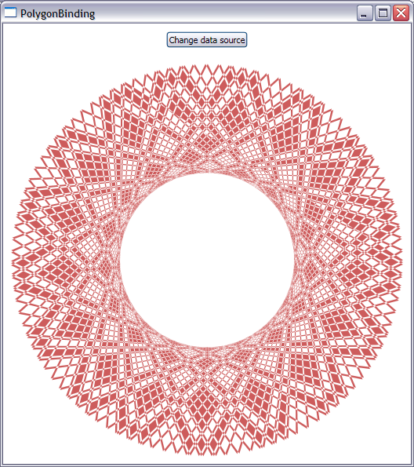

# How to data bind a Polygon’s Points to a data source – Part II

In my <a href="..\32-PolygonBinding">last blog post</a>, I talked about one solution to data bind a Polygon's Points to a collection such that:
- Changes in the source are propagated to the UI.
- There is a clean separation between the UI and data layers.

This solution is good for scenarios where big changes to the collection happen each time we want to refresh the UI, but not so good when we need to frequently add or remove one point only. The reason for this is that every time we raise a collection change notification, a new PointCollection instance is created. 

Today I will explain to you my thought process of coming up with a solution with the advantages of the previous one but without the drawback. 

I will start by showing you the data source I use in this blog post:

	public class PolygonItem
	{
		private double angleIncrement = Math.PI / Math.Sqrt(2);
		private int initialCount = 249;
	
		private ObservableCollection<Point> points = new ObservableCollection<Point>();
	
		public ReadOnlyObservableCollection<Point> Points
		{
			get { return new ReadOnlyObservableCollection<Point>(this.points); }
		}
	
		public void AddPoint()
		{
			double angle = this.points.Count * this.angleIncrement;
			double x = 250 + 250 * Math.Cos(angle);
			double y = 250 + 250 * Math.Sin(angle);
			this.points.Add(new Point(x, y));
		}
	
		public PolygonItem()
		{
			while (this.points.Count < this.initialCount)
			{
				this.AddPoint();
			}
		}
	}

As you can see, every time the AddPoint method is called, a single point is added to the source collection (unlike the sample in the previous post, where every time you click on a button, the whole source collection is redone.) The fact that a very small change happens to the collection each time provides the motivation we need to find a solution different from the one in my last post.

In this post, I will explain how we can write a custom MarkupExtension that changes the target PointCollection when the source collection changes. My idea was that if Binding (which is a MarkupExtension too) doesn't provide this functionality, I could write my own simple specialized Binding that does what I want. 

To create the MarkupExtension, I started by thinking about which properties are needed to allow the user to specify the source collection. I got some inspiration from the Binding object and decided to pick two properties: "Source" and "PropertyName". "Source" holds a source object, of any type, and "PropertyName" holds the name of a property of that object, of type IEnumerable&lt;Point&gt;. This is basically a very trimmed down version of Binding.

	[MarkupExtensionReturnType(typeof(PointCollection))]
	public class PointCollectionConnectorExtension : MarkupExtension
	{
		private object source;
		private string propertyName;
		private PointCollection pointCollection;
	
		public object Source
		{
			get { return this.source; }
			set
			{
				if (value == null)
				{
					throw new ArgumentNullException("value");
				}
				this.source = value;
			}
		}
	
		public string PropertyName
		{
			get { return this.propertyName; }
			set
			{
				if (value == null)
				{
					throw new ArgumentNullException("value");
				}
				this.propertyName = value;
			}
		}
	
		(...)
	}

Next I had to override the ProvideValue abstract method from MarkupExtension. This method is where you can find all the logic necessary to calculate the value provided by a MarkupExtension. In this particular scenario, I want to start listening to source collection change notifications and to modify the provided PointCollection everytime the source changes. Here is what my ProvideValue method looks like:

	public override object ProvideValue(IServiceProvider serviceProvider)
	{
		if (this.source == null || this.propertyName == null)
		{
			throw new InvalidOperationException("Cannot use PointCollectionConnector extension without setting Source and PropertyName.");
		}
	
		// Get the value of the property with name PropertyName from the source object.
		Type sourceType = this.source.GetType();
		PropertyInfo propertyInfo = sourceType.GetProperty(propertyName);
		if (propertyInfo == null)
		{
			throw new InvalidOperationException(String.Format("Source object of type {0} does not have a property named {1}.", sourceType.Name, propertyName));
		}
		object propertyValue = propertyInfo.GetValue(this.source, null);
	
		// See if the value is an enumerable collection of points.
		IEnumerable<Point> enumerable = propertyValue as IEnumerable<Point>;
		if (enumerable == null)
		{
			throw new InvalidOperationException(String.Format("Source object of type {0} has a property named {1}, but its value (of type {2}) doesn't implement IEnumerable<Point>.", sourceType.Name, propertyName, propertyValue.GetType().Name));
		}
	
		// Construct the initial point collection by copying points from the enumerable collection.
		this.pointCollection = new PointCollection(enumerable);
	
		// Listen for collection changed events coming from the source, if possible.
		INotifyCollectionChanged notifyCollectionChanged = propertyValue as INotifyCollectionChanged;
		if (notifyCollectionChanged != null)
		{
			notifyCollectionChanged.CollectionChanged += this.Source_CollectionChanged;
		}
	
		return this.pointCollection;
	}

As you can see, I use the Source and PropertyName properties to grab the source collection through reflection. The value provided by the MarkupExtension to the target DP is a new PointCollection created here, which contains the same points as the source collection. The most important part of this code, however, is where I hook up a listener for collection change notifications in the source collection. In that event handler, I have some code that replicates in the PointCollection any changes made to the source collection:

	private void Source_CollectionChanged(object sender, NotifyCollectionChangedEventArgs e)
	{
		switch (e.Action)
		{
			case NotifyCollectionChangedAction.Add:
				for (int i = 0; i < e.NewItems.Count; i++)
				{
					this.pointCollection.Insert(e.NewStartingIndex + i, (Point)e.NewItems[i]);
				}
				break;
	
			case NotifyCollectionChangedAction.Move:
				for (int i = 0; i < e.NewItems.Count; i++)
				{
					this.pointCollection.RemoveAt(e.OldStartingIndex);
					this.pointCollection.Insert(e.NewStartingIndex + i, (Point)e.NewItems[i]);
				}
				break;
	
			case NotifyCollectionChangedAction.Remove:
				for (int i = 0; i < e.OldItems.Count; i++)
				{
					this.pointCollection.RemoveAt(e.OldStartingIndex);
				}
				break;
	
			case NotifyCollectionChangedAction.Replace:
				for (int i = 0; i < e.NewItems.Count; i++)
				{
					this.pointCollection[e.NewStartingIndex + i] = (Point)e.NewItems[i];
				}
				break;
	
			case NotifyCollectionChangedAction.Reset:
				this.pointCollection.Clear();
				break;
		}
	}

Here is the XAML that uses this MarkupExtension:

	<Window.Resources>
		<local:PolygonItem x:Key="src"/>
	</Window.Resources>
	
	<Polygon Name="polygonElement" Width="500" Height="500" Margin="10" Fill="#CD5C5C">
		<Polygon.Points>
			<local:PointCollectionConnector Source="{StaticResource src}" PropertyName="Points"/>
		</Polygon.Points>
	</Polygon>

I am using property-element syntax to add the MarkupExtension in this case. Unfortunately there is a bug that prevents me from using attribute syntax with a custom MarkupExtension:

	<Polygon Points="{PointCollectionConnector Source={StaticResource src}, PropertyName=Points}" />

Next I supplied a Button with an event handler that adds a point to the source collection each time the Button is pressed.

	<Button Click="ChangeSource" Margin="10" HorizontalAlignment="Center">Change data source</Button>
	
	private void ChangeSource(object sender, RoutedEventArgs e)
	{
		PolygonItem polygonItem = this.Resources["src"] as PolygonItem;
		polygonItem.AddPoint();
	
		// Unfortunately, the Polygon element won't update unless we call InvalidateMeasure and InvalidateVisual.
		this.polygonElement.InvalidateMeasure();
		this.polygonElement.InvalidateVisual();
	}

Unfortunately there is a bug here too: the UI will not reflect changes in the PointCollection. To work around it, we need to call InvalidateMeasure followed by InvalidateVisual, as shown above.

If you now click on the Button, you will see that a new Point is added to the collection, and the pattern in the UI changes. This solution sounds pretty good, but it has a drawback: you can not use this MarkupExtension in a Style because the PointCollection, which is a Freezable, freezes (meaning, it can not be changed). Freezables become frozen when used in Styles because it's the only way they can be used across threads. It's very common for Styles (particularly those in the theme files) to be used in multiple threads.

I like this solution, but of course I couldn't stop thinking about this until I was able to find a solution with all the advantages of this one, and without the drawback. I will talk about a third solution in my next blog post, so stay tuned.

Here is a screenshot of this application:

