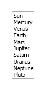
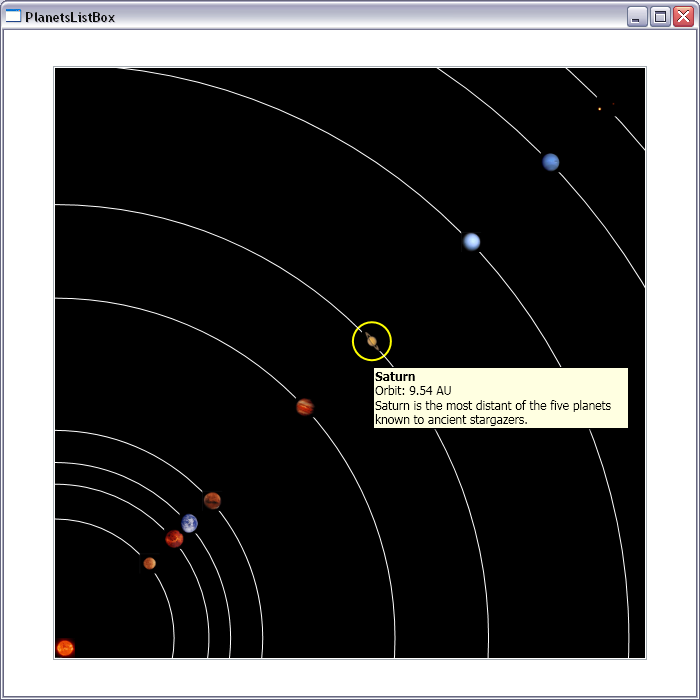

# The power of Styles and Templates in WPF

In WPF, there is a very clean separation between the behavior of a Control and the look of a Control. For example, a Button's behavior consists only of listening to Click events, but its look can be anything - you can make a Button look like an arrow, a fish, or whatever else suits your application. Redefining the look of a Control is very easy to do in VS with Styles and Templates, and even easier if you have Blend. In this sample, I will show you how I redefined the look of a ListBox representing a list of planets.

I started out by implementing a data source with planets and the sun. I defined a class called "SolarSystemObject" with several properties (Name, Orbit, Diameter, Image and Details). I overrode the ToString(...) method in this class to return the name of the solar system object. Then I added a class called "SolarSystem" with a property called "SolarSystemObjects" of type ObservableCollection&lt;SolarSystemObject&gt;. In the constructor for the "SolarSystem" class, I added the sun and the nine planets to the "SolarSystemObjects" collection.

Once I had my source defined, I was ready to add a ListBox to the Window, bound to this collection:

	<Window.Resources>
		<local:SolarSystem x:Key="solarSystem" />
		(...)
	</Window.Resources>
	
	<ListBox ItemsSource="{Binding Source={StaticResource solarSystem}, Path=SolarSystemObjects}" />

The ListBox displays the planets, but visually this is still a little plain:

At this point, I started brainstorming ways to display the planets in a more realistic way - my goal was to achieve a look similar to the solar system diagrams in school books. The first step was to change the layout of the ListBoxItems. The default layout for a ListBox is a StackPanel, which causes the ListBoxItems to be displayed one above another (to be more precise, it's a VirtualizingStackPanel, which adds virtualization to the traditional StackPanel). In order to display the planets the way I wanted, I needed a Canvas, which allows me to position the items within it by specifying the number of pixels to the Top and Left of that Canvas. There is an ItemsPanel property on ListBox of type ItemsPanelTemplate that can be used to change the layout of the ListBox, which is what I used in my sample. Here is how I did that:

	

My next step was to define the look of each planet, which I did by using a DataTemplate. I decided to represent each planet by its image, with a white ellipse simulating its orbit around the sun. I also added a tooltip with more information about the planet, which appears when you hover over the image.

	<DataTemplate DataType="{x:Type local:SolarSystemObject}">
		<Canvas Width="20" Height="20" >
			<Ellipse
				Canvas.Left="{Binding Path=Orbit, Converter={StaticResource convertOrbit}, ConverterParameter=-1.707}"
				Canvas.Top="{Binding Path=Orbit, Converter={StaticResource convertOrbit}, ConverterParameter=-0.293}"
				Width="{Binding Path=Orbit, Converter={StaticResource convertOrbit}, ConverterParameter=2}"
				Height="{Binding Path=Orbit, Converter={StaticResource convertOrbit}, ConverterParameter=2}"
				Stroke="White"
				StrokeThickness="1"/>
			<Image Source="{Binding Path=Image}" Width="20" Height="20">
				<Image.ToolTip>
					<StackPanel Width="250" TextBlock.FontSize="12">
						<TextBlock FontWeight="Bold" Text="{Binding Path=Name}" />
						<StackPanel Orientation="Horizontal">
							<TextBlock Text="Orbit: " />
							<TextBlock Text="{Binding Path=Orbit}" />
							<TextBlock Text=" AU" />
						</StackPanel>
						<TextBlock Text="{Binding Path=Details}" TextWrapping="Wrap"/>
					</StackPanel>
				</Image.ToolTip>
			</Image>
		</Canvas>
	</DataTemplate>
	
	

As you can see in the template and style above, the properties that specify the position of the ListBoxItem and the position and size of the Ellipse depend on the orbit of the planet, and all use the same converter with different parameters. The converter's job is to transform distances between solar system objects to distances in device independent pixels within the canvas. My original implementation of this converter simply multiplied the orbit value by a constant, but I found that the inner planets were too crowded together, so I changed the math a little to make it non-linear. I also decided to have the converter take a parameter that scales the result by a factor, so I could reuse this logic.

	public class ConvertOrbit : IValueConverter
	{
		public object Convert(object value, Type targetType, object parameter, CultureInfo culture)
		{
			double orbit = (double)value;
			double factor = System.Convert.ToDouble(parameter);
			return Math.Pow(orbit / 40, 0.4) * 770 * factor;
		}
	
		public object ConvertBack(object value, Type targetType, object parameter, CultureInfo culture)
		{
			throw new NotSupportedException("This method should never be called");
		}
	}

If you run the application now, you will see that the planets are all correctly positioned in relation to the sun. If you hover over them, you will get more detailed information about the planet. If you click on a planet, the default ListBoxItem template assigns a blue background to the selected item, which shows a little bit around the image. This is not the effect I was looking for, so I decided to change the look of the selected item.

In order to change that style, I figured it would be easier to use Expression Blend to look at the default template, and then tweak it to the look I had in mind. I started by selecting the ListBox in Blend, then I went to the "Object" menu, selected "Edit Other Styles", "Edit ItemContainerStyle", and "Edit a Copy". Then I gave the style a name, and clicked "OK". If you go to the XAML tab at this point, you will see the full default Style for the ListBoxItems, which includes the following template:

	<Setter Property="Template">
		<Setter.Value>
			<ControlTemplate TargetType="{x:Type ListBoxItem}">
				<Border SnapsToDevicePixels="true" x:Name="Bd" Background="{TemplateBinding Background}" BorderBrush="{TemplateBinding BorderBrush}" BorderThickness="{TemplateBinding BorderThickness}" Padding="{TemplateBinding Padding}">
					<ContentPresenter SnapsToDevicePixels="{TemplateBinding SnapsToDevicePixels}" HorizontalAlignment="{TemplateBinding HorizontalContentAlignment}" VerticalAlignment="{TemplateBinding VerticalContentAlignment}"/>
				</Border>
				<ControlTemplate.Triggers>
					<Trigger Property="IsSelected" Value="true">
						<Setter Property="Background" TargetName="Bd" Value="{DynamicResource {x:Static SystemColors.HighlightBrushKey}}"/>
						<Setter Property="Foreground" Value="{DynamicResource {x:Static SystemColors.HighlightTextBrushKey}}"/>
					</Trigger>
					<MultiTrigger>
						<MultiTrigger.Conditions>
							<Condition Property="IsSelected" Value="true"/>
							<Condition Property="Selector.IsSelectionActive" Value="false"/>
						</MultiTrigger.Conditions>
						<Setter Property="Background" TargetName="Bd" Value="{DynamicResource {x:Static SystemColors.ControlBrushKey}}"/>
						<Setter Property="Foreground" Value="{DynamicResource {x:Static SystemColors.ControlTextBrushKey}}"/>
					</MultiTrigger>
					<Trigger Property="IsEnabled" Value="false">
						<Setter Property="Foreground" Value="{DynamicResource {x:Static SystemColors.GrayTextBrushKey}}"/>
					</Trigger>
				</ControlTemplate.Triggers>
			</ControlTemplate>
		</Setter.Value>
	</Setter>

Using this as a base, I came up with a simpler template that adds a yellow ellipse around a planet when selected:

	

Below is a screenshot of the final application. If you hover over the images of the planets, you will get more information about them. If you click on a planet, a yellow ellipse will encircle it.

This sample is part of a talk I presented last Tuesday, in an event here at Microsoft in Redmond where several customers came to learn more about WPF. It was a lot of fun to talk directly to customers and reply to their questions.