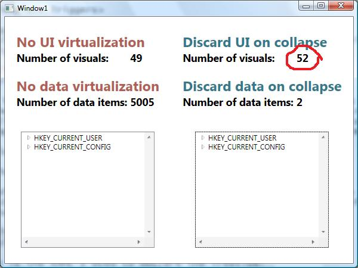
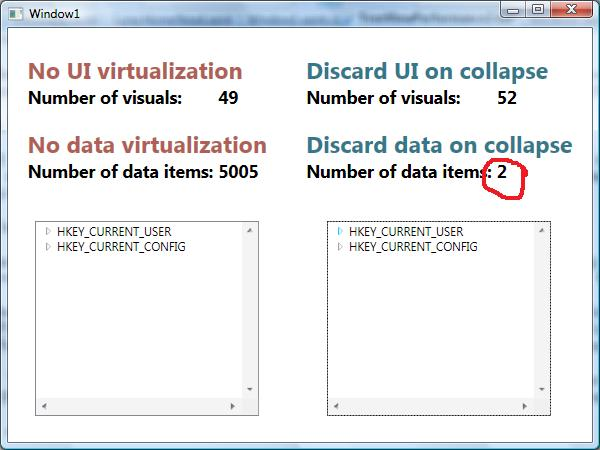

# How to improve TreeView's performance – Part II

In my <a href="http://www.zagstudio.com/blog/475">previous post</a>, I discussed some of the performance limitations of TreeView. In particular, I mentioned the three facts about our current implementation that may lead to performance issues, depending on your scenario:

- UI elements stay in memory even when collapsed.
- There is no UI virtualization.
- There is no data virtualization.

Today I will talk about a trick that avoids the first problem and partially fixes the third. In my previous post, I always kept the data for all levels of the TreeView in memory. In this project, I only load subkey data items when their parent key node is expanded, and I discard those data items when their parent node is collapsed. You can think of the class that manages which portions of the data source stay in memory as an intermediate custom source, which sits between your UI and the complete source of your items. In this case, the complete source for the registry keys consists of the APIs used to load them into memory, but you can easily imagine how this could be a SQL database or a webservice. If you've read <a href="http://blogs.msdn.com/johngossman/archive/2006/04/13/576163.aspx">John Gossman's</a> thoughts on the Model-View-ViewModel pattern, you can think of this intermediate class as the "ViewModel" section.

Let's start by looking at the custom data source. Similarly to my previous post, I have a RegistryKeyHolder2 class that contains a ShortName property and another property that holds the SubKeys collection of type ObservableCollection&lt;RegistryKeyHolder2&gt;. I also have a PopulateSubKeys() method that fills the SubKeys collection with instances of the children keys, which I showed in my previous post. The only new method I added to this class is ClearSubKeys(), which I will use to discard items from memory when I collapse a TreeViewItem:

	public int ClearSubKeys()
	{
		int subKeyCount = CountSubKeys(this);
		this.subKeys.Clear();
		return subKeyCount;
	}

Just like last week's sample, I have a RegistryData2 class that contains a RootKeys property of type ObservableCollection&lt;RegistryKeyHolder2&gt;. This will hold the first level of keys displayed in the TreeView, as well as the whole hierarchy of keys that is displayed underneath it. However, unlike my previous post, this class has methods that will populate and clear the keys of just one level, and not the whole hierarchy. I implemented it this way because I will populate or clear items only when the TreeViewItems are expanded and collapsed, and that will only ever affect one level at a time.

	public void PopulateSubKeys(RegistryKeyHolder2 keyHolder)
	{
		int itemsAddedCount = keyHolder.PopulateSubKeys();
		...
	}
	
	public void ClearSubKeys(RegistryKeyHolder2 keyHolder)
	{
		int itemsClearedCount = keyHolder.ClearSubKeys();
		...
	}

The next step is to cause these methods to be called when TreeViewItems are expanded and collapsed. This can be done easily with the following code and XAML:

	<TreeView
		...
		TreeViewItem.Collapsed="ItemCollapsedOrExpanded2"
		TreeViewItem.Expanded="ItemCollapsedOrExpanded2">
		...
	</TreeView>
	
	private void ItemCollapsedOrExpanded2(object sender, RoutedEventArgs e)
	{
		TreeViewItem tvi = (TreeViewItem)e.OriginalSource;
		RegistryKeyHolder2 keyHolder = (RegistryKeyHolder2)tvi.Header;
		RegistryData2 registryData = (RegistryData2)this.grid2.DataContext;
		if (e.RoutedEvent == TreeViewItem.ExpandedEvent)
		{
			registryData.PopulateSubKeys(keyHolder);
		}
		else if (e.RoutedEvent == TreeViewItem.CollapsedEvent)
		{
			registryData.ClearSubKeys(keyHolder);
		}
		this.InvokeUpdateVisualCount(this.treeView2);
		e.Handled = true;
	}

This is basically all that needs to be done at the data level. If you use this source with the default style for TreeViewItem, however, you will see that you will not be provided with the UI to expand the first level of TreeViewItems. This happens because the expander arrow (or plus sign, depending on your theme) is only visible when the HasItems property of TreeViewItem is true. How did I figure this out? Easy, I used Blend to look at the default template for TreeViewItem. I started by creating a new project and adding a TreeView to it. Then I went to the "Object" menu, clicked on "Edit other styles", "Edit ItemContainerStyle", "Edit a Copy", gave it a name and clicked OK. And that's it, you can look at the default style for TreeViewItem in the XAML tab. Here is the part of the XAML that causes the undesired behavior:

	<ControlTemplate TargetType="{x:Type TreeViewItem}">
		...
		<ControlTemplate.Triggers>
			...
			<Trigger Property="HasItems" Value="false">
				<Setter Property="Visibility" TargetName="Expander" Value="Hidden"/>
			</Trigger>
			...
		</ControlTemplate.Triggers>
	</ControlTemplate>

The solution for this problem is to have the visibility of the expander of a particular key be controlled by the count of its subkeys. Since the subkeys are not loaded in memory when the parent key is created, you can not use the "Count" property of the "SubKeys" collection to retrieve this information (it is always 0). Fortunately, the "RegistryKey" class in the CLR contains a "SubKeyCount" property that we can use for this purpose. Here is the replacement for the XAML above:

	<ControlTemplate TargetType="{x:Type TreeViewItem}">
		...
		<ControlTemplate.Triggers>
			...
			<DataTrigger Binding="{Binding Path=Key.SubKeyCount}" Value="0">
				<Setter Property="Visibility" TargetName="Expander" Value="Hidden"/>
			</DataTrigger>
			...
		</ControlTemplate.Triggers>
	</ControlTemplate>

And finally, here is the XAML I used to declare the TreeView:

	<TreeView ItemsSource="{Binding Path=RootKeys}"
		...
		TreeViewItem.Collapsed="ItemCollapsedOrExpanded2"
		TreeViewItem.Expanded="ItemCollapsedOrExpanded2">
		<TreeView.Resources>
			<HierarchicalDataTemplate DataType="{x:Type local:RegistryKeyHolder2}" ItemsSource="{Binding Path=SubKeys}">
				<TextBlock Text="{Binding Path=ShortName}" />
			</HierarchicalDataTemplate>
    
... Here I added the default styles and templates for TreeView that I copied from Blend, modified with the DataTrigger above...
            
		</TreeView.Resources>
		<TreeView.ItemContainerStyle>
			<StaticResourceExtension ResourceKey="tvStyle1" />
		</TreeView.ItemContainerStyle>
	</TreeView>            

At the beginning of this post, I mentioned that the solution I presented here avoids keeping elements in memory after they've been collapsed and partially fixes data virtualization. Is this really the case?

## Visuals no longer stay in memory when collapsed

The fact that I'm discarding the data items when a TreeViewItem is collapsed causes the UIElement associated with those items to also be discarded. You can confirm this by looking at the visual count that I added to the sample, after expanding and collapsing the first item:

The visual count of the TreeView starts out as 49. After expanding the first item, the count increases to 169, and after collapsing it, the count becomes 52. There's a difference in the number of visuals before and after for two reasons: 

- The StackPanel that wraps the subkey items stays in memory.
- After the vertical scroll bar becomes interactive and then disabled again, two visuals are left behind. I tried to minimize the difference of visuals caused by the scroll bar by making it present (but disabled) from the beginning.

I would like you to focus on the big numbers, and not the details. With this solution, after collapsing a TreeViewItem, almost all of the visuals created when the TreeViewItem was expanded are not kept in memory any longer.

## Some of the data is virtualized

The initial count of data items for this TreeView scenario is 2. Once the first item is expanded that number goes up to 15, but when you collapse that item, the number of data items goes back down to 2.

Note that I am by no means claiming to provide a full solution to data virtualization. My solution only listens to expand and collapse events. True data virtualization for TreeView would take into account not only expanding and collapsing, but also scrolling events. Imagine a scenario where you have many TreeViewItems expanded so that the total number of items expanded in the TreeView is a thousand (not all of them visible, of course). In this case, my solution will keep those thousand items in memory, while a true data virtualization solution would only keep in memory the few items displayed on the screen. As the user scrolls the TreeView, data virtualization would figure out which items should be swapped in and out of memory.

However, I believe that the solution here offers the biggest bang for the buck. It's extremely simple to implement and it helps with a very common usage scenario for TreeViews: TreeViews can be bound to extremely large data sets, but users typically only have a small subset of that data expanded at a particular time.
