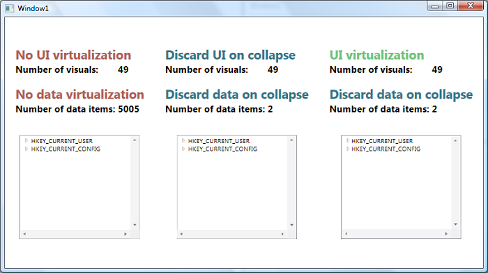

# How to improve TreeView's performance – Part III

*Update: This post is out of date. With .NET 3.5 SP1, TreeView now provides opt-in UI virtualization. You can see this feature working by setting VirtualizingStackPanel.IsVirtualizing="True" on the TreeView itself. TreeView also supports container recycling, which you can control by setting the VirtualizingStackPanel.VirtualizationMode property.

In <a href="..\39-TreeViewPerformancePart1">part I</a> of my discussions on TreeView performance, I presented the three main limitations in the current implementation of TreeView that may lead to slower performance:

- UI elements stay in memory even when collapsed. 
- There is no UI virtualization. 
- There is no data virtualization.

In <a href="..\40-TreeViewPerformancePart2">part II</a>, I talked about a solution where I introduced a middle tier between the UI and the data layer, that discards the data when a TreeViewItem is collapsed, and brings the data back into memory when a TreeViewItem is expanded. This solution completely fixes the first limitation of TreeView - the UI elements no longer stay in memory after expanding and collapsing a TreeViewItem. It also partially fixes the lack of data virtualization in TreeView because we only keep a small portion of the data in memory. I say "partially" because it virtualizes data on expand/collapse, but it does not take scrolling into account.

Today I will discuss a solution that builds on top of the previous one by providing UI virtualization.

With the current version of WPF, only two Controls offer UI virtualization: ListBox and ListView (actually, ListView gets it for free because it derives from ListBox). The work to make virtualization happen is done by VirtualizingStackPanel, which is the panel used by default in ListBox. It would be nice if we could simply tell TreeView to use a VirtualizingStackPanel to lay out its items, but unfortunately it's not that simple. VirtualizingStackPanel understands only flat lists of items, so it is not capable of laying out the hierarchical data required for a TreeView.

On the other hand, styles and templates are among the most powerful features of WPF because they allow you to completely change the look of a control while retaining its behavior. For example, <a href="..\37-PlanetsListBox">this post</a> shows how a ListBox can easily be customized to look like a diagram of our solar system. With this in mind, Ben Carter (an awesome dev on the WPF team) had the brilliant idea of simply making a ListBox look like a TreeView. This allows us to use VirtualizingStackPanel for free, which offers UI virtualization. And you will see how easy it is to make a ListBox look like a TreeView, thanks to the power of styles and templates in WPF. We'll need to make a few changes to the data side, but I will explain what they are.

I started by thinking about the theming portion of this scenario. To make my ListBox look like a TreeView, I need the toggle button that expands and collapses TreeViewItems. I used Blend, once again, to dig into the default style for the ToggleButton in TreeViewItem (which in the Aero theme looks like a triangle), and copied it to the window's resources. This style contains triggers to change its look when the mouse is over it, and to rotate it when a user clicks on it. Then I added the following DataTemplate to the ItemTemplate property of my ListBox:

	...
	<ListBox.ItemTemplate> 
		<DataTemplate> 
			<StackPanel Orientation="Horizontal"> 
				<ToggleButton x:Name="tb" ClickMode="Press" Style="{StaticResource ExpandCollapseToggleStyle}"/> 
				<TextBlock Text="{Binding Path=ShortName}" /> 
			</StackPanel> 
		</DataTemplate> 
	</ListBox.ItemTemplate> 
	...

I tested it with a rudimentary data source - a simple (non-hierarchical) ObservableCollection of RegistryKey items that contain a ShortName property. This helped me understand how I need my data to be presented to the ListBox.

## Adding and removing items in the ObservableCollection

My first realization was that my data source can not be hierarchical this time, because ListBox only understands flat lists of data. So I will need to have a single ObservableCollection with the data for all the visible items, regardless of their depth in the original hierarchy. I will have to update this list of visible items any time the user expands or collapses an item. When the user expands an item, I will insert the item's children just after it in the ObservableCollection. When the user collapses an item, I will remove its children from the ObservableCollection. Here is the code I wrote to make this happen:

	public class RegistryData3 : INotifyPropertyChanged 
	{ 
		private ObservableCollection<RegistryKeyHolder3> allKeys; 
		...
		
		public ObservableCollection<RegistryKeyHolder3> AllKeys 
		{ 
			get { return allKeys; } 
		}
		
		...
		public RegistryData3() 
		{ 
			this.allKeys = new ObservableCollection<RegistryKeyHolder3>(); 
			this.AddNewKeyHolder(Registry.CurrentUser); 
			this.AddNewKeyHolder(Registry.CurrentConfig); 
			...
		}
		
		private void AddNewKeyHolder(RegistryKey registryKey) 
		{ 
			RegistryKeyHolder3 newKeyHolder = new RegistryKeyHolder3(registryKey, 0); 
			newKeyHolder.PropertyChanged += new PropertyChangedEventHandler(KeyHolder_PropertyChanged); 
			this.allKeys.Add(newKeyHolder); 
		}
		
		public void PopulateSubKeys(RegistryKeyHolder3 parentKeyHolder) 
		{ 
			int indexParentKey = this.allKeys.IndexOf(parentKeyHolder); 
			if (indexParentKey == this.allKeys.Count - 1 || this.allKeys[indexParentKey + 1].Level <= parentKeyHolder.Level) 
			{ 
				string[] subKeyNames = parentKeyHolder.Key.GetSubKeyNames(); 
				for (int i = 0; i < subKeyNames.Length; i++) 
				{ 
					RegistryKeyHolder3 childKeyHolder = new RegistryKeyHolder3(parentKeyHolder.Key.OpenSubKey(subKeyNames[i]), parentKeyHolder.Level + 1); 
					childKeyHolder.PropertyChanged += new PropertyChangedEventHandler(KeyHolder_PropertyChanged); 
					allKeys.Insert(indexParentKey + i + 1, childKeyHolder); 
					...
				} 
			} 
		} 
		...
		
		public void ClearSubKeys(RegistryKeyHolder3 parentKeyHolder) 
		{ 
			int indexToRemove = this.allKeys.IndexOf(parentKeyHolder) + 1; 
			while ((indexToRemove < this.allKeys.Count) && (this.allKeys[indexToRemove].Level > parentKeyHolder.Level)) 
			{ 
				this.allKeys.RemoveAt(indexToRemove); 
				...
			} 
		}
		
		...
	} 

The PopulateSubKeys method is responsible for adding an item's children to the ObservableCollection when the user expands that item. This method retrieves the children of the parent item, creates a RegistryKeyHolder3 instance for each item and inserts those instances starting at the index just after the parent. Don't worry about the Level concept you see in this code; I will explain it in the next section. I will also explain and show the code for the property changed event handler later in this post.

The ClearSubKeys method removes an item's children from the list, and is called when the user collapses the parent. It starts removing items from the list in the index after the parent's and continues until the expected number of items has been removed.

These two methods allow us to keep a flat list with the items in the order we want the ListBox to display them. Adding items to and removing items from the flat list achieves partial data virtualization, just like the solution in my previous post.

## Indentation

I also realized that I need to tag each RegistryKeyHolder3 data item with the level they belong to, which will help me figure out how much they have to be indented in the ListBox. I decided to add a property called "Level" to the RegistryKeyHolder3 class for that purpose. For the root keys the Level property will be set to 0, for the next level it will be set to 1, and so on. Notice that while constructing the children key holders, the code in PopulateSubKeys specifies that the level of the children is the parent's level incremented by 1. Also, in the ClearSubKeys method, one of the conditions to stop removing children is encountering an item that has the same level as the one being collapsed.

To indent the items in the UI based on the Level value, I added a Border to the left of the expander and text and bound its Width property to the Level property in the source:

	...
	<ListBox.ItemTemplate> 
		<DataTemplate> 
			<StackPanel Orientation="Horizontal"> 
				<Border Width="{Binding Path=Level, Converter={StaticResource ConvertLevelToIndent}}" /> 
				<ToggleButton x:Name="tb" ClickMode="Press" ... Style="{StaticResource ExpandCollapseToggleStyle}"/> 
				<TextBlock Text="{Binding Path=ShortName}" /> 
			</StackPanel> 
			...
		</DataTemplate> 
	</ListBox.ItemTemplate> 
	...

In order to convert a Level value to the Border's Width, I defined the following converter:

	public class ConvertLevelToIndent : IValueConverter 
	{ 
		public object Convert(object value, Type targetType, object parameter, System.Globalization.CultureInfo culture) 
		{ 
			return (int)value * 16; 
		}
		
		public object ConvertBack(object value, Type targetType, object parameter, System.Globalization.CultureInfo culture) 
		{ 
			throw new NotSupportedException("Not supported - ConvertBack should never be called in a OneWay Binding."); 
		} 
	}

## Parent item expansion

I decided to add an "IsExpanded" property to the RegistryKeyHolder3 class that will help me tie the children expansion on the data side with the visual rotation of the toggle button in the UI.

	...
	<ListBox.ItemTemplate> 
		<DataTemplate> 
			<StackPanel Orientation="Horizontal"> 
				<Border Width="{Binding Path=Level, Converter={StaticResource ConvertLevelToIndent}}" /> 
				<ToggleButton x:Name="tb" ClickMode="Press" IsChecked="{Binding Path=IsExpanded}" Style="{StaticResource ExpandCollapseToggleStyle}"/> 
				<TextBlock Text="{Binding Path=ShortName}" /> 
			</StackPanel> 
			...
		</DataTemplate> 
	</ListBox.ItemTemplate> 
	...

If you take a look at the ToggleButton's XAML, you will notice that its IsChecked property is bound to the IsExpanded property. The Mode of this binding is TwoWay - no Mode is defined explicitly, but I know that's the default Mode for the IsChecked DP.

Also, if you look at the code that adds items to the list in the PopulateSubKeys method, you will notice that I added KeyHolder_PropertyChanged as the handler for the PropertyChanged event on RegistryKeyHolder3. Here is the code for that event handler:

	void KeyHolder_PropertyChanged(object sender, PropertyChangedEventArgs e) 
	{ 
		if (e.PropertyName == "IsExpanded") 
		{ 
			RegistryKeyHolder3 keyHolder = (RegistryKeyHolder3)sender; 
			if (keyHolder.IsExpanded) 
			{ 
				this.PopulateSubKeys(keyHolder); 
			} 
			else 
			{ 
				this.ClearSubKeys(keyHolder); 
			} 
		} 
	}

When the application starts, all the items appear collapsed because the IsExpanded property of each data item is initialized to false, and the IsChecked property is bound to IsExpanded. Here is what happens when the user expands an item:

1) When the user clicks on the ToggleButton to expand an item, IsChecked becomes true, and because of the TwoWay binding, the IsExpanded property for the corresponding data item is set to true. 
2) RegistryKeyHolder3 raises a PropertyChanged event when its IsExpanded property changes, causing the code in the handler (the KeyHolder_PropertyChanged method in RegistryData3) to be executed. 
3) Because IsExpanded is true for this data item, the PopulateSubKeys method on RegistryData3 is called, causing the children of this item to be added to the list and displayed in the ListBox.

You can imagine a similar sequence of events when the user clicks to collapse an item.

## Visibility of the expander

Lastly, I wanted to make the expander for a particular item hidden whenever that item has no children. I was able to do this by adding a simple DataTrigger that causes the ToggleButton to be hidden whenever the Key's SubKeyCount property is zero, and visible otherwise. You can see the complete XAML for the ItemTemplate's DataTemplate here:

	...
	<ListBox.ItemTemplate> 
		<DataTemplate> 
			<StackPanel Orientation="Horizontal"> 
				<Border Width="{Binding Path=Level, Converter={StaticResource ConvertLevelToIndent}}" /> 
				<ToggleButton x:Name="tb" ClickMode="Press" IsChecked="{Binding Path=IsExpanded}" Style="{StaticResource ExpandCollapseToggleStyle}"/> 
				<TextBlock Text="{Binding Path=ShortName}" /> 
			</StackPanel> 
			<DataTemplate.Triggers> 
				<DataTrigger Binding="{Binding Path=Key.SubKeyCount}" Value="0"> 
					<Setter Property="Visibility" TargetName="tb" Value="Hidden"/> 
				</DataTrigger> 
			</DataTemplate.Triggers> 
		</DataTemplate> 
	</ListBox.ItemTemplate> 
	...

## Conclusion 

This solution provides true UI virtualization, as you can see in the screenshot below, where I expanded the three first items (in depth first order). If you scroll the third TreeView (or should I say ListBox?), you will see that for a little while the number of UI elements in memory increases, but it quickly settles on a number much lower than the other two TreeViews. This delay happens because we queue in the dispatcher the operation to clean up those items with a low priority so that it doesn't make the UI unresponsive.

And just like the solution in my previous post, this solution discards children elements on collapse and provides a partial data virtualization solution.

So, should you all switch your TreeViews to ListBoxes? Well, as with almost everything in life, there is a price to pay for the benefits of this solution: the programming model is more cumbersome than if you were using a TreeView. You will not be able to use HierarchicalDataTemplates to style your items, you'll miss the convenience properties and methods of TreeView, you'll have to introduce a slightly complex intermediate layer between your UI and your data, and you will have to work hard to minimize the inconsistencies in the UI. In short, you can make a ListBox look like a TreeView, but you can't make a ListBox become a TreeView.

Whether this solution is right for you depends on how much you value the performance gain over the disadvantages it brings.

