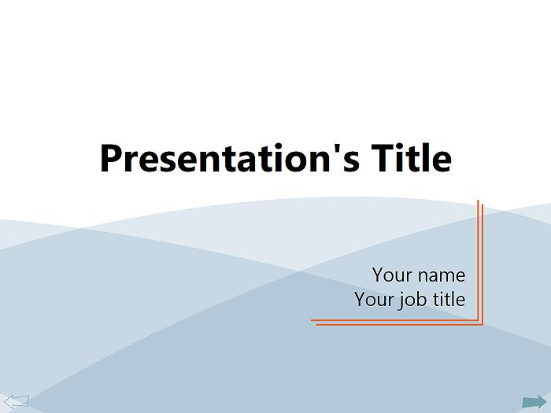

# Using WPF instead of PowerPoint for presentations

If you've attended one of my presentations before, you've noticed that I never use PowerPoint - instead, I have my slides coded in WPF. I've decided to write my own presentation code because I want my slides to be interactive - instead of showing a concept in PowerPoint and switching to VS to demo it, I can demo it directly within the presentation. Several people have asked me for my presentation code in the past, so I've decided to share it here in my blog.

## Use this project

You don't have to read the whole blog post if all you want to do is use my code as a base for your presentation. Here are the steps to add your slides to this project:

- You may want to delete the pages I created (01Title.xaml, 02Slide.xaml, 03Slide.xaml).
- Add a new WPF Page for each new slide you want to create.
- In the "Presentation.cs" file, add the name of your xaml slide to the "slides" string array, in the order you want them to appear.

## Understand the code

Yeah, I thought all of you geeks would continue reading. I will explain below how I implemented each of the features in this project.

### Navigation

I added two elements to the Window's main grid: 

- A frame that displays each slide in turn. Notice that its Source is data bound to the CurrentSlide property of a data source. The CurrentSlide property will contain the name of the XAML Page that is being displayed. I will show what that data source looks like later in this section.
- A TextBlock that contains the title of the slide. Notice that this TextBlock is data bound to the Title of the Frame's content (which is really the Title of each slide Page).

These two elements are wrapped by a Viewbox. I find the Viewbox quite handy in this scenario because I want my slides to scale correctly for every screen resolution. 

	<Grid x:Name="LayoutRoot">
		<Viewbox Margin="10,20,10,40" Stretch="Uniform">
			<StackPanel>
				<!-- Title -->
				<TextBlock VerticalAlignment="Top" Height="84" FontFamily="Calibri" FontSize="65" FontWeight="Bold" Text="{Binding Path=Content.Title, ElementName=Frame, Mode=Default}" TextAlignment="Center" TextWrapping="Wrap"/>
				<!-- Content of the slide -->
				<Frame Width="1000" Height="600" Source="{Binding Path=CurrentSlide, Source={StaticResource presentation}}" x:Name="Frame" NavigationUIVisibility="Hidden" Background="{x:Null}" Focusable="False"/>
			</StackPanel>
		</Viewbox>
		...
	</Grid>
	
The data source that contains the slide information contains a private array with the names of the slides, and it exposes public properties for CurrentSlide and CurrentIndex.

	private string[] slides = { "01Title.xaml", "02Slide.xaml", "03Slide.xaml" };

In the XAML above, you can see that I disabled the usual frame navigation UI by setting NavigationUIVisibility to Hidden. Instead, I decided to add custom "previous" and "next" buttons in the shape of arrows. I designed the arrows in Blend, added IsMouseOver, IsPressed and IsEnabled triggers that cause changes in their appearance, and used those assets within the style of my "previous" and "next" buttons. I added GoBack() and GoNext() methods to the data source that decrement and increment the CurrentIndex, and made sure that those are called in the click handlers of the arrow buttons.

Last, I wanted to disable the "next" button upon reaching the end of the presentation, and disable the "previous" button at the start of the presentation. To do this, I added CanGoBack and CanGoNext properties to my data source, to which I bound the IsEnabled property of the arrow buttons:

	public bool CanGoBack
	{
		get { return this.currentIndex > 0; }
	}
	
	public bool CanGoNext
	{
		get { return this.currentIndex < this.slides.Length - 1; }
	}
	
	<Button IsEnabled="{Binding Path=CanGoNext, Source={StaticResource presentation}}" … Style="{DynamicResource NextButtonStyle}" />

This is really all it took to have a basic but functional presentation program. 

### Pick starting slide

Sometimes I like to stop the slide application to change some xaml or code in one of the slides, and then restart it to show the changes during a live demo. However, I don’t want to restart the whole slide show; I want to skip directly to the slide that I just edited. So I added the following code to the constructor of the Window in order to find the xaml file with the most recent modification time:

	public Window1()
	{
		...
		// When restarting this app, it will start the slide show in the last edited XAML page.
		int indexLastWritten = 0;
		DateTime latestDateTimeWritten = DateTime.MinValue;
		for (int i = 0; i < presentation.Slides.Length; i++)
		{
			string slide = presentation.Slides[i];
			DateTime dateLastWritten = File.GetLastWriteTime(@"..\..\" + slide);
			if (dateLastWritten.CompareTo(latestDateTimeWritten) > 0)
			{
				latestDateTimeWritten = dateLastWritten;
				indexLastWritten = i;
			}
		}
	
		presentation.CurrentIndex = indexLastWritten;
		...
	}

### Hide cursor

I found that sometimes the cursor gets in the way during a presentation. I want it to be visible when I move the mouse, but I want it to disappear when I'm just talking about a slide or demo. I wrote some code that causes the cursor to disappear when I don't move the mouse for 5 seconds, and causes it to reappear when I move the mouse again.

In the constructor for the Window, I added a DispatcherTimer that ticks every 5 seconds, and started it. In the tick handler for this timer, I set the cursor to Cursors.None, causing it to disappear. Then I added handlers for the mouse move and mouse click events, which restart the timer and make the cursor go back to its default look.

	private DispatcherTimer timer;
	
	public Window1()
	{
		...
		// Initializes timer that causes the mouse cursor to disappear after 5 seconds.
		timer = new DispatcherTimer();
		timer.Interval = TimeSpan.FromSeconds(5);
		timer.Tick += new EventHandler(Timer_Tick);
		timer.Start();        
	}
	
	private void Timer_Tick(object sender, EventArgs e)
	{
		this.Cursor = Cursors.None;
	}
	
	private void ShowCursor()
	{
		timer.Start();
		this.ClearValue(FrameworkElement.CursorProperty);
	}
	
	private void Window_PreviewMouseLeftButtonDown(object sender, MouseButtonEventArgs e)
	{
		ShowCursor();
		...
	}
	
	private void Window_PreviewMouseMove(object sender, MouseEventArgs e)
	{
		ShowCursor();
	}

### Animation when clicking

When attending a presentation, it is hard to know when the presenter is hovering over an element, and when she's clicking on it. For some of my demos, it is actually important for the customers attending to recognize those gestures, so I started thinking of ways to make this distinction obvious.

I ended up deciding to add a small animation near the mouse pointer when I click anywhere within the Window. I used Blend to get the animation set up, to make sure it gets triggered on PreviewMouseLeftButtonDown, and to control the visibility of the canvas containing the animation (this canvas should be always collapsed except when I click on the Window). Then I wrote a little bit of code to make sure that the canvas is positioned at the mouse location when the click happens:

	private void Window_PreviewMouseLeftButtonDown(object sender, MouseButtonEventArgs e)
	{
		ShowCursor();
		Point currentPoint = e.GetPosition(this);
		this.clickCanvas.RenderTransform = new TranslateTransform(currentPoint.X, currentPoint.Y);
	}

### Keyboard shortcuts

Finally, I realized that it was a bit impractical to always have to use the mouse to move to the next slide, so I decided to add support for KeyDown events. My event handler jumps to the previous or next slide when I press the left or right arrow key, and exits the presentation when I press the escape key.

	private void Window_KeyDown(object sender, System.Windows.Input.KeyEventArgs e)
	{
		if (e.Key == Key.Left)
		{
			presentation.GoBack();
			e.Handled = true;
		}
		else if (e.Key == Key.Right)
		{
			presentation.GoNext();
			e.Handled = true;
		}
		else if (e.Key == Key.Escape)
		{
			Application.Current.Shutdown();
			e.Handled = true;
		}
	}

## Conclusion

As you can see, my presentation program is quite simple but effective. Hopefully, those of you who do WPF presentations will find it as useful as I do.

