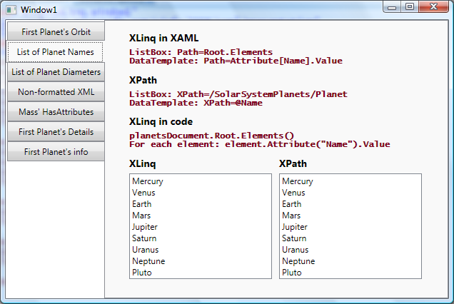

# How to bind WPF elements to XLinq

One of the main features that we shipped in .NET 3.5 is the ability to bind to XLinq directly from XAML. In this post, I will first cover the basics of this new feature, and then discuss the seven queries I added to the sample project. Please keep in mind that this blog post does not attempt to provide an introduction to XLinq. For those of you that need a quick introduction to the topic, I found <a href="http://msdn2.microsoft.com/en-us/library/bb308960.aspx">this site</a> to be a good resource.

## Basics of binding to XLinq

When the XLinq and WPF teams started thinking about the integration of the two products, we quickly realized that we would need to do some work to improve our XAML scenarios in .NET 3.5. The main reason for this decision was the fact that simple XLinq queries are mostly done by calling sequences of methods on an XElement (such as .Elements() or .Descendants()) and we don't have a good syntax to do that in XAML. (Yes, we can bind to the result of a method by using ObjectDataProvider as I explained in <a href="http://www.zagstudio.com/blog/438">this post</a>, but you can imagine how cumbersome the syntax would be if you wanted to call a method on the object returned by another method call. It would be much easier to do it in code.)

Since WPF already has a good syntax for binding to properties and subproperties, the logical solution to this problem was to add PropertyDescriptors to the XLinq DLL that expose certain key methods as if they were properties. If you are not familiar with PropertyDescriptors, I encourage you to read <a href="http://msdn.microsoft.com/msdnmag/issues/05/04/NETMatters/">this article on ICustomTypeDescriptor</a> and <a href="http://msdn.microsoft.com/msdnmag/issues/05/05/NETMatters/default.aspx">this one on TypeDescriptorProvider</a>. These are the two best articles I have found on the topic. There is a precedent for this solution: we did basically the same thing to provide XAML support when binding to ADO.NET. As I described in <a href="http://www.zagstudio.com/blog/372">this post</a> , we expose the Relation names using PropertyDescriptors so that you can bind to them as if they were properties.

I want you to understand how we implemented this feature so that it doesn't come as a surprise when I say that to bind to XLinq, you will need to use a binding's Path (not XPath!) and the same "dot syntax" that we use to bind to subproperties.

We implemented six new PropertyDescriptors. You can find the new code added by the XLinq team in the System.Xml.XLinq.ComponentModel namespace of the System.Xml.XLinq DLL. You will see the TypeDescriptionProvider (XTypeDescriptionProvider&lt;T&gt;) and a new PropertyDescriptor class for each property we expose this way (e.g., XElementAttributePropertyDescriptor). The table below shows the correspondence between the properties exposed by the PropertyDescriptors (to be used in XAML) and their equivalent XLinq code. 

<table border="1">
<tr>
<td>XAML</td>
<td>Code</td>
<td>Notes</td>
</tr>
<tr>
<td>Element[MyElementName]</td>
<td>.Element("MyElementName")</td>
<td />
</tr>
<tr>
<td>Elements[MyElementName]</td>
<td>.Elements("MyElementName")</td>
<td>Parameter is optional.</td>
</tr>
<tr>
<td>Attribute[MyAttributeName]</td>
<td>.Attribute("MyAttributeName")</td>
<td />
</tr>
<tr>
<td>Descendants[ElementName]</td>
<td>.Descendants("ElementName")</td>
<td>Parameter is optional.</td>
</tr>
<tr>
<td>Value</td>
<td>.Value</td>
<td>Special case. (I explain below.)</td>
</tr>
<tr>
<td>Xml</td>
<td>.ToString(SaveOptions.DisableFormatting)</td>
<td />
</tr>
</table>

The properties in the XAML column of this table are all exposed in XElement, but Value is also exposed in XAttribute. Based on the table above, you can deduce that the following XLinq code...

	var query = myXElement.Attribute("MyAttribute");

...has the following equivalent in XAML (assuming that the DataContext is the XElement myElement):

	<TextBlock Text="{Binding Path=Attribute[MyAttribute]}" />

However, you may be wondering why we decided to define a PropertyDescriptor for Value, given that it is already a property (and not a method) of XElement (and XAttribute). It seems that we could simply bind to XElement and dot into it, right? Well, the reason for this is that we wanted to provide change notifications for Value. If you get a particular XElement as the result of a query, bind to it, and then change its value, we want that to be reflected in the UI. By adding a PropertyDescriptor for this property, we can provide change notifications in a non-intrusive way (without having to change the XElement class). 

Similarly, it is important to keep in mind that anytime you bind to properties that don't have a corresponding PropertyDescriptor (such as Root and HasAttributes in the samples I will show below), WPF will not be notified of property changes. If those properties happen to be in the middle of a query, they break the chain of notifications.

You can use <a href="http://www.aisto.com/roeder/dotnet/">.NET reflector</a> to look into these PropertyDescriptors and understand how I came up with the table above. For example, search for XElementXmlPropertyDescriptor, look at the GetValue method, and you will see that it returns this.element.ToString(SaveOptions.DisableFormatting).

This is all there is to this new feature. Next I will show a few samples and a comparison between the XLinq code syntax, XLinq XAML syntax, and the XPath way of doing the same query.

## Samples

Here is the data source used in these samples:

	<SolarSystemPlanets>
		<Planet Name="Mercury">
			<Orbit>57,910,000 km (0.38 AU)</Orbit>
			<Diameter>4,880 km</Diameter>
			<Mass>3.30e23 kg</Mass>
			
The small and rocky planet Mercury is the closest planet to the Sun.

		</Planet>
		...
	</SolarSystemPlanets>

I defined the XML in an external file, added it as a Resource, and parsed it into an XDocument with the following code:

	XDocument planetsDocument = InitializeDataSource("/Planets.xml");

	private XDocument InitializeDataSource(string uriString)
	{
		StreamResourceInfo resourceInfo = Application.GetResourceStream(new Uri(uriString, UriKind.Relative));
		StreamReader reader = new StreamReader(resourceInfo.Stream);
		return XDocument.Load(reader);
	}

I also created an XmlDataProvider so that I could show queries equivalent to the XLinq ones, but using XPath:

	XmlDataProvider xdp = new XmlDataProvider();
	xdp.Source = new Uri("Planets.xml", UriKind.Relative);

### First Planet's Orbit
	
	// XLinq code
	var query2 = planetsDocument.Root.Element("Planet").Element("Orbit");
	Console.WriteLine(query2);
	
	// XLinq XAML
	<TextBlock Text="{Binding Path=Root.Element[Planet].Element[Orbit]}" />
	
	// XPath
	<TextBlock Text="{Binding XPath=/SolarSystemPlanets/Planet[1]/Orbit, Path=OuterXml}" />
	
	// Result
	//<Orbit>57,910,000 km (0.38 AU)</Orbit>

This working sample shows how easy it is to follow the table above to translate XLinq code into XAML. Please keep in mind that the range of useful query methods supported by XLinq is far greater than the ones we decided to support. For example, you could have written this same query in the following way:

	var query2 = planetsDocument.Element("SolarSystemPlanets").Element("Planet").Element("Orbit");

This can not be translated directly into XAML because the first Element(...) method is called on XDocument, and we only added the Element property descriptor for XElement. 
Here are a couple of other examples of queries that produce the same result:

	var query2 = planetsDocument.Root.Elements().First().Element("Orbit");
	var query2 = planetsDocument.Root.Elements().ElementAt(0).Element("Orbit");

These can also not be translated into XAML because we don't provide property descriptors for First() and ElementAt(...). So, if you have an XLinq query in code that you want to translate into XAML, you should try to first modify it to use only the methods we support. Of course, this will only work for simple queries - if you are using more advanced features of XLinq, your only option is to use code.

You may have noticed that the XmlDataProvider binding above uses both XPath and Path. This scenario is fully supported and sometimes very useful. The data binding engine will first resolve the XPath, and then it will call the OuterXml property on the resulting XmlElement. If I hadn't called OuterXml, the query would return only the content of this element.

### List of Planet Names
	
	// XLinq code
	var query3 = planetsDocument.Root.Elements();
	foreach (var element in query3)
	{
		Console.WriteLine(element.Attribute("Name").Value);
	}
	
	// XLinq XAML 
	<StackPanel Name="XLinqPanel3">
		<StackPanel.Resources>
			<DataTemplate x:Key="PlanetTemplate">
				<TextBlock Text="{Binding Path=Attribute[Name].Value}" />
			</DataTemplate>
		</StackPanel.Resources>
		...
		<ListBox ItemsSource="{Binding Path=Root.Elements}" ItemTemplate="{StaticResource PlanetTemplate}" ... />
	</StackPanel>
	
	// XPath
	<StackPanel Name="XMLPanel3" Margin="10,0,0,0">
		<StackPanel.Resources>
			<DataTemplate x:Key="PlanetTemplate">
				<TextBlock Text="{Binding XPath=@Name}" />
			</DataTemplate>
		</StackPanel.Resources>
		...
		<ListBox ItemsSource="{Binding XPath=/SolarSystemPlanets/Planet}" ItemTemplate="{StaticResource PlanetTemplate}" .../>					
	</StackPanel>
	
	// Result
	//Mercury
	//Venus
	// ...
	//Pluto

In this sample I show how to bind to a collection and how to display an attribute. Notice that in XLinq, if I only want to show the content of the attribute, I have to explicitly call its Value property. If I don't call Value, each item in the ListBox will display something like 'Name="Mercury"'. In XML, binding to the attribute @Name will give me the contents of the attribute automatically.

### List of Planet Diameters
	
	// XLinq code
	var query4 = planetsDocument.Root.Descendants("Diameter");
	foreach (var element in query4)
	{
		Console.WriteLine(element.Value);
	}
	
	// XLinq XAML
	<ListBox ItemsSource="{Binding Path=Root.Descendants[Diameter]}" DisplayMemberPath="Value" .../>
	
	// XPath
	<ListBox ItemsSource="{Binding XPath=/SolarSystemPlanets/*/Diameter}" .../>
	
	// Result
	//4,880 km
	//12,103.6 km
	// ...
	//2274 km

I added this sample to show binding to the "Descendants" property, and the corresponding XML. Pretty simple.

### Non-formatted XML
	
	// XLinq code 
	var query5 = planetsDocument.Root.Element("Planet").ToString(SaveOptions.DisableFormatting);
	Console.WriteLine(query5);
	
	// XLinq XAML
	<TextBlock Text="{Binding Path=Root.Element[Planet].Xml}" .../>
	
	// XPath
	<TextBlock Text="{Binding XPath=/SolarSystemPlanets/Planet[1], Path=OuterXml}"  .../>
	
	// Result
	// <Planet Name="Mercury"><Orbit>57,910,000 km (0.38 AU)</Orbit><Diameter>4,880 km</Diameter><Mass>3.30e23 kg</Mass>
The small and rocky planet Mercury is the closest planet to the Sun.
</Planet>

The Xml property allows you to query for the unformatted version of the XML. This is the only property whose name is quite different from the corresponding method in code (as you can imagine, it would be quite cumbersome to keep them consistent). If you use the same XLinq query in XAML but without  ".Xml" in the Path, you would get XML that is formatted with indentation.

### HasAttributes of Mass
	
	// XLinq code 
	var query6 = planetsDocument.Root.Element("Planet").Element("Mass").HasAttributes;
	Console.WriteLine(query6);
	
	// XLinq XAML
	<TextBlock Text="{Binding Path=Root.Element[Planet].Element[Mass].HasAttributes}" />
	
	// XPath
	<TextBlock Text="{Binding XPath=/SolarSystemPlanets/Planet[1]/Mass, Path=HasAttributes}" />
	
	// Result
	// false

HasAttributes is a property that exists both in XmlElement and XElement. You can see in this example that since XLinq uses Path, it's easy to bind to properties exposed directly in XElement. This same scenario using XPath has to be implemented by combining XPath and Path.

### First Planet's Details
	
	// XLinq code 
	XNamespace ns = "http://myNamespace";
	var query7 = planetsDocument.Root.Element("Planet").Element(ns + "Details").Value;
	Console.WriteLine(query7);
	
	// XLinq XAML
	<TextBlock Text="{Binding Path=Root.Element[Planet].Element[{http://myNamespace}Details].Value}" />
	
	// XPath
	<TextBlock Text="{Binding XPath=/SolarSystemPlanets/Planet[1]/mn:Details}" />
	
	// Result
	//The small and rocky planet Mercury is the closest planet to the Sun.

This sample shows how to embed namespaces in XAML. Below you can see that when I instantiated the XmlDataProvider, I also added an XmlNamespaceMapping that allows me to use the string "mn" instead of the full namespace. That is how the data binding engine knows how to resolve the namespace in "mn:Details" correctly.

	XmlDataProvider xdp = new XmlDataProvider();
	xdp.Source = new Uri("Planets.xml", UriKind.Relative);
	XmlNamespaceMapping mapping = new XmlNamespaceMapping("mn", new Uri("http://myNamespace"));
	XmlNamespaceMappingCollection mappingCollection = new XmlNamespaceMappingCollection();
	mappingCollection.Add(mapping);
	xdp.XmlNamespaceManager = mappingCollection;

In XLinq, however, there is no concept of namespace prefixes. This decision was made in order to avoid confusion caused by the fact that prefixes depend on context to have meaning. For this reason, we need to include the full namespace directly in the XAML query as I show above. See what the XLinq team has to say about <a href="http://www.xlinq.net/xlinq/reference/index.html?page=html%2F719fee2f-2bc9-4235-99e1-cf105c0cf26e.htm">namespaces and prefixes</a>.

### First Planet's info
	
	// XLinq code 
	var query8 = planetsDocument.Root.Element("Planet").Elements();
	foreach (var element in query8)
	{
		Console.WriteLine(element.Value);
	}
	
	// XLinq XAML
	<StackPanel Name="XLinqPanel8">
		<StackPanel.Resources>
			...
			<DataTemplate DataType="Mass">
				<StackPanel Orientation="Horizontal">
					<TextBlock FontWeight="Bold" Text="Mass:  " />
				<TextBlock Text="{Binding Path=Value}" />
			</StackPanel>
			</DataTemplate>

			<DataTemplate DataType="{}{http://myNamespace}Details">
				<StackPanel Orientation="Horizontal">
					<TextBlock FontWeight="Bold" Text="Details:  " />
				<TextBlock Text="{Binding Path=Value}" />
			</StackPanel>
			</DataTemplate>
		</StackPanel.Resources>
		...
		<ItemsControl ItemsSource="{Binding Path=Root.Element[Planet].Elements}" HorizontalAlignment="Left" />
	</StackPanel>
	
	// XPath
	<StackPanel Name="XMLPanel8">
		<StackPanel.Resources>
			...
			<DataTemplate DataType="Mass">
				<StackPanel Orientation="Horizontal">
					<TextBlock FontWeight="Bold" Text="Mass:  " />
				<TextBlock Text="{Binding XPath=.}" />
			</StackPanel>
			</DataTemplate>

			<DataTemplate DataType="mn:Details">
				<StackPanel Orientation="Horizontal">
					<TextBlock FontWeight="Bold" Text="Details:  " />
				<TextBlock Text="{Binding XPath=.}" />
			</StackPanel>
			</DataTemplate>
		</StackPanel.Resources>
		...
		<ItemsControl ItemsSource="{Binding XPath=/SolarSystemPlanets/Planet[1]/*}" HorizontalAlignment="Left" />
	</StackPanel>
	
	// Result
	//57,910,000 km (0.38 AU)
	//4,880 km
	//3.30e23 kg
	//The small and rocky planet Mercury is the closest planet to the Sun.

In the previous sample, you may have noticed that XLinq namespaces are surrounded by curly braces in XAML. This worked well when used inside of an indexer, however, since curly braces already have meaning for the XAML parser, sometimes we need to escape them. For example, in the DataType of the Details DataTemplate in this sample, I had to escape the namespace with a leading {}. Remember that when binding to objects, the DataType property could be set to a value such as {x:Type local:MyDataObject}, so escaping the namespace allows the parser to distinguish between the two scenarios. 

