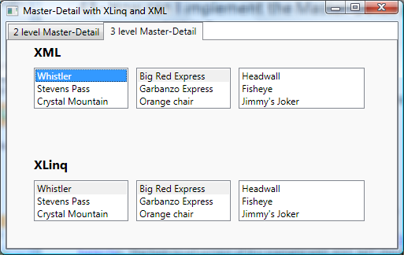

# How to implement the Master-Detail pattern when binding to XLinq and XML

I have explained in previous posts how to implement:

- A two-level Master-Detail scenario using objects as data source <a href="http://www.zagstudio.com/blog/355">here</a>.
-  A three level Master-Detail scenario using objects as data source <a href="http://www.zagstudio.com/blog/356">here</a> 
- A three level Master-Detail scenario using ADO.NET <a href="http://www.zagstudio.com/blog/372">here</a>.  The two-level version of this scenario with ADO.NET should be obvious based on the samples above.

In this post, I will explain how to implement a two and three level Master-Detail when binding to XLinq and XML. 

## Two level Master-Detail with XML

Here is the XML data source I used for this scenario:

	<XmlDataProvider x:Key="PlanetsXDP" XPath="SolarSystemPlanets/Planet" Source="SolarSystemPlanets.xml" />
			
	<!-- In file SolarSystemPlanets.xml -->
	<?xml version="1.0" encoding="utf-8" ?>
	<SolarSystemPlanets>
		<Planet Name="Mercury">
			<Orbit>57,910,000 km (0.38 AU)</Orbit>
			<Diameter>4,880 km</Diameter>
			<Mass>3.30e23 kg</Mass>
			
The small and rocky planet Mercury is the closest planet to the Sun.

		</Planet>
		...
	</SolarSystemPlanets>

The two level Master-Detail scenario works very similarly regardless of the data source. The following code and XAML make up the core of this scenario, when using XML as a data source:

	<Grid Margin="30" Name="XML2Level" DataContext="{Binding Source={StaticResource PlanetsXDP}}">
		...
		<ListBox ItemsSource="{Binding}"  Name="MasterListBox2" ItemTemplate="{StaticResource XMLMasterPlanetTemplate}" IsSynchronizedWithCurrentItem="True" Width="100" ... />
		<ContentControl Name="Detail2" Content="{Binding}" ContentTemplate="{StaticResource XMLDetailPlanetTemplate}" ... />
	</Grid>

Notice that both the ListBox and ContentControl elements have the exact same empty Binding as content. This is possible because, as I explained in a <a href="http://www.zagstudio.com/blog/355">previous post</a>, the data binding engine detects that the ContentControl can not display a list of items, and grabs the current item of that list instead. This is true for every data source type.

## Two level Master-Detail with XLinq

I started by creating an XElement by loading the same XML file shown above, and used it as the data source for the XLinq scenario. In my <a href="http://www.zagstudio.com/blog/483">last blog post</a> I loaded the XML in code, so this time I show how to do this in XAML, using ObjectDataProvider.

	<ObjectDataProvider ObjectType="{x:Type xlinq:XElement}" MethodName="Load" x:Key="PlanetsODP">
		<ObjectDataProvider.MethodParameters>
			<system:String>../../SolarSystemPlanets.xml</system:String>
		</ObjectDataProvider.MethodParameters>
	</ObjectDataProvider>

You can see below that the only somewhat interesting difference between the XLinq and XML scenarios is the Path of the DataContext Binding. In this scenario, we need to drill into the "Elements" property of the root XElement, in order to obtain a list of Planet elements. Since we now have a collection as the DataContext, we can use a simple empty Binding on the ListBox and ContentControl to get the Master-Detail pattern to work.

	<Grid Margin="30" Name="XLinq2Level" DataContext="{Binding Source={StaticResource PlanetsODP}, Path=Elements}">
		...
		<ListBox ItemsSource="{Binding}" Name="MasterListBox1" ItemTemplate="{StaticResource XLinqMasterPlanetTemplate}" IsSynchronizedWithCurrentItem="True" ... />
		<ContentControl Name="Detail1" Content="{Binding}" ContentTemplate="{StaticResource XLinqDetailPlanetTemplate}" ... />
	</Grid>

## Three level Master-Detail with XML

Here is the XML data source I used for this scenario :

	<XmlDataProvider x:Key="MountainsXDP" XPath="Mountains/Mountain" Source="Mountains.xml"/>
	
	<!-- In file Mountains.xml -->
	<Mountains >
		<Mountain Name="Whistler">
			<Lifts>
				<Lift Name="Big Red Express">
					<Runs>
						<Run>Headwall</Run>
						<Run>Fisheye</Run>
						<Run>Jimmy's Joker</Run>
					</Runs>
				</Lift>
				...
			</Lifts>
		</Mountain>
		...
	</Mountains>

The three level Master-Detail with XML is a little trickier than the two level version of the same pattern. Here is the code and XAML necessary to implement this scenario:
	
	<Grid Margin="30" Name="XML3Level" DataContext="{Binding Source={StaticResource MountainsXDP}}">
		...
		<ListBox ItemsSource="{Binding}" Name="MasterListBox4" ItemTemplate="{StaticResource XMLMountainTemplate}" IsSynchronizedWithCurrentItem="True" .../>
		<ListBox ItemsSource="{Binding XPath=Lifts/Lift}" ItemTemplate="{StaticResource XMLLiftTemplate}" IsSynchronizedWithCurrentItem="True" Name="MiddleListBox4" .../>
		<ListBox Name="Detail4" DataContext="{Binding ElementName=MiddleListBox4, Path=SelectedItem}" ItemsSource="{Binding XPath=Runs/Run}" ItemTemplate="{StaticResource XMLRunTemplate}" .../>
	</Grid>
	
The first ListBox simply binds to the collection of Mountains (notice the XPath in the XmlDataProvider). 

The second ListBox drills into the collection of Lifts of each Mountain. This is implemented internally by executing an XPath query on the instance of the Moutains collection shown in the first ListBox, with the syntax found in the XPath property. The two collections can be kept in sync because the second collection instance is a subcollection of the first.

If you've seen my post on <a href="http://www.zagstudio.com/blog/356">three level Master-Detail when binding to objects</a>, you probably expect the following syntax to work for the third ListBox (a similar syntax works when binding to objects):

	<ListBox ... ItemsSource="{Binding XPath=Lifts/Lift/Runs/Run}" ... />

If you try this on the third ListBox, you might be surprised by the results. The third ListBox shows all the runs of <b>all the lifts</b> of the selected mountain, instead of showing all the runs of <b>the selected lift</b> of the selected mountain. That's because when you use this syntax, the binding engine executes a new XPath query on the DataContext, which happens to be the collection of mountains displayed in the first list box. The XPath query can't be executed on a collection, so the binding engine executes the query on the current item of the collection - whichever mountain is selected in the first ListBox. The result of the query is completely independent of the current selection in the second ListBox.

The only way to grab instances of items from the collection in the second ListBox is by binding to the ListBox itself. This is why the DataContext of the third ListBox is bound to the SelectedItem of the second ListBox in the working solution. 

You're probably wondering why I'm binding to the DataContext and the ItemsSource of the third ListBox, instead of using the ItemsSource property only. This is what the Binding would look like, if I used the ItemsSource only:

	<ListBox ... ItemsSource="{Binding ElementName=MiddleListBox4, Path=SelectedItem, XPath=Runs/Run}" ... />

As I explained in <a href="http://www.zagstudio.com/blog/483">my previous post</a>, it's actually possible (and sometimes very useful) to have a Path and XPath in the same Binding. Keep in mind, however, that whenever XPath and Path are both specified, the XPath is always executed before the Path, independently of the order in which you specify them in the Binding. We decided on this order of execution because this feature is used mostly to drill into properties of XmlElement (such as HasAttributes, InnerXml or Name). In the Master-Detail sample, we need to first get the SelectedItem (which is an XmlElement), and then execute the XPath query on it. Unfortunately there is no way for us to specify in a Binding that we want to execute the Path before the XPath. And this is the reason I had to break up the Binding into two: the part with the Path needs to be executed first so it goes in the DataContext, and the XPath needs to be executed second, so it goes in the ItemsSource.

## Three level Master-Detail with XLinq

Here is the code and XAML for the XLinq version of the three level Master-Detail:

	<ObjectDataProvider ObjectType="{x:Type xlinq:XElement}" MethodName="Load" x:Key="MountainsODP">
		<ObjectDataProvider.MethodParameters>
			<system:String>../../Mountains.xml</system:String>
		</ObjectDataProvider.MethodParameters>
	</ObjectDataProvider>
	
	<Grid Margin="30" Name="XLinq3Level" DataContext="{Binding Source={StaticResource MountainsODP}, Path=Elements}">
		...
		<ListBox ItemsSource="{Binding}" Name="MasterListBox3" ItemTemplate="{StaticResource XLinqMountainTemplate}" IsSynchronizedWithCurrentItem="True" .../>
		<ListBox ItemsSource="{Binding Path=Element[Lifts].Elements}" ItemTemplate="{StaticResource XLinqLiftTemplate}" IsSynchronizedWithCurrentItem="True" Name="MiddleListBox3" .../>
		<ListBox Name="Detail3" ItemsSource="{Binding ElementName=MiddleListBox3, Path=SelectedItem.Element[Runs].Elements}" ItemTemplate="{StaticResource XLinqRunTemplate}" IsSynchronizedWithCurrentItem="True"  .../>
	</Grid>
	
Similarly to the XML scenario, the first ListBox binds to the collection of Mountain XElements directly. The second ListBox gets the Lifts collection of a particular mountain, and drills into its Elements collection. This returns all the Lift XElements for the selected mountain.

But the most interesting part of this scenario is the third ListBox. First of all, notice that I am still using ElementName to bind to the second ListBox. The reason for this is exactly the same as in the XML scenario. Notice also I am no longer splitting the Binding between the DataContext and ItemsSource. That is because we use Path to do XLinq queries, so there are no issues with precedence of Path versus XPath. As you can see, we can specify our query in a much more linear way: we first get the SeletedItem (of type XElement) from the second ListBox, then get its Runs child, and then drill into all the Run elements. 

## Keeping two ListBoxes in sync

There are some differences of behavior when keeping two ListBoxes in sync (as part of three level Master-Detail or in isolation) using different data sources, so I will add a few extra words on this.

In the XML three-level Master-Detail, if you select "Whistler", then "Stevens Pass", then "Jupiter Chair", then "Whistler", then "Stevens Pass" again, you will notice that "Jupiter Chair" is no longer selected (the first element of that ListBox is selected instead). This happens because every time  you click on "Stevens Pass", we execute the appropriate XPath query, and that returns a different instance of the same collection. 

If you try this scenario when binding to CLR objects, ADO.NET or XLinq, you will see that previous selections in the second ListBox will be remembered.  This is typically what users want, so we paid special attention to it when designing integration between WPF and XLinq.

## Conclusion

When you have the option of either binding directly to the current item of the previous collection or using ElementName and SelectedItem to achieve Master-Detail, I typically advise people to bind to the current item. One reason for this is that the Master-Detail scenario is a data concept, and if possible it should be implemented by using only data concepts such as currency (SelectedItem is a concept similar to currency, but relevant to the UI only). Besides, your scenario becomes independent of the names of the ListBoxes. 

However, in scenarios like the three-level Master-Detail using XML and XLinq, where there is no solution purely based on current item, in my opinion it's perfectly OK to implement the binding on the second ListBox using ElementName and SelectedItem. This has the advantage of maintaining consistency between the second and third ListBoxes, making the XAML easier to read. In this post, I wanted to show how far you can go in Master-Detail by binding to the current item only, which is why I opted to show different styles of Bindings in the second and third ListBoxes. In my opinion, both ways are OK, so it really comes down to personal preference.

