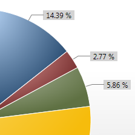
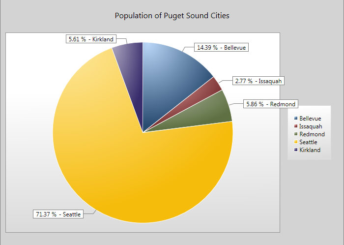

# How to add labels to a WPF pie chart

*Update April 4 2010: The LabeledPieChart code in this post has been updated to the latest WPF and Silverlight toolkits. You can find more details in <a href="..\67-PieChartWithLabelsUpdates">this blog post</a>.

The <a href="http://wpf.codeplex.com/Release/ProjectReleases.aspx?ReleaseId=29117">WPF Toolkit</a> and <a href="http://www.codeplex.com/Silverlight">Silverlight Toolkit</a> both include a very versatile chart control. Although support for labels (or annotations) is a frequently requested feature, it is not yet present in the current toolkits. <a href="http://blogs.msdn.com/delay/archive/2009/07/27/simple-column-labels-you-can-create-at-home-re-templating-the-silverlight-wpf-data-visualization-columndatapoint-to-add-annotations.aspx">David Anson</a> blogged about a great solution to add labels to a ColumnSeries. In the next few posts, I will talk about one way to add labels to a PieSeries.

In this post, I will show how you can use my custom control that provides annotations for the WPF pie chart; in the next post, I will discuss the control's implementation; and in the post after that I will show you the process of converting the WPF code to Silverlight.

## Basic usage

You can use the following XAML to display a labeled pie chart with your data without any further customizations.

	<customControls:LabeledPieChart 
		Title="Population of Puget Sound Cities"
		ItemsSource="{Binding}" 
		IndependentValuePath="Name"
		DependentValuePath="Population" />

This markup assumes that the data context is set to the following ObservableCollection:

	this.cities = new ObservableCollection<City>
	{
		new City { Name = "Bellevue", Population = 121347 },
		new City { Name = "Issaquah", Population = 23363 },
		new City { Name = "Redmond", Population = 49427 },
		new City { Name = "Seattle", Population = 602000 },
		new City { Name = "Kirkland", Population = 47325 }
	};
	this.DataContext = this.cities;

Here is the result of the XAML and code above:

## Label display modes

The LabeledPieChart control has four ways it can position each label:

- ArcMidpoint: The label is centered on the midpoint of the circular arc of the corresponding pie wedge. 
- Connected: The label is positioned outside the pie chart, with a short line connecting it to its pie wedge. 
- AutoMixed: Small pie wedges display their labels using the connected mode, and bigger wedges use the arc midpoint mode.
- Auto: If at least one pie wedge is small, all wedges use the connected mode. If all wedges are big, they all use the arc midpoint mode. Dynamically adding and removing wedges may cause all wedges to alternate between arc midpoint and connected mode.

The images below illustrate the label modes (except Auto, which looks like ArcMidpoint or Connected).

<table  width="100%">
<tr>
<th>ArcMidpoint</th>
<th>Connected</th>
<th>AutoMixed</th>
</tr>
<tr>
<th></th>
<th></th>
<th></th>
</tr>
</table>

To switch between these modes, you can set the LabelDisplayMode property of the LabeledPieChart control:

	<customControls:LabeledPieChart 
		LabelDisplayMode="Auto"
		... />

## Customizing the content of the labels

To configure the content of the labels, you can define a DataTemplate that displays the data you're interested in, using the PieChartLabelItemTemplate property of LabeledPieChart:

	<DataTemplate DataType="{x:Type local:City}" x:Key="pieChartLabelDataTemplate">
		<Border BorderThickness="1" BorderBrush="Gray">
			<StackPanel Background="White" Orientation="Horizontal">
				<TextBlock Text="{Binding RelativeSource={RelativeSource AncestorType={x:Type customControls:PieChartLabel}}, Path=FormattedRatio}" VerticalAlignment="Center" Margin="5,0,5,0" />
				<TextBlock Text="- " />
				<TextBlock Text="{Binding Name}" Margin="0,0,5,0"/>
			</StackPanel>
		</Border>
	</DataTemplate>
	
	<customControls:LabeledPieChart 
		PieChartLabelItemTemplate="{StaticResource pieChartLabelDataTemplate}"
		... />

The content for PieChartLabel - the custom control that displays a single label - is the actual City data item. Therefore, if you want to display properties of the data item within the label, you can bind to them by just specifying the Path.

Notice that I am using an AncestorType binding to get at the FormattedRatio property. FormattedRatio is a very handy property that gives you the percentage of the numeric value represented in the current wedge, in relation to the sum of all items. This property is defined originally on PieDataPoint, and also on PieChartLabel. PieChartLabel's FormattedRatio is data bound to the one in PieDataPoint, so they're kept in sync. Since the DataTemplate's templated parent is a ContentPresenter, using TemplateBinding would try to find the FormattedRatio property on the ContentPresenter itself, which would of course fail. So, I need to keep walking up the tree to find the PieChartLabel control so that I can bind to that property. AncestorType provides an easy way of doing that.

## Customizing the connector line

The connecting line's thickness and brush are exposed as properties in PieChartLabel, and therefore can be customized easily in its style. Here's an example:

	
	
	<customControls:LabeledPieChart 
		PieChartLabelStyle="{StaticResource pieChartLabelStyle}"
		... />

## Master-detail scenario

To implement the master-detail scenario using this chart, you simply need to set the IsSelectionEnabled property exposed by LabeledPieChart, and bind another element to the chart's selected item:

	<ContentControl  Content="{Binding ElementName=labeledPieChart, Path=SelectedItem}" ContentTemplate="{StaticResource cityDetails}" />
	<customControls:LabeledPieChart IsSelectionEnabled="True" x:Name="labeledPieChart" ... />

Clicking on the label has the same effect as clicking on the PieDataPoint associated with it - it changes the selection of the details section.

## Summary

This blog post provided a quick overview of LabeledPieChart control's main features. Hopefully these features cover many scenarios people are looking for. However, my guess is that this code will be used as a starting point for customized scenarios. My next post discusses some implementation details, which I am hoping will inspire developers to customize and extend the control for their own needs. So stay tuned.

For more information about Charting, I recommend subscribing to <a href="http://blogs.msdn.com/delay/default.aspx">David Anson's blog</a> - there is no better charting resource out there!
