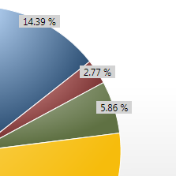
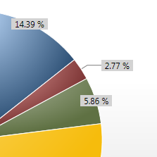

# How to add labels to a WPF pie chart – Implementation details

*Update April 4 2010: The LabeledPieChart code in this post has been updated to the latest WPF and Silverlight toolkits. You can find more details in <a href="..\67-PieChartWithLabelsUpdates">this blog post</a>.

In my <a href="..\54-PieChartWithLabels">last blog post</a>, I showed how you can use a custom control to add labels to a WPF pie chart. In this post I will discuss its implementation.

I started by thinking about what I wanted the usage syntax to look like. Ideally, I would like to create a LabeledPieSeries class that derives from PieSeries, and that exposes a LabelStyle property. This would make using a pie series with labels as easy as using any other chart series, which WPF chart users are already familiar with (the <a href="http://silverlight.codeplex.com/Wiki/View.aspx?title=Silverlight%20Toolkit%20Overview%20Part%202">Codeplex charting overview</a> shows what that syntax would look like). Unfortunately, PieSeries is currently sealed, so I had to search for another alternative. 

Often, when faced with this design constraint, using a behavior is a good alternative. A behavior is simply an attached property that provides access to the element it's attached to, and therefore to the whole tree it belongs to. I used a similar technique in my <a href="..\46-DragDropListBox">drag and drop blog post</a>. More recently, Blend 3 has embraced this technique by providing support for applying behaviors at design time, and has generated a community around the creation of <a href="http://gallery.expression.microsoft.com/en-us/">reusable behaviors</a>. You can read more about Blend's support for behaviors in <a href="http://electricbeach.org/?p=147">Christian's blog</a>.

## Behavior

The implementation of this behavior consists of an attached DependencyProperty "IsLabeled," defined on a static class called PieLabelBehavior. This DP is intended to be attached to a PieDataPoint. When the DP is attached, the behavior creates a new label (instantiates a PieChartLabel), sets many of its properties, and walks the tree to add it to the desired location. Attaching the DP to the corresponding PieDataPoint provides an easy and reliable way to be notified when the PieDataPoints are created and added to the tree, and therefore ready to have the corresponding labels generated. Attaching the DP to PieSeries instead would have simplified setting the DP, since there would only be one place to set it, but it would have made it harder to know exactly when the PieDataPoints are added to the tree. Here is how the behavior is attached to each PieDataPoint:

	
	
	<datavis:StylePalette x:Key="LabeledPieChartStylePalette">
		<!--Blue-->
		
		<!--Red-->
		
	</datavis:StylePalette>

To avoid having neighboring wedges overlap a pie label, all labels had to be positioned in their own Canvas, which has a higher z-order than the PieDataPoint's Canvas. My first attempt was to add the label's Canvas to the PieSeries' template. I added a Grid which had as its children the already existing PlotArea Canvas and my newly created Canvas that would contain the labels. The problem with this approach was that PieSeries clips itself, causing longer labels to be cut off. I attempted to have the actual pie chart occupy a smaller percentage of the PieSeries' area, but unfortunately charting source code is setting the chart to take 95% of PieSerie's space. Since this is percentage is not configurable, I had to find another solution. So, instead, I moved the label's canvas to the Chart template. This fixed the clipping issue.

At this point, I have a way to inject code in a PieDataPoint when it's added to the tree and I have a location to add my labels. The missing piece is the easiest part: when the PieDataPoint is added to the tree, I walk up the visual tree to find the label area Canvas, create a PieChartLabel and add it to the Canvas. This was done in the change handler for the IsLabeled attached DP (this handler was attached during the DP's registration, as part of its PropertyMetadata):

	private static void IsLabeledPropertyChanged(DependencyObject obj, DependencyPropertyChangedEventArgs e)
	{
		bool isLabeled = (bool)e.NewValue;
		if (isLabeled == true)
		{
			PieDataPoint pieDataPoint = obj as PieDataPoint;
			if (pieDataPoint != null)
			{
				Chart chart = TreeHelper.FindAncestor<Chart>(pieDataPoint.Parent as DependencyObject);
				if (chart != null)
				{
					Canvas labelArea = chart.Template.FindName("LabelArea_PART", chart) as Canvas;
					if (labelArea != null)
					{
						AddLabel(pieDataPoint, labelArea);
					}
				}
			}
		}
	}

The AddLabel method creates a new PieChartLabel, sets its properties - many of them reflecting information found in the corresponding PieDataPoint, which we have a handle to - and adds it as a child of the label area Canvas passed as a parameter. AddLabel also contains code that removes the label when the PieDataPoint is unloaded:

	pieDataPoint.Unloaded += delegate
	{
		labelArea.Children.Remove(label);
	};

The next step was to figure out how the labels were going to be positioned in the Canvas. I decided to have four "display modes", which I explain in my <a href="..\54-PieChartWithLabels">previous blog post</a>. Picking the desired display mode can be done through a DisplayMode property on PieChartLabel. Below I discuss the implementation of each mode.

## ArcMidpoint mode

In order to implement this mode, I first needed to calculate the midpoint of the PieDataPoint's arc. To get that information, I created a PieChartHelper static class containing a GetPieChartInfo method with the following signature:

	public static bool GetPieChartInfo(Geometry geometry, out Point center, out Point arcMidpoint, out bool isArcSmall)

The "geometry" parameter is the wedge geometry of the corresponding PieDataPoint. This method returns three values: "center" which we'll use in the Connected mode, "arcMidPoint" which is the midpoint of the arc needed for this mode, and "isArcSmall" which we'll use in the AutoMixed mode. More on the Connected and AutoMixed modes later.

I won't go into the implementation details for this method here. It requires a bit of understanding of math, and very little of WPF. If there's interest, I'll write a separate blog post for it - leave a comment or send me email if this interests you. 

PieDataPoint exposes its Geometry through a DP, which is handy in this scenario. When I create a new PieChartLabel (in the behavior), I data bind PieChartLabel's Geometry DP to the PieDataPoint's Geometry. This ensures that a change in the PieDataPoint's Geometry causes the PieChartLabel's Geometry to change too. With this in mind, the change handler for PieChartLabel's Geometry is a good location to call GetPieChartInfo:

	private Point center;
	private Point arcMidpoint;
	public bool IsArcSmall { get; set; }
	...
	
	private static void GeometryPropertyChanged(DependencyObject obj, DependencyPropertyChangedEventArgs e)
	{
		PieChartLabel label = obj as PieChartLabel;
		if (label != null)
		{
			bool isArcSmall;
			PieChartHelper.GetPieChartInfo(e.NewValue as Geometry, out label.center, out label.arcMidpoint, out isArcSmall);
			label.IsArcSmall = isArcSmall;
		}
	}

Now that I have the arc midpoint, the next step is to position the label where I want it when the DisplayMode is set to "ArcMidpoint". In the registration for the DisplayMode property, I specify that setting this property affects arrange, and ensured that the labels get repositioned during arrange. In the explanation for Auto mode it will become clear why I decided to reposition labels on arrange, instead of simply calling the PositionLabel method from within the DisplayMode's change handler.

	protected override Size ArrangeOverride(Size arrangeBounds)
	{
		this.PositionLabel();
		return base.ArrangeOverride(arrangeBounds);
	}
	
	private void PositionLabel()
	{
		switch (this.DisplayMode)
		{
			case DisplayMode.ArcMidpoint:
				this.PositionArcMidpoint();
				break;
			case DisplayMode.Connected:
				this.PositionConnected();
				break;
			case DisplayMode.AutoMixed:
				this.PositionAutoMixed();
				break;
			case DisplayMode.Auto:
				this.PositionAuto();
				break;
		}
	}

With this code in place, the method that actually centers the label on the arc midpoint is very simple:

	private void PositionArcMidpoint()
	{
		this.RemovePolyline();
	
		if (this.contentPart != null)
		{
			Canvas.SetTop(this.contentPart, this.arcMidpoint.Y - 0.5 * this.contentPart.DesiredSize.Height);
			Canvas.SetLeft(this.contentPart, this.arcMidpoint.X - 0.5 * this.contentPart.DesiredSize.Width);
		}
	}

I will explain in the next section why I call RemovePolyline() at the beginning of this method.

## Connected mode

To create the line that connects the wedge to the label in this mode, we have to obtain the coordinates for each of its three points. We already have the first point - it's the arc midpoint. 

The second point should be placed on the line defined by the center of the chart and the arc midpoint. This is why I am returning the center of the chart from the GetPieChartInfo method. I decided that the second point would be 10 pixels away from the arc midpoint, in the outward direction. You may want to change this value or provide a DP to make it configurable. 

The third point is placed 20 pixels away from the second point, on the X axis. If the wedge is on the right side of the chart the point is placed towards the right, otherwise it's placed towards the left.

	private void PositionConnected()
	{
		this.RemovePolyline();
	
		if (this.contentPart != null)
		{
			PointCollection newPoints = new PointCollection();
	
			// First point
			newPoints.Add(this.SnapPoint(this.arcMidpoint));
	
			// Second point
			Vector radialDirection = this.arcMidpoint - this.center;
			radialDirection.Normalize();
			Point secondPoint = this.arcMidpoint + (radialDirection * 10);
			newPoints.Add(this.SnapPoint(secondPoint));
	
			// Third point
			int sign = Math.Sign(radialDirection.X); // 1 if label is on the right side, -1 if it's on the left.
			Point thirdPoint = secondPoint + new Vector(sign * 20, 0);
			newPoints.Add(this.SnapPoint(thirdPoint));
	
			double contentX = (sign == 1) ? thirdPoint.X : thirdPoint.X - this.contentPart.DesiredSize.Width;
			double contentY = thirdPoint.Y - 0.5 * this.contentPart.DesiredSize.Height;
			Canvas.SetTop(this.contentPart, contentY);
			Canvas.SetLeft(this.contentPart, contentX);
	
			Polyline polyline = new Polyline();
			polyline.Points = newPoints;
			polyline.SetBinding(Polyline.StrokeThicknessProperty, new Binding("LineStrokeThickness") { Source = this });
			polyline.SetBinding(Polyline.StrokeProperty, new Binding("LineStroke") { Source = this });
			polyline.StrokeLineJoin = PenLineJoin.Round;
	
			this.canvasPart.Children.Add(polyline);
		}
	}

You  may be wondering why I am creating a new Polyline every time the line needs to be updated. It would be more efficient to add a Polyline to the PieChartLabel's ControlTemplate, and simply replace its points in this method. Unfortunately, a WPF rendering bug prevents that solution from working. This is why we need to call the RemovePolyline() method every time we're about to reposition a label.

## AutoMixed mode

The AutoMixed mode uses the size of the arc to decide how to position the label: if the arc is small, it uses the Connected mode, otherwise it uses the ArcMidpoint mode. The GetPieChartInfo helper method returns an "isArcSmall" boolean value indicating which mode to use:

	private void PositionAutoMixed()
	{
		if (this.IsArcSmall)
		{
			this.PositionConnected();
		}
		else
		{
			this.PositionArcMidpoint();
		}
	}

## Auto mode

In the Auto mode, if at least one wedge is small, all labels are positioned using the Connected mode. Otherwise, they are all positioned using the ArcMidpoint mode. This behavior is tricky to implement. The positioning mode decision can not be made at the label level because it requires knowledge of the arc size of all other PieDataPoints.

The canvas containing all the labels is a perfect place to decide how each label should be positioned because it knows about all labels. So, I replaced that canvas with a custom control deriving from Canvas which I called PieChartLabelArea. Then I added a property called HasSmallArc which is true if at least one wedge is small. This DP is set in the MeasureOverride method:

	protected override Size MeasureOverride(Size constraint)
	{
		bool hasSmallArc = false;
		foreach (PieChartLabel label in this.Children.OfType<PieChartLabel>())
		{
			if (label.IsArcSmall)
			{
				hasSmallArc = true;
				break;
			}
		}
		this.HasSmallArc = hasSmallArc;
	
		return base.MeasureOverride(constraint);
	}

When HasSmallArc changes, its change handler is called, which invalidates arrange for all labels.

	private static void HasSmallArcPropertyChanged(DependencyObject obj, DependencyPropertyChangedEventArgs e)
	{
		PieChartLabelArea labelArea = obj as PieChartLabelArea;
		if (labelArea != null)
		{
			foreach (PieChartLabel label in labelArea.Children.OfType<PieChartLabel>())
			{
				label.InvalidateArrange();
			}
		}
	}

We've already seen previously that PieChartLabel's ArrangeOverride re-positions the label. 

Let's run through a common execution example. Imagine that during MeasureOverride the PieChartLabelArea control discovers that one of its labels has a small arc. The label area's IsSmallArc is set to true, which causes its change handler to execute, which invalidates arrange on the labels, which causes all labels to be re-positioned using the Auto mode. At this point, label area's HasSmallArc is set to true, and all labels can walk the tree to get to it. With this in mind, the following code of PieChartLabel should be easy to understand:

	private void PositionAuto()
	{
		Chart chart = TreeHelper.FindAncestor<Chart>(this);
		if (chart != null)
		{
			PieChartLabelArea labelArea = chart.Template.FindName("LabelArea_PART", chart) as PieChartLabelArea;
			if (labelArea != null && labelArea.HasSmallArc)
			{
				this.PositionConnected();
			}
			else
			{
				this.PositionArcMidpoint();
			}
		}
	}

The style for the Chart is identical to the default style, but with the PieChartLabelArea control added to it, on top of all other elements:

	

## The chart custom control

Most of the label functionality is working at this point, but I still don't have a way to specify the Style for the labels. Ideally, I would derive from the Chart control, add a LabelStyle DP to my custom chart control, and provide the style above (with the PieChartLabelArea) as its default style. Unfortunately, Chart is also sealed, so I had to think of other alternatives. 

I could have added another attached property containing the LabelStyle, to be applied to the Chart control. If I had done this, usage of a pie chart with labels would require: 1) creating a chart with a PieSeries in XAML as usual, 2) setting the Chart's style to the Style that contains PieChartLabelArea, 3) setting PieSeries' StylePalette to the style that attaches IsLabeled to each PieDataPoint (I show this Style in the Behavior section), and 4) setting the LabelStyle attached DP on the Chart itself. I wasn't happy with the complexity of this option - I wanted to shield the developer from some of this complexity.

Instead, I opted to create a custom control (derived from Control) containing the Chart and PieSeries in its template. I called it LabeledPieChart:

	

LabeledPieChart exposes a property called PieChartLabelStyle where the developer can specify the look for all labels. For added convenience, it also exposes a PieChartLabelItemTemplate DP to specify the DataTemplate. If these are not set I provide a reasonable default look.
 
The upside of implementing this custom control is that the developer doesn't have to worry about attaching DPs and setting Styles to use a labeled pie chart. The downside is that all properties in Chart and PieSeries that would allow the developer to customize the chart are now hidden. One solution is to expose all of those properties in LabeledPieChart and template bind them to the ones in Chart and PieSeries. I exposed a few properties that I found most useful, as an example. As you use this control you may need to expose other properties.

## Selection

Last, I wanted to enable selection for the PieChart, and I wanted to make clicking a label have the same effect as clicking the associated PieDataPoint.

I started by exposing the IsSelectionEnabled property of PieSeries in my LabeledPieChart control. Enabling selection is as easy as setting this DP on the control:

	<customControls:LabeledPieChart IsSelectionEnabled="True" ... />

I also had to expose the SelectedItem property, but with a slightly different behavior. For this property, I want changes in the LabeledPieChart's SelectedItem to be reflected in the PieSeries' SelectedItem and vice versa. If this property is set by the user the UI needs to reflect it, and if it's set by internal code it needs to return the right value to the user. This is why I use a two-way binding to the  templated parent, as you can see in the LabeledPieChart's default Style above. With this in place, I only had to make sure that clicking on the label would change SelectedItem, which was done with the following code in PieChartLabel:

	protected override void OnMouseLeftButtonDown(MouseButtonEventArgs e)
	{
		Chart chart = TreeHelper.FindAncestor<Chart>(this);
		if (chart != null)
		{
			PieSeries pieSeries = chart.Series.OfType<PieSeries>().FirstOrDefault();
			if (pieSeries != null)
			{
				pieSeries.SelectedItem = this.Content;
			}
		}
	}

## Summary

By helping you understand this implementation of pie charts labels, my goal is to inspire you to extend this code and adapt it to your particular scenario. And hopefully you learned some new tricks that will help you in other scenarios with similar technical problems.

After I wrote my <a href="..\54-PieChartWithLabels">last blog post</a>, I fixed a couple of bugs in the code, so if you're using the old code make sure you download it again.

In my next blog post, I will talk about the experience of porting this code to Silverlight.

