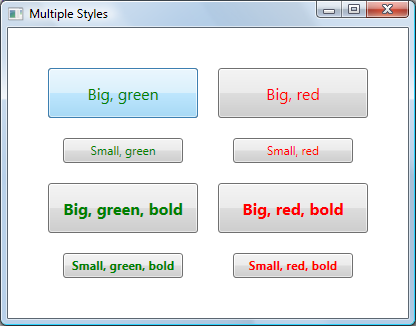

# How to set multiple styles in WPF

WPF and Silverlight both offer the ability to derive a Style from another Style through the "BasedOn" property. This feature enables developers to organize their styles using a hierarchy similar to class inheritance. Consider the following styles:

	

	

With this syntax, a Button that uses RedButtonStyle will have its Foreground property set to Red and its Margin property set to 10.

This feature has been around in WPF for a long time, and it's new in Silverlight 3. 

What if you want to set more than one style on an element? Neither WPF nor Silverlight provide a solution for this problem out of the box. Fortunately there are ways to implement this behavior in WPF, which I will discuss in this blog post.

WPF and Silverlight use markup extensions to provide properties with values that require some logic to obtain. Markup extensions are easily recognizable by the presence of curly brackets surrounding them in XAML. For example, the {Binding} markup extension contains logic to fetch a value from a data source and update it when changes occur; the {StaticResource} markup extension contains logic to grab a value from a resource dictionary based on a key. Fortunately for us, WPF allows users to write their own custom markup extensions. This feature is not yet present in Silverlight, so the solution in this blog is only applicable to WPF.

<a href="http://swdeveloper.wordpress.com/2009/01/03/wpf-xaml-multiple-style-inheritance-and-markup-extensions/">Others</a> have written great solutions to merge two styles using markup extensions. However, I wanted a solution that provided the ability to merge an unlimited number of styles, which is a little bit trickier.

Writing a markup extension is straightforward. The first step is to create a class that derives from MarkupExtension, and use the MarkupExtensionReturnType attribute to indicate that you intend the value returned from your markup extension to be of type Style.

	[MarkupExtensionReturnType(typeof(Style))]
	public class MultiStyleExtension : MarkupExtension
	{
	}

## Specifying inputs to the markup extension

We'd like to give users of our markup extension a simple way to specify the styles to be merged. There are essentially two ways in which the user can specify inputs to a markup extension. The user can set properties or pass parameters to the constructor. Since in this scenario the user needs the ability to specify an unlimited number of styles, my first approach was to create a constructor that takes any number of strings using the "params" keyword:

	public MultiStyleExtension(params string[] inputResourceKeys)
	{
	}

My goal was to be able to write the inputs as follows:

	<Button Style="{local:MultiStyle BigButtonStyle, GreenButtonStyle}"  ... />

Notice the comma separating the different style keys. Unfortunately, custom markup extensions don't support an unlimited number of constructor parameters, so this approach results in a compile error. If I knew in advance how many styles I wanted to merge, I could have used the same XAML syntax with a constructor taking the desired number of strings:

	public MultiStyleExtension(string inputResourceKey1, string inputResourceKey2)
	{
	}

As a workaround, I decided to have the constructor parameter take a single string that specifies the style names separated by spaces. The syntax isn't too bad:

	<Button Style="{local:MultiStyle BigButtonStyle GreenButtonStyle}" ... />
	
	private string[] resourceKeys;
	
	public MultiStyleExtension(string inputResourceKeys)
	{
		if (inputResourceKeys == null)
		{
			throw new ArgumentNullException("inputResourceKeys");
		}
	
		this.resourceKeys = inputResourceKeys.Split(new char[] { ' ' }, StringSplitOptions.RemoveEmptyEntries);
	
		if (this.resourceKeys.Length == 0)
		{
			throw new ArgumentException("No input resource keys specified.");
		}
	}

## Calculating the output of the markup extension

To calculate the output of a markup extension, we need to override a method from MarkupExtension called "ProvideValue". The value returned from this method will be set in the target of the markup extension.

I started by creating an extension method for Style that knows how to merge two styles. The code for this method is quite simple:

	public static void Merge(this Style style1, Style style2)
	{
		if (style1 == null)
		{
			throw new ArgumentNullException("style1");
		}
		if (style2 == null)
		{
			throw new ArgumentNullException("style2");
		}
	
		if (style1.TargetType.IsAssignableFrom(style2.TargetType))
		{
			style1.TargetType = style2.TargetType;
		}
	
		if (style2.BasedOn != null)
		{
			Merge(style1, style2.BasedOn);
		}
	
		foreach (SetterBase currentSetter in style2.Setters)
		{
			style1.Setters.Add(currentSetter);
		}
	
		foreach (TriggerBase currentTrigger in style2.Triggers)
		{
			style1.Triggers.Add(currentTrigger);
		}
	
		// This code is only needed when using DynamicResources.
		foreach (object key in style2.Resources.Keys)
		{
			style1.Resources[key] = style2.Resources[key];
		}
	}

With the logic above, the first style is modified to include all information from the second. If there are conflicts (e.g. both styles have a setter for the same property), the second style wins. Notice that aside from copying styles and triggers, I also took into account the TargetType and BasedOn values as well as any resources the second style may have. For the TargetType of the merged style, I used whichever type is more derived. If the second style has a BasedOn style, I merge its hierarchy of styles recursively. If it has resources, I copy them over to the first style. If those resources are referred to using {StaticResource}, they're statically resolved before this merge code executes, and therefore it isn't necessary to move them. I added this code in case we're using DynamicResources.

The extension method shown above enables the following syntax:

	style1.Merge(style2);

This syntax is useful provided that I have instances of both styles within ProvideValue. Well, I don't. All I get from the constructor is a list of string keys for those styles. If there was support for params in the constructor parameters, I could have used the following syntax to get the actual style instances:

	<Button Style="{local:MultiStyle {StaticResource BigButtonStyle}, {StaticResource GreenButtonStyle}}"  ... />

	public MultiStyleExtension(params Style[] styles)
	{
	}

But that doesn't work. And even if the params limitation didn't exist, we would probably hit another limitation of markup extensions, where we would have to use property-element syntax instead of attribute syntax to specify the static resources, which is verbose and cumbersome (I explain this bug better in a <a href="..\33-PolygonBinding2">previous blog post</a>). And even if both those limitations didn't exist, I would still rather write the list of styles using just their names - it is shorter and simpler to read than a StaticResource for each one. 

The solution is to create a StaticResourceExtension using code. Given a style key of type string and a service provider, I can use StaticResourceExtension to retrieve the actual style instance. Here is the syntax:

	Style currentStyle = new StaticResourceExtension(currentResourceKey).ProvideValue(serviceProvider) as Style;

Now we have all the pieces needed to write the ProvideValue method:

	public override object ProvideValue(IServiceProvider serviceProvider)
	{
		Style resultStyle = new Style();
	
		foreach (string currentResourceKey in resourceKeys)
		{
			Style currentStyle = new StaticResourceExtension(currentResourceKey).ProvideValue(serviceProvider) as Style;
	
			if (currentStyle == null)
			{
				throw new InvalidOperationException("Could not find style with resource key " + currentResourceKey + ".");
			}
	
			resultStyle.Merge(currentStyle);
		}
		return resultStyle;
	}

Here is a complete example of the usage of the MultiStyle markup extension:

	<Window.Resources>
		
	
		
	
		
	</Window.Resources>
	
	<Button Style="{local:MultiStyle SmallButtonStyle GreenButtonStyle BoldButtonStyle}" Content="Small, green, bold" />

