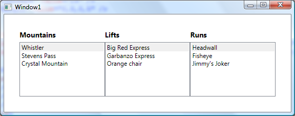

# WPF's CollectionViewSource

CollectionViewSource has existed for a long time in WPF and was recently introduced in Silverlight 3. My next post will cover CollectionViewSource in the context of Silverlight. But before covering that topic, I've decided to provide some background about why we introduced this class in WPF.

## Views in WPF

When a user binds a WPF property to a collection of data, WPF automatically creates a view to wrap the collection, and binds the property to the view, not the raw collection. This behavior always happens, and is independent of CollectionViewSource. 

Views provide four types of functionality: sorting, filtering, grouping and tracking the current item. The scenarios you can implement with these four simple features are endless!

The type of view created by WPF depends on the collection type. There are essentially 3 types of views automatically generated by WPF, all deriving from the CollectionView base class:

- ListCollectionView -> Created when the collection implements IList.
- BindingListCollectionView -> Created when the collection implements IBindingList.
- EnumerableCollectionView -> Created when the collection implements nothing but IEnumerable. This class is internal to WPF.

Before CollectionViewSource was introduced in WPF, you could manipulate the automatically generated view (called the "default view") by obtaining the ItemCollection returned by the ItemsControl.Items property. ItemCollection is a "hybrid" class - it's both a collection (implementing ICollection, IList, and IEnumerable) containing the list of items in the ItemsControl, and a view (deriving from CollectionView) that exposes properties to manipulate the default view. Here's an example:

	this.MyItemsControl.Items.SortDescriptions.Add(new SortDescription(...));

ItemCollection doesn't contain the implementation for any "view" related functionality though - all of its "view" methods are delegated. If the ItemsControl has items added directly to it in XAML (not data bound), ItemCollection delegates view operations to a private property of type "InnerItemCollectionView" (you can find it in Reflector - it's appropriately called "_internalView"). If the ItemsControl is data bound, the ItemCollection delegates all view operations to the automatically generated default view that wraps the collection.

There is one more view in WPF that you may come across: CompositeCollectionView. Naturally, this view is automatically created when the property is data bound to a CompositeCollection. CompositeCollections have also existed in WPF for a long time. They allow merging several individual collections and individual items into one single collection in XAML.

	<ItemsControl.ItemsSource>
		<CompositeCollection>
			<ListBoxItem><TextBlock Text="Hello" /></ListBoxItem>
			<CollectionContainer Collection="{Binding Source={StaticResource Collection1}}"/>
			<CollectionContainer Collection="{Binding Source={StaticResource Collection2}}"/>
		</CompositeCollection>
	</ItemsControl.ItemsSource>

Instead of using the default view, the user can also create his own view to wrap the collection. This could be a custom view (implementing ICollectionView) or one of the existing public views - typically ListCollectionView or BindingListCollectionView. For example:

	ListCollectionView lcv = new ListCollectionView(myList);
	this.MyItemsControl.ItemsSource = lcv;
	lcv.SortDescriptions.Add(new SortDescription(...));

In this scenario, WPF will not wrap this view in another view, it simply uses the one it's given, as expected. The user can then use his ListCollectionView object to perform view-related operations (such as adding sort descriptions).

## CollectionViewSource in WPF

All of these features already existed in WPF before we decided to add CollectionViewSource. We could already do filtering, sorting, grouping, we could track and set the current item, we could retrieve the default view created by WPF and manipulate it, and we could manually create multiple views of the same collection. So, why did we add CollectionViewSource?

The main reason was to enable those view-related operations in XAML - previously they could only be done in code. Without XAML support, tools like Blend can not provide a good tooling experience for these features. The most common uses of CollectionViewSource are to specify sorting and grouping directly in XAML, or to use XAML to hook up a filter handler defined in code. I've shown several samples of this syntax before (<a href="..\28-FilterSample">this post</a> shows filtering, <a href="..\16-GroupByType">this post</a> shows grouping, and <a href="..\14-SortingGroups">this post</a> shows sorting and grouping combined), so I won't go into that here.

CollectionViewSource is NOT a view, unlike the classes I described above. If you look in Reflector, you will notice that it doesn't even implement ICollectionView - a requirement for a class to be considered a "view". CollectionViewSource is simply a class that once given a collection (by setting its Source property) creates and exposes the corresponding view (through the View property), and that allows adding sorting and grouping (unfortunately not filtering) directly in XAML. 

CollectionViewSource also provides several other methods useful to obtain and manipulate views. Among them is yet another way to retrieve the view that wraps a collection:

	ListCollectionView lcv = CollectionViewSource.GetDefaultView(myCollection) as ListCollectionView;
	lcv.SortDescriptions.Add(new SortDescription(...));

This is my favorite way of getting a view for a collection because 1) it doesn't require a handle to the ItemsControl like when using ItemCollection and 2) I don't need to create the view myself. This method completes the list of ways to retrieve the view for a particular collection.

 CollectionViewSource also enables another interesting scenario. If a particular CollectionViewSource points to different collections at different times, it remembers all the views that it created to wrap those collections. If a source that has already been set in the past is set again, CVS recognizes it and reuses the view it created originally. This behavior is useful in hierarchical binding scenarios. To illustrate this point, I created a very simple three-level master-detail scenario with the following XAML:

	<Window.Resources>
		<CollectionViewSource Source="{Binding}" x:Key="cvs1"/>
		<CollectionViewSource Source="{Binding Source={StaticResource cvs1}, Path=Lifts}" x:Key="cvs2"/>
		<CollectionViewSource Source="{Binding Source={StaticResource cvs2}, Path=Runs}" x:Key="cvs3"/>
	</Window.Resources>
    
	<ListBox ItemsSource="{Binding Source={StaticResource cvs1}}" DisplayMemberPath="Name"/>
	<ListBox ItemsSource="{Binding Source={StaticResource cvs2}}" DisplayMemberPath="Name" />
	<ListBox ItemsSource="{Binding Source={StaticResource cvs3}}" />

The DataContext for this window is set to a data source with the following structure:

	public class Mountains : ObservableCollection<Mountain>
	{
		...
	}
	
	public class Mountain
	{
		public ObservableCollection<Lift> Lifts { get; set; }
		...
	}
	
	public class Lift
	{
		public ObservableCollection<string> Runs { get; set; }
		...
	}

Here is a screenshot:

In this sample, cvs1 points to the mountains collection and creates a ListCollectionView to wrap it; cvs2 holds one of three collections: the Lifts collection for the first, second or third mountain; and cvs3 holds one of eight collections of Runs. Now imagine that you pick the first mountain (Whistler) and the second lift from that mountain (Garbanzo Express), then you switch to the second mountain (Stevens Pass) and back to the first mountain again (Whistler). At this point, you would expect the second lift (Garbanzo Express) to still be selected. And it is. Because the second CollectionViewSource stores the view last used to wrap that particular Lifts collection, reusing it next time it needs to display that same collection, the current item is preserved. 

If you made it so far, you know more about CollectionViewSource than you will ever need! My next post will include a similar discussion in the context of Silverlight.
