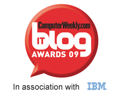

# Oredev and Computer Weekly IT Blog Awards

I got back from the Oredev conference in Malmo (Sweden) a few days ago, where I spoke on advanced line-of-business features of WPF and Silverlight. I presented at Oredev last year and became a big fan of this conference - I had to go back! Just like last year, I was highly impressed by:

<b>The meticulous organization of the conference.</b> Only in Sweden could there be so much attention to detail in such a big conference. I could go on about this...
<b>High technical level and interest of the attendees.</b> All attendees I interacted with were smart, experienced, and highly engaged. It was a pleasure to speak to such an audience.
<b>Interactions I had with other speakers.</b> Other than seeing old Microsoft friends, I had a chance to interact with people from others parts of the industry and get a broader understanding of software trends. I also had the chance to meet some very inspiring women, as you can see in <a href="http://www.cloudcasts.net/ViewWebcast.aspx?webcastid=2521442880638513149">this interview</a> with Amanda, Kerry and me.

In other news, I was excited to find out recently that I was nominated for the Computer Weekly IT Blog Awards 2009, in the <a href="http://www.computerweekly.com/Articles/2009/11/10/237825/IT-Blog-Awards-2009-Individual-IT-Professional-Female.htm">Individual IT Professional Female</a> category. It would have been even better if Computer Weekly had contacted me and <a href="http://www.computerweekly.com/Articles/2009/11/03/238190/vote-in-the-computer-weekly-it-blog-awards-2009.htm">voting</a> weren't closed already. Still I am very honored to have been listed as one of the 10 nominees for this award - so thanks everyone for reading my blog and making this possible!