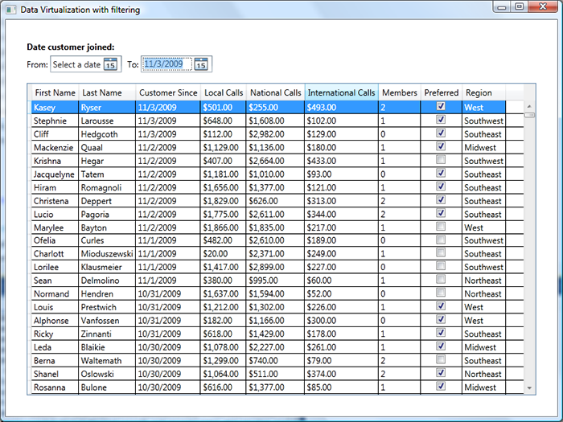

# How to filter data virtualized items in WPF

A few months ago, I wrote about <a href="..\52-DataVirtualization">a data virtualization solution</a> that combines many of the advantages of two other data virtualization solutions (<a href="http://www.codeproject.com/KB/WPF/WpfDataVirtualization.aspx">Paul's</a> and <a href="..\52-DataVirtualization\DataVirtualization.pdf">Vincent's</a>). Today's post extends the data virtualization solution in my earlier post by adding the ability to filter the virtualized data. My next post will extend today's solution further by adding the ability to sort the data, in a way that is seamlessly integrated with the DataGrid UI.

## Filtering data virtualized items

WPF offers users the ability to filter data (one way to do that is by using CollectionViewSource, which I discussed in <a href="..\59-WPFCollectionViewSource">another post</a> in the context of WPF). However, when you filter using the client-side solutions that ship in WPF, all data items need to be accessed. This is fine if you don't have a lot of items, but for large data sets, it will negate any benefits of  virtualization. The trick to get around this problem is to delegate all filtering operations to the server. Today's sample will show you how to do that.

The scenario for the sample is a list of customers that needs to be filtered by two dates. The list of customers is displayed in a DataGrid, and among its many columns, it displays the date the customer joined a particular mobile phone plan. The user is able to enter two dates, thereby applying a filter that displays only the customers that joined between those two dates.

## Run the sample on your machine

Today's post requires you to have SQL server (or SQL Express) installed. I used VS 2010 Beta 2 to create this project, so you will need to have that installed to open the project. The only new features of WPF 4.0 Beta 2 that are used here were available previously in the toolkit (DataGrid and DatePicker), so you can easily port this project to an older version of VS and .NET if needed. There is no need to have any sample database installed, since we will build our own.

The WPF project that I typically use to create sample databases (for presentations and demo code) can be found in "InitializeDatabase". Open it in VS 2010, search for the "connectionString" variable in MainWindow.xaml.cs, and replace the name of my sql server instance (SQLEXPRESS) with your own. Then run it and click on the "Initialize Database" button to create the database. This will take a while, so please be patient. When the initialization is complete, you should see "Database has been initialized" displayed in the UI. You can confirm the database's creation by opening "SQL Server Management Studio" and making sure that the "Customers" database is listed under "Databases".

You are now ready to open today's app, "DVFilter", in VS 2010. Search the solution for "SQLEXPRESS" to find all connection strings and replace them with your own. You should find these in the Customers.dbml, Properties\Settings.settings, and Properties\Settings.Designer.cs pages. You should now be able to press F5 and run the sample. 

## Data virtualization implementation

In "SQL Server Management Studio", open the "Customers" database. You will notice that it creates one table - "Customers" - and two stored procedures - "GetCount" and "GetSortedFilteredCustomers" (look under Programmability \ Stored Procedures). "GetCount" returns the number of customers that joined between two specified dates. "GetSortedFilteredCustomers" returns a sorted subset of customers that joined between two specified dates (the subset is defined by specifying the begin and end indices of the desired items). Even though this post won't focus on sorting, you will see how to pass a simple sorting string to this stored procedure (my next post will cover sorting in depth).

Once the database is in place, the next step is to query it from the client app, which I decided to do using Linq to SQL. If you want to recreate the project, add a new item to the project of type "Linq to SQL classes" and call it "Customers.dbml". Then open "Server Explorer", right click "Data connections", specify your server name, and select the "Customers" database from the drop down. Then expand the data connection until you find the "Customer" table and drag it to the left section of the Linq To SQL's designer. Similarly, expand the stored procedures section and drag both stored procedures to the right section of the designer. 

Once  you get to this point, build and inspect the Customers.designer.cs class. You will notice that dragging the Customers table caused a "Customer" class to be generated containing a property for each column in the corresponding table. You will also notice that dragging the stored procedures caused two methods with the same names to be generated. The "GetCount" method has a return type of ISingleResult&lt;GetCountResult&gt; - at the bottom of that file you can see that the GetCountResult class contains one single "Count" property of type int. The "GetSortedFilteredCustomers" method has a return type of int. This stored procedure selects a list of customers, so the return type is not quite right. This is because this stored procedure uses an EXEC to run a SELECT statement created at runtime (more on that in my next post). Replacing the int return type with ISingleResult&lt;Customer&gt; corrects the problem; after that, you need to rebuild the project.
 
At this point, you are able to execute the stored procedures added to the database from the client app. It's time to include the data virtualization files from my previous post in this project. You can find the data independent and reusable virtualization files in a separate dll called "DataVirtualization.dll". The next step is to implement the class that derives from IItemsProvider (which I decided to call CustomerProvider in this project). As a reminder, IItemsProvider requires the implementation of two methods: FetchCount and FetchRange. FetchCount calls the "GetCount" Linq method and stored procedure:

	public int FetchCount()
	{
		CustomersDataContext customersDataContext = new CustomersDataContext();
		count = customersDataContext.GetCount(dateFrom, dateTo).ToList().First().Count.Value;
		return count;
	}

And FetchRange calls the GetSortedFilteredCustomers Linq method and stored procedure:

	public IList<Customer> FetchRange(int startIndex, int pageCount, out int overallCount)
	{
		CustomersDataContext customersDataContext = new CustomersDataContext();
	
		IList<Customer> customersResult;
	
		startIndex = startIndex + 1; // SQL index starts at 1.
		int endIndex = startIndex + pageCount - 1; // GetCustomers returns items with indices startIndex through endIndex, inclusive.
	
		overallCount = count; // In this case it's ok not to get the count again because we're assuming the data in the database is not changing.
		customersResult = customersDataContext.GetSortedFilteredCustomers(startIndex, endIndex, this.dateFrom, this.dateTo, this.sortField).ToList();
	
		return customersResult;
	}

The  data virtualization files are all complete. Now we can implement the user interface that uses them. 

## User interface - DataGrid and DateRangePicker

The first step is to add a DataGrid to MainWindow.xaml. I modified the styles of the actual DataGrid and of each DataGridRow to display feedback to the user when items are being accessed from the database (similar to what I explained in the "IsInitializing + IsLoading" section of my <a href="..\61-OredevComputerWeekly">previous post</a>). The XAML for the DataGrid is simple and there is plenty of information online explaining the different properties, so I won't go into detail about it here. 

The next step is to implement the UI for the user to specify the dates to filter by. I decided to group this functionality in a UserControl which I called "DateRangePicker". In this UserControl, I added two DatePicker controls, one to enter the "from" date and another one to enter the "to" date. 

	<TextBlock Text="From:" />
	<controls:DatePicker x:Name="DatePickerFrom" />
	<TextBlock Text="To:" />
	<controls:DatePicker x:Name="DatePickerTo" />

If the user specifies both dates, I have the information I need to find customers with "CustomerSince" date between those dates. I also want to allow finding customers that joined after a certain date or before a certain date, so I need to handle the scenario where only one date is specified. And if the user doesn't specify any filter dates, all items should be returned.

With these requirements in mind, I decided to expose two properties in DateRangePicker, "DateFrom" and "DateTo", of type Nullable&lt;DateTime&gt; (null meaning that the customer did not pick a date for that field). Then I two-way data bound these properties and the selected dates of the DatePickers added to the content of this control:

	this.DatePickerFrom.SetBinding(DatePicker.SelectedDateProperty, new Binding("DateFrom") { Source = this, Mode = BindingMode.TwoWay });
	this.DatePickerTo.SetBinding(DatePicker.SelectedDateProperty, new Binding("DateTo") { Source = this, Mode = BindingMode.TwoWay });

Since my app requires both dates to be in the past, I decided to help the user by preventing selection of dates in the future, which can be done with the following code:

	this.DatePickerFrom.BlackoutDates.Add(new CalendarDateRange(DateTime.Today.AddDays(1), DateTime.MaxValue));
	this.DatePickerTo.BlackoutDates.Add(new CalendarDateRange(DateTime.Today.AddDays(1), DateTime.MaxValue));

I also decided to expose events that are fired when the "from" and "to" dates are changed:

	public event EventHandler FromDateChanged;
	public event EventHandler ToDateChanged;

Then I added change handlers for the "from" and "to" properties that I use to fire the events. In addition, if the "from" date is set to be after the "to" date, I clear the "to" date, since this is not a valid state.

	private static void DateFrom_PropertyChanged(DependencyObject obj, DependencyPropertyChangedEventArgs e)
	{
		DateRangePicker dateRangePicker = (DateRangePicker)obj;
		dateRangePicker.DateFromChanged();
	}
	
	private void DateFromChanged()
	{
		// This updates the blackout dates for DatePickerTo.
		this.DatePickerTo.BlackoutDates.Clear();
		if (this.DateFrom.HasValue)
		{
			DateTime dateFrom = this.DateFrom.Value;
			if (this.DateTo.HasValue)
			{
				DateTime dateTo = this.DateTo.Value;
				if (dateTo <= dateFrom)
				{
					this.DateTo = null;
				}
			}
	
			this.DatePickerTo.BlackoutDates.Add(new CalendarDateRange(DateTime.MinValue, dateFrom));
		}
		this.DatePickerTo.BlackoutDates.Add(new CalendarDateRange(DateTime.Today.AddDays(1), DateTime.MaxValue));
	
		this.OnDateChanged(FromDateChanged);
	}
	
	private static void DateTo_PropertyChanged(DependencyObject obj, DependencyPropertyChangedEventArgs e)
	{
		DateRangePicker dateRangePicker = (DateRangePicker)obj;
		dateRangePicker.OnDateChanged(dateRangePicker.ToDateChanged);
	}

With this, the code for the DateRangePicker control is complete. Switching back to the main app, I added that control to the page, right above the DataGrid:

	<reusableControls:DateRangePicker x:Name="CustomerSinceDatePicker" />

## Hooking up the UI to the data

At this point we have all the data virtualization infrastructure, plus an adequate UI for the user to specify the filter parameters and for us to display the customer list. The only thing that's missing is to hook up the UI to the data. 

When the user picks a new date in the DateRangePicker UserControl, we want to re-query the database with the new "from" and "to" date parameters, and display that data in the DataGrid. I did that by adding a handler for the "FromDateChanged" and "ToDateChanged" events of DateRangePicker. Within that handler, I create a new CustomerProvider with the right date parameters, instantiate the data virtualization classes, and re-set the DataContext:

	<reusableControls:DateRangePicker x:Name="CustomerSinceDatePicker" FromDateChanged="CustomerSinceDatePicker_DateChanged" ToDateChanged="CustomerSinceDatePicker_DateChanged"/>
	
	private void CustomerSinceDatePicker_DateChanged(object sender, EventArgs e)
	{
		this.RefreshData();
	}
	
	private void RefreshData()
	{
		string sortString = "CustomerSince DESC";
		customerProvider = new CustomerProvider(this.CustomerSinceDatePicker.DateFrom, this.CustomerSinceDatePicker.DateTo, sortString);
		AsyncVirtualizingCollection<Customer> customerList = new AsyncVirtualizingCollection<Customer>(customerProvider, pageSize, timePageInMemory);
		this.DataContext = customerList;
	 
		this.CustomersDataGrid.SelectedIndex = 0;
	}

You may have noticed in the code above that I am passing a sort string to the server - "CustomerSince DESC". With the current implementation, customers are always displayed in this order. If you have a few pre-defined common sort expressions, you have here all the pieces needed to send those sort descriptions to the server. But what if you want clicking on DataGrid columns to cause sorting in the database? My next post will show how you can do that.

