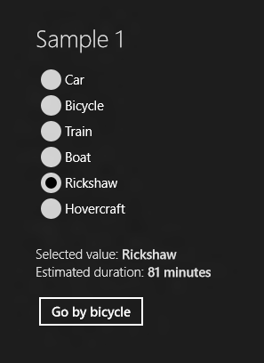

# Binding RadioButtons to an Enum – Part I

This is the first of a series of posts covering different options to bind a set of RadioButtons to an enumeration. The sample code provided here is written using WinRT for Windows Store applications running on Windows 8.

Let's assume we have an enumeration in our model, and that we want to allow the user to pick a value from that enumeration using RadioButtons.  In the view layer (UI), we need one RadioButton for each value in the enumeration. In the model layer, we need a way to store the option selected by the user. We also need a mechanism to propagate changes in both directions: if the user clicks on a RadioButton, we want the enumeration value associated with it to be stored in the model; if an enumeration value is set in code (for example the initial value), we want the corresponding RadioButton to be selected.

The solution we'll discuss today involves re-styling a ListBox to look like a list of RadioButtons. If you think of this problem in an abstract way, forgetting the UI, we're really dealing with concepts that ListBox knows about. ListBoxes are capable of displaying lists of items, and they know how to select one of those items. Sure, most of the time ListBoxItems don't look like RadioButtons, but with Styles and Templates we can make ListBoxItems look like anything we want. 

Our model is simply the enumeration we want to represent in the UI.

	public enum TransportationMode
	{
		Car,
		Bicycle,
		Train,
		Boat,
		Rickshaw,
		Hovercraft
	}

Our view model contains a property that represents the selected enumeration value, called SelectedTransportationMode. This value is initialized to "Rickshaw" and will change as the user selects different RadioButtons, firing the appropriate change notification events through the SetProperty and OnPropertyChanged methods of BindableBase.

	private TransportationMode selectedTransportationMode = TransportationMode.Rickshaw;
	
	public TransportationMode SelectedTransportationMode
	{
		get { return this.selectedTransportationMode; }
		set
		{
			if (this.SetProperty(ref this.selectedTransportationMode, value))
			{
				this.OnPropertyChanged("EstimatedDuration");
			}
		}
	}
	
The view model also contains a property that holds all the possible enumeration values, called AvailableTransportationModes, which we initialize in the view model's constructor:
	
	public JourneyViewModel1()
	{
		this.AvailableTransportationModes = Enum.GetValues(typeof
			(TransportationMode)).OfType<TransportationMode>().ToArray();
	}
	
	public IEnumerable<TransportationMode> AvailableTransportationModes
	{
		get;
		private set;
	}
	
We're now ready to add a ListBox to the UI. We bind the ItemsSource of this ListBox to the AvailableTransporationModes property, so that all values of the enumeration are listed in the ListBox. We also bind the SelectedItem of the ListBox to the view model's SelectedTransportationMode property, using the two-way binding mode to ensure that changes propagate in both directions.

	<ListBox ItemsSource="{Binding Path=AvailableTransportationModes}"
		SelectedItem="{Binding SelectedTransportationMode, Mode=TwoWay}" … />
	
We've now achieved the desired behavior, but we still need to change the ListBoxItems to look like RadioButtons. The easiest way to do this is to start with the default style for RadioButton and transform it into a ListBoxItem style, while keeping the original look. To get the default RadioButton style, open C:\Program Files (x86)\Windows Kits\8.0\Include\WinRT\Xaml\Design\generic.xaml and search for 'TargetType="RadioButton"'.  We copied this style into the app, set the TargetType of the style and template to ListBoxItem, and tweaked the visual states a bit to match those that ListBoxItem expects. We also had to copy the ListBox default style and change a few properties that were interfering with the look we wanted. You can find the modified styles under Styles\ControlStyles.xaml in the sample code for this post. 

Next, we set the ItemContainerStyle and Style properties of the ListBox to use the new styles.

	<ListBox ItemsSource="{Binding Path=AvailableTransportationModes}"
		SelectedItem="{Binding SelectedTransportationMode, Mode=TwoWay}"
		ItemContainerStyle="{StaticResource RadioButtonListBoxItemStyle}"
		Style="{StaticResource RadioButtonListBoxStyle}"/>

At this point, the sample behaves and looks the way we intended it to.

There is one minor issue with the code we show here though. The order in which the enumeration values are listed in the UI is the same as the order in which they're listed in the enumeration code. This may not be the order you and your designer want these items to appear in the UI. Sure, you could change your model to the new order, but in general it's not good practice to have the model drive a purely visual aspect of the app.

A better option is to change the way the AvailableTransportationModes property is set in the view model's constructor. Instead of using the Enum.GetValues function like we showed earlier, you can set this property to an explicit list where you control the order of the items:

	this.AvailableTransportationModes = new TransportationMode[] { 
		TransportationMode.Train, 
		TransportationMode.Car, 
		TransportationMode.Rickshaw, 
		TransportationMode.Hovercraft, 
		TransportationMode.Bicycle, 
		TransportationMode.Boat 
	};

And that's it for today. Stay tuned for other ways of accomplishing the same task, and a discussion of pros and cons of each option.

