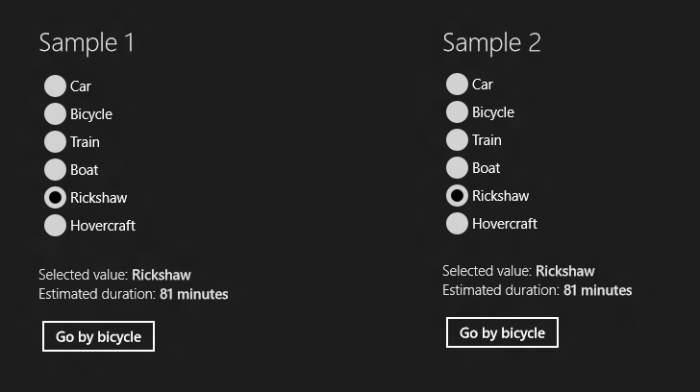

# Binding RadioButtons to an Enum – Part II

This is the second of a series of posts covering different options to bind a set of RadioButtons to an enumeration. The sample code provided here is written using WinRT for Windows Store applications running on Windows 8.

In the solution we'll discuss today, we'll add the RadioButtons explicitly to the UI and we'll bind each of them to a Boolean property in the view model.

Our model is the same as in the first post of this series:

	public enum TransportationMode
	{
		Car,
		Bicycle,
		Train,
		Boat,
		Rickshaw,
		Hovercraft
	}

As in the first sample, our view model contains a property to hold the selected value in the enumeration, but this time with some additional property change notifications:

	private TransportationMode selectedTransportationMode = TransportationMode.Rickshaw;
	
	public TransportationMode SelectedTransportationMode
	{
		get { return this.selectedTransportationMode; }
		set
		{
			if (this.SetProperty(ref this.selectedTransportationMode, value))
			{
				this.OnPropertyChanged("IsCar");
				this.OnPropertyChanged("IsBicycle");
				this.OnPropertyChanged("IsTrain");
				this.OnPropertyChanged("IsBoat");
				this.OnPropertyChanged("IsRickshaw");
				this.OnPropertyChanged("IsHovercraft");
				this.OnPropertyChanged("EstimatedDuration");
			}
		}
	}

Our view model also contains a Boolean property for each of the values in the enumeration. The property that corresponds to the selected enumeration value returns true, and all others return false.

	public bool IsCar 
	{
		get { return this.SelectedTransportationMode == TransportationMode.Car; }
		set { if (value) this.SelectedTransportationMode = TransportationMode.Car; }
	}
	
	public bool IsBicycle
	{
		get { return this.SelectedTransportationMode == TransportationMode.Bicycle; }
		set { if (value) this.SelectedTransportationMode = TransportationMode.Bicycle; }
	}
	…

This is fine if you have only a few enumeration values, but you can see how it can get tedious if you have an enumeration with lots of values, or several enum-valued properties.

The UI contains a RadioButton per enumeration value, each one bound to the corresponding Boolean property in the view model:

	<RadioButton Content="Car" GroupName="Group2"
		IsChecked="{Binding IsCar, Mode=TwoWay}"/>
	<RadioButton Content="Bicycle" GroupName="Group2"
		IsChecked="{Binding IsBicycle, Mode=TwoWay}"/>
	<RadioButton Content="Train" GroupName="Group2"
		IsChecked="{Binding IsTrain, Mode=TwoWay}"/>
	<RadioButton Content="Boat" GroupName="Group2"
		IsChecked="{Binding IsBoat, Mode=TwoWay}"/>
	<RadioButton Content="Rickshaw" GroupName="Group2"
		IsChecked="{Binding IsRickshaw, Mode=TwoWay}"/>
	<RadioButton Content="Hovercraft" GroupName="Group2"
		IsChecked="{Binding IsHovercraft, Mode=TwoWay}"/>

Notice that the bindings are all two-way, to ensure that changes propagate in both directions.

In this solution, the order of the values in the enumeration is inherently independent from their order in the UI. Listing out all RadioButtons in the UI may seem less elegant than the first solution, but it provides an easy way for your designer to reorder the RadioButtons as she wishes directly in the XAML.

Our next posts will discuss two more solutions to the same problem.

