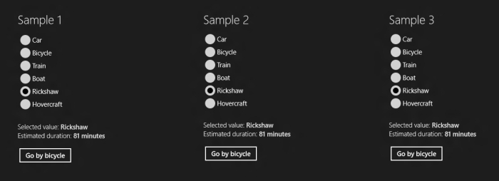

# Binding RadioButtons to an Enum – Part III

This is the third of a series of posts covering different options to bind a set of RadioButtons to an enumeration. The sample code provided here is written using WinRT for Windows Store applications running on Windows 8.

In the solution discussed today, we'll use a value converter to translate between the Boolean values used by the RadioButtons and the enumeration values stored in the view model.

Our model is still the same:

	public enum TransportationMode
	{
		Car,
		Bicycle,
		Train,
		Boat,
		Rickshaw,
		Hovercraft
	}

Our view model is fairly simple; we don't need the Boolean-valued properties that appeared in the previous sample, nor do we need the AvailableTransportationModes collection that appeared in the first sample.

The goal is to include each of the RadioButtons explicitly in the XAML, with its IsChecked property bound to the SelectedTransportationMode property of the view model. We'll use a value converter to help us compare the selected enum value in the view model with the enum value each RadioButton represents. If these are the same, the converter returns true, otherwise it returns false, and the RadioButton is checked or unchecked accordingly.

We started by including a generic EnumToBooleanConverter class that we reuse across many of our projects:

	public class EnumToBooleanConverter<TEnum> : IValueConverter where TEnum : struct
	{
		public object Convert(object value, Type targetType, object parameter, string language)
		{
			// Convert parameter from string to enum if needed.
			TEnum enumValue;
			if (parameter is string &&
				Enum.TryParse<TEnum>((string)parameter, true, out enumValue))
			{
				parameter = enumValue;
			}
			// Return true if value matches parameter.
			return Object.Equals(value, parameter);
		}
	
		public object ConvertBack(object value, Type targetType, object parameter, string language)
		{
			// If value is true, then return the enum value corresponding to parameter.
			if (Object.Equals(value, true))
			{
				// Convert parameter from string to enum if needed.
				TEnum enumValue;
				if (parameter is string &&
					Enum.TryParse<TEnum>((string)parameter, true, out enumValue))
				{
					parameter = enumValue;
				}
				return parameter;
			}
			// Otherwise, return UnsetValue, which is ignored by bindings.
			return DependencyProperty.UnsetValue;
		}
	}

And then we created a strongly-typed converter that derives from this generic class:

	public class TransportationModeToBooleanConverter :
		EnumToBooleanConverter<TransportationMode> { }

We then added an instance of this converter to the page's resources, and data bound all RadioButtons to the same selected enumeration value in the view model. We added a converter to each of these bindings, and passed a different string in the ConverterParameter, which identifies the enumeration value each of these RadioButtons represents. Note that our generic EnumToBooleanConverter class above knows how to convert these strings into the corresponding enumeration values.

Here's what the RadioButtons look like:

	<RadioButton Content="Car" GroupName="Group3" 
		IsChecked="{Binding 
		Path=SelectedTransportationMode, 
		Converter={StaticResource transportationModeToBooleanConverter},
		ConverterParameter=Car,
		Mode=TwoWay}" />
	<RadioButton Content="Bicycle" GroupName="Group3" 
		IsChecked="{Binding 
		Path=SelectedTransportationMode, 
		Converter={StaticResource transportationModeToBooleanConverter},
		ConverterParameter=Bicycle,
		Mode=TwoWay}" />
	...

Stay tuned for yet another solution to the same problem.

