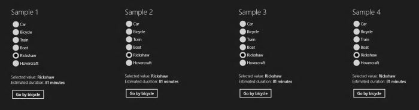

# Binding RadioButtons to an Enum – Part IV

This is the fourth of a series of posts covering different options to bind a set of RadioButtons to an enumeration. The sample code provided here is written using WinRT for Windows Store applications running on Windows 8.

Today's solution binds each RadioButton's IsChecked property to a helper class. This helper is a reusable generic class that wraps an enumeration and adds two-way binding capabilities.

Our model is still the same:

	public enum TransportationMode
	{
		Car,
		Bicycle,
		Train,
		Boat,
		Rickshaw,
		Hovercraft
	}

This time, instead of storing the selected value of the enumeration directly in our view model, we use a new type called BindableEnum to hold the value:

	public JourneyViewModel4()
	{
		this.SelectedTransportationMode =
			new BindableEnum<TransportationMode>(TransportationMode.Rickshaw);
		this.SelectedTransportationMode.ValueChanged += delegate
		{
			this.OnPropertyChanged("EstimatedDuration");
		};
	}
	
	public BindableEnum<TransportationMode> SelectedTransportationMode
	{
		get;
		private set;
	}

BindableEnum is a generic and reusable class that adds two-way data binding capabilities to enumerations. We'll explain some of the core functionality of this class.

	/// 

	/// A wrapper class for an enum value that supports two-way data binding.
	/// 

	/// <typeparam name="TEnum">The enum type.</typeparam>
	public sealed class BindableEnum<TEnum> : BindableBase where TEnum : struct
	{
		/// 

		/// The enum value.
		/// 

		private TEnum enumValue = default(TEnum);
	
		/// 

		/// Constructs a new bindable enum object.
		/// 

		/// <param name="initialValue">The initial value for the enum.</param>
		public BindableEnum(TEnum initialValue)
		{
			this.enumValue = initialValue;
		}
	
		/// 

		/// Gets or sets the enum value.
		/// 

		public TEnum Value
		{
			get { return this.enumValue; }
			set
			{
				if (!this.enumValue.Equals(value))
				{
					this.enumValue = value;
					this.OnPropertyChanged("Value");
					this.OnPropertyChanged("Item[]");
					EventHandler handler = this.ValueChanged;
					if (handler != null)
					{
						handler(this, EventArgs.Empty);
					}
				}
			}
		}
	
		/// 

		/// Gets or sets a Boolean value that is true if and only if the enum value's name
		/// matches the valueName parameter.
		/// 

		/// <param name="valueName">The name of the value to test against.</param>
		/// <returns>True if the enum value's name matches valueName; false, otherwise.</returns>
		/// <remarks>Case is ignored when comparing strings.</remarks>
		public bool this[string valueName]
		{
			get { return this.Value.ToString().Equals(valueName, StringComparison.OrdinalIgnoreCase); }
			set
			{
				TEnum newEnumValue;
				if (value && Enum.TryParse<TEnum>(valueName, out newEnumValue))
				{
					this.Value = newEnumValue;
				}
			}
		}
	
		/// 

		/// Raised when the Value property changes.
		/// 

		public event EventHandler ValueChanged;
	}

The Value property allows developers to get or set the selected value of the enumeration (which is stored in the private enumValue property). The sample binds the text of a Run to this property to show which enumeration value is selected:

	<Run FontWeight="SemiBold"
		Text="{Binding Path=SelectedTransportationMode.Value}"/>

The RadioButton's IsChecked property, on the other hand, will be bound to the indexer of the BindableEnum class. Reading from the indexer using its get method enables us to check if a particular enumeration value matches the selected enumeration value (returning true or false accordingly). This allows each RadioButton to see whether the enumeration value it represents is the currently selected value in the view model.

The selected enumeration value can be changed either by setting the Value property, or through the indexer. Our RadioButtons will use the indexer: when a RadioButton is clicked, IsChecked becomes true and the binding calls the indexer's set method, which assigns the corresponding enumeration value to the BindableEnum's Value property.

With this infrastructure in place, we're now ready to add the RadioButtons to the UI and bind their IsChecked property to the BindableEnum's indexer. Notice how each RadioButton passes a different string to the indexer. This string is converted into an enumeration value in the indexer's set method, before being compared to the currently selected value.

	<RadioButton Content="Car" GroupName="Group4" 
		IsChecked="{Binding 
		Path=SelectedTransportationMode[Car], 
		Mode=TwoWay}" />
	<RadioButton Content="Bicycle" GroupName="Group4" 
		IsChecked="{Binding 
		Path=SelectedTransportationMode[Bicycle], 
		Mode=TwoWay}" />
	…

Now you have four different solutions to bind a list of RadioButtons to an enumeration. Our next post will summarize the advantages and disadvantages of each of these solutions.

