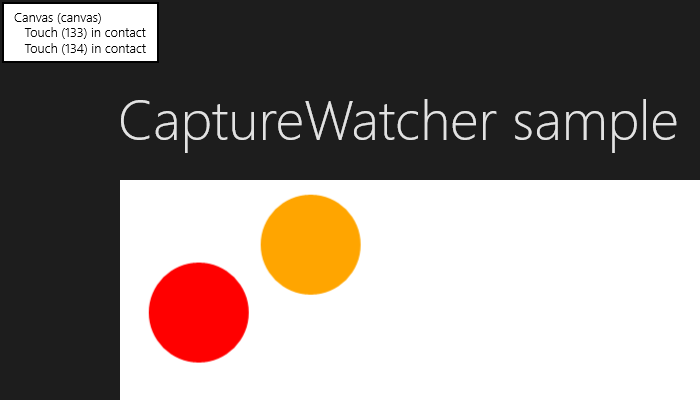

# How to debug pointer capture

In our <a href="http://www.zagstudio.com/blog/1335">previous blog post</a>, we mentioned some of the challenges developers face in creating keyboard-friendly applications, and we presented our FocusWatcher class for debugging these issues in Windows Store apps. The keyboard is just one way an app may receive input; Windows Store apps can also get input from mouse, stylus, and of course, touch. Modern tablets and touch screens often support multiple simultaneous touch inputs, in fact. All these different inputs can make it tough for developers to figure out what's going on, especially when combining many built-in controls and custom controls.

In this post, we offer you a companion to the FocusWatcher class, called CaptureWatcher. This tool constantly monitors your application and reveals which elements have captured events from any of the available pointers, including mouse, stylus, and touch pointers. Here are just some of the issues that CaptureWatcher can help uncover:
• Failing to capture a pointer. It's important for controls to call UIElement.CapturePointer when the user starts dragging an element, otherwise pointer movement events will get lost as soon as the user moves the pointer outside the control.
• Failing to release a pointer capture. It's equally important to call UIElement.ReleasePointerCapture when the user finishes dragging, otherwise your control will continue to get pointer events when it shouldn't.
• Failing to distinguish between multiple pointers. With the advent of multitouch input, you have to decide whether to capture and process events from only one pointer or from many pointers, and pay attention to the PointerId of each event.
• Losing pointer capture. Your control may lose pointer capture to another control within the app, or to another app entirely.

Like the FocusWatcher class, CaptureWatcher displays information in a text overlay. It lists the type and name of any element that has captured one or more pointers, followed by the type and ID of the captured pointers. The screenshot below shows that a Canvas element (named "canvas") has captured two touch pointers with IDs 133 and 134.

Here's how to use CaptureWatcher in your own Windows Store application:
1. Download <a href="http://www.zagstudio.com/blogfiles/77/CaptureWatcher.zip">CaptureWatcher.zip</a>.
2. Add CaptureWatcher.cs and TreeHelper.cs to your project.
3. In App.xaml.cs, within the app's OnLaunched method, just after calling Window.Current.Activate(), add a call to ZagStudio.Helpers.CaptureWatcher.Start().
4. Build and run.

Your code should look something like this:

	protected override void OnLaunched(LaunchActivatedEventArgs args)
	{
		...
		Window.Current.Activate();
		ZagStudio.Helpers.CaptureWatcher.Start();
		…
	}

Like FocusWatcher, you can also start and stop CaptureWatcher whenever you need to. We hope you find these tools helpful.

