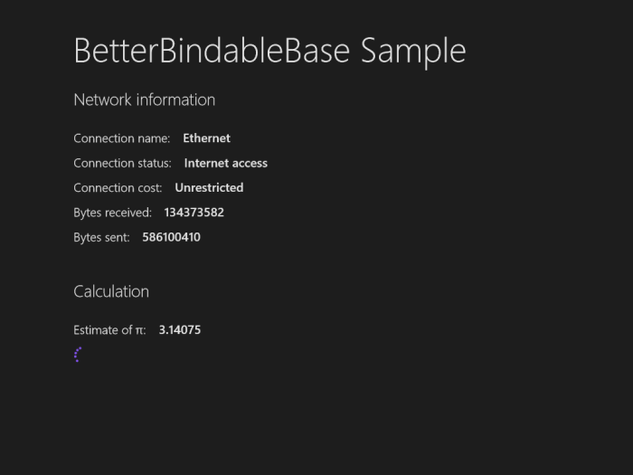

# A better BindableBase

Visual Studio has some great features built into its project templates for Windows Store applications. In particular, the Grid App (XAML) and Split App (XAML) project templates include the BindableBase class, which serves as a convenient starting point when building view models for data binding.  The BindableBase class provides an implementation of INotifyPropertyChanged, along with a convenient SetProperty method that makes it easy to add properties to your view model.  Getting property change notifications to work correctly with data binding is as simple as adding a field and a property that follow this pattern:

	public class ViewModel : BindableBase
	{
		private string _connectionName;
		public string ConnectionName
		{
			get { return _connectionName; }
			set { SetProperty(ref _connectionName, value); }
		}
	}

Or so it might seem.

Suppose our view model listens for changes in network connectivity:

	public ViewModel()
	{
		NetworkInformation.NetworkStatusChanged +=
			NetworkInformation_NetworkStatusChanged;
	}

	private void NetworkInformation_NetworkStatusChanged(object sender)
	{
		ConnectionProfile connectionProfile =
			NetworkInformation.GetInternetConnectionProfile();
		ConnectionName = connectionProfile.ProfileName;
	}

If we now bind to the ConnectionName property, we'd expect to see the name update whenever we connect or disconnect an internet-connected ethernet or wireless network.  Unfortunately, the UI doesn't update, and instead we see a COMException in BindableBase's OnPropertyChanged method while debugging. The exception message gives a good hint about what went wrong:

	The application called an interface that was marshalled for a different thread. (Exception from HRESULT: 0x8001010E (RPC_E_WRONG_THREAD))

A little investigation reveals that the system uses a worker thread to monitor network connections and to fire NetworkStatusChanged events, but data bindings refuse to accept property change events unless they are fired on the UI thread.  Windows Store apps share this restriction with Silverlight and WinForms. (WPF is more forgiving, automatically marshalling property change events across threads for you.) Depending how your Windows Store app code is structured, a property change notification issued by a worker thread may result in premature termination of the worker thread.

One possible solution is to change the handler of the NetworkStatusChanged event so that it relies on the UI thread to update the view model. Assuming we have access to the CoreDispatcher object of the UI thread, we'd end up with code like this:

	private void NetworkInformation_NetworkStatusChanged(object sender)
	{
		Dispatcher.RunAsync(CoreDispatcherPriority.Normal, () =>
		{
			ConnectionProfile connectionProfile =
				NetworkInformation.GetInternetConnectionProfile();
			ConnectionName = connectionProfile.ProfileName;
		});
	}

This approach works, but it's not very elegant to sprinkle "Dispatcher.RunAsync" calls in all the places where view model code may be called by worker threads. Instead, we would much rather change the code in just the one place that actually raises the PropertyChanged event. That's why we created the BetterBindableBase class. It's identical to the BindableBase class except in its constructor (which looks for the current UI dispatcher) and its implementation of OnPropertyChanged (which uses the dispatcher to make sure we're running on the UI thread before raising the PropertyChanged event):

	protected BetterBindableBase()
	{
		if (!DesignMode.DesignModeEnabled)
		{
			_dispatcher = CoreWindow.GetForCurrentThread().Dispatcher;
		}
	}

	protected void OnPropertyChanged([CallerMemberName] 
		string propertyName = null)
	{
		if (_dispatcher == null || _dispatcher.HasThreadAccess)
		{
			var eventHandler = this.PropertyChanged;
			if (eventHandler != null)
			{
				eventHandler(this, 
					new PropertyChangedEventArgs(propertyName));
			}
		}
		else
		{
			IAsyncAction doNotAwait =
				_dispatcher.RunAsync(CoreDispatcherPriority.Normal,
				() => OnPropertyChanged(propertyName));
		}
	}

Our sample app contains a view model that listens to NetworkStatusChanged events, and also performs some mathematical calculations on a thread-pool thread. When the view model derives from BindableBase, the UI doesn't update properly for either the network status changes or the calculations. When the view model derives from BetterBindableBase, things work properly.

