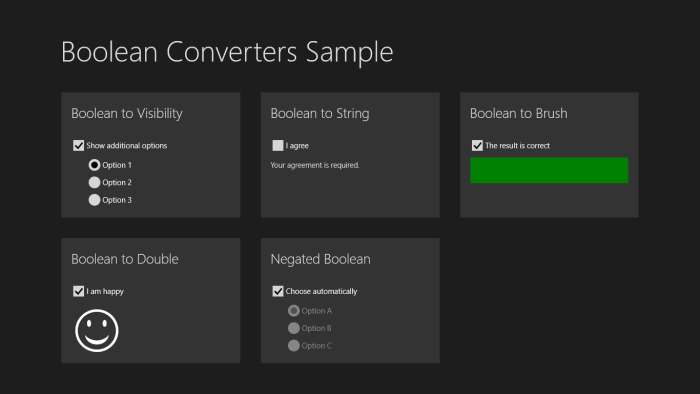

# Handy Boolean value converters

WPF, Silverlight, and Windows Store apps often use value converters to massage data into the proper format for data binding.  Although WPF provides a built-in BooleanToVisibilityConverter class, the Silverlight and Windows Store frameworks do not, and it's convenient to have several other frequently-used converters lying around.  In this post, we focus on a few simple conversions between Boolean values and other types, all of which can be derived from a single generic base class:

	public abstract class BooleanConverter<T> : IValueConverter
	{
		protected BooleanConverter(T trueValue, T falseValue)
		{
			this.TrueValue = trueValue;
			this.FalseValue = falseValue;
		}
		
		public T TrueValue { get; set; }
		
		public T FalseValue { get; set; }
		
		public object Convert(object value, Type targetType,
			object parameter, string language)
		{
			return Object.Equals(value, true) ?
				this.TrueValue : this.FalseValue;
		}
		
		public object ConvertBack(object value, Type targetType,
			object parameter, string language)
		{
			return Object.Equals(value, this.TrueValue) ? true : false;
		}
	}

As you can see, the base class converts Boolean values into values of type T, with true getting converted to the value specified by the TrueValue property, and false getting converted to the value specified by the FalseValue property.  The implementation above is for Windows Store apps--though the only change required for WPF and Silverlight is to replace the "string language" parameters with "CultureInfo culture" parameters.

The BooleanConverter<T> base class makes it very simple to convert to a variety of types.  The sample app pictured below illustrates the use of five converters, all derived from our generic base class:

<b>BooleanToVisibilityConverter</b> converts true to Visible and false to Collapsed by default.  Unlike the built-in converter in WPF, the behavior can be altered by changing the TrueValue and FalseValue properties.

	public sealed class BooleanToVisibilityConverter
		: BooleanConverter<Visibility>
	{
		public BooleanToVisibilityConverter()
			: base(Visibility.Visible, Visibility.Collapsed) { }
	}

<b>BooleanToStringConverter</b> converts true and false to two different strings, which must be specified by setting TrueValue and FalseValue.

	public sealed class BooleanToStringConverter : BooleanConverter<string>
	{
		public BooleanToStringConverter()
			: base(null, null) { }
	}

<b>BooleanToBrushConverter</b> converts true and false to the two different Brush values specified in TrueValue and FalseValue.  This converter is useful for displaying different colors or images based on a Boolean value.

	public sealed class BooleanToBrushConverter : BooleanConverter<Brush>
	{
		public BooleanToBrushConverter()
			: base(null, null) { }
	}

<b>BooleanToDoubleConverter</b> converts true to 1 and false to 0 by default.  This is helpful when binding to the Opacity dependency property.

	public sealed class BooleanToDoubleConverter : BooleanConverter<double>
	{
		public BooleanToDoubleConverter()
			: base(1, 0) { }
	}

<b>NegatedBooleanConverter</b> converts true to false and vice versa.  This converter is handy when binding IsEnabled or IsChecked to data properties that have the opposite meaning.

	public sealed class NegatedBooleanConverter : BooleanConverter<bool>
	{
		public NegatedBooleanConverter()
			: base(false, true) { }
	}
